# Physics of Language Models: How Transformers Learn to Parse

*A detailed summary of "Physics of Language Models: Part 1, Learning Hierarchical Language Structures" by Zeyuan Allen-Zhu and Yuanzhi Li (ICML 2024)*

---

## TL;DR

Transformers trained on synthetic context-free grammars (CFGs) don't just memorize patterns -- they build internal parse trees and implement a form of dynamic programming through their attention mechanisms. This paper provides the first controlled, mechanistic evidence that autoregressive language models learn genuine hierarchical reasoning, not just surface-level statistics.

---

## Motivation

Large language models like GPT-4 produce remarkably coherent text, but a fundamental question persists: **do they actually understand the hierarchical structure of language, or are they sophisticated pattern matchers?**

Natural language is deeply hierarchical. A sentence like "The cat that chased the mouse that ate the cheese ran away" requires tracking nested dependencies across multiple levels. In formal terms, this structure is captured by *context-free grammars* (CFGs), where production rules recursively expand non-terminal symbols into terminal words. Every valid sentence has an underlying parse tree -- and generating grammatically correct text requires implicitly constructing (or at least respecting) that tree.

The challenge is that next-token prediction in a hierarchical language is fundamentally different from simple pattern matching. Consider a sequence generated by a CFG with deep nesting: the correct next token at any position may depend on structural information dozens or hundreds of tokens back. A flat n-gram model would fail catastrophically. The question is whether transformers fail too, or whether they discover some form of structural reasoning.

Prior work has approached this from two directions. **Formal language studies** (e.g., Deletang et al., 2023) tested neural networks on the Chomsky hierarchy but used toy-scale tasks. **Structural probing studies** (e.g., Hewitt and Manning, 2019) found syntactic information in pretrained models but couldn't control what structure was available to learn. **Mechanistic interpretability** work (e.g., Wang et al., 2022; Olsson et al., 2022) reverse-engineered specific circuits in transformers but focused on simple behaviors like "induction heads" rather than full hierarchical parsing.

What was missing was a **controlled study at realistic scale** that could answer: can transformers learn deep hierarchical structure, and if so, *how*?

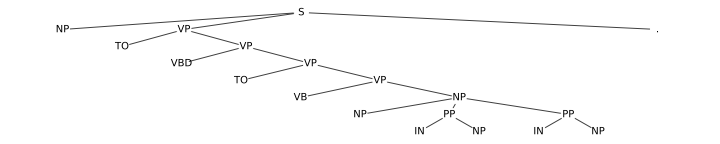
*Figure 1: Parse trees for real English sentences from the Penn TreeBank. Even simple sentences have multi-level hierarchical structure that a language model must implicitly respect to generate correct text.*

---

## Approach

### The Synthetic CFG Testbed

Allen-Zhu and Li designed a family of synthetic context-free grammars with precisely controlled properties, creating an ideal testbed that isolates hierarchical reasoning from lexical semantics. Their CFGs have:

- **Up to 7 hierarchy levels** with non-terminal (NT) counts per level such as $(1, 3, 9, 27, 81, 27, 9)$
- **Sequence lengths up to 300 tokens** -- far beyond toy-scale tasks
- **Vocabulary of 300 terminal symbols** -- large enough to prevent memorization
- **Long-range dependencies** requiring bracket matching across the full sequence length
- **Local ambiguity** where the correct next token depends on the global parse state, not just the local context window

Each CFG variant (cfg3b, cfg3f, cfg3g, cfg3h, cfg3i) tests a different structural property -- varying rule lengths, hierarchy depths, and terminal distributions. This systematic design means any pattern the model learns must reflect genuine structural understanding rather than surface shortcuts.

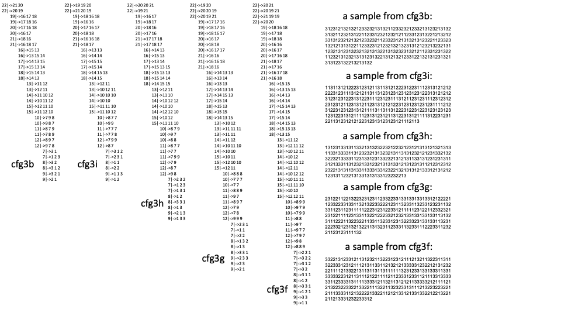
*Figure 2: Examples of the synthetic CFG families used in this work. Production rules generate sequences with deep hierarchical structure. The challenge for a language model is that next-token prediction requires tracking parse state across hundreds of tokens.*

### Key Notation

The paper introduces precise notation for the hierarchical structure. For a sequence $x = (x_1, x_2, \ldots, x_n)$ generated by a CFG:

- **NT ancestor indices** $s_\ell(i)$: the non-terminal symbol at level $\ell$ that dominates position $i$ in the parse tree
- **NT boundaries**: positions where the NT ancestor changes, marking the edge of a constituent
- **NT-end boundary** $b_\ell(i)$: indicator for whether position $i$ is the last token under a level-$\ell$ non-terminal

These quantities are the ground truth the paper probes for in the transformer's hidden states.

*Figure 3: Notation for non-terminal (NT) structure. For each position in the token sequence (bottom row), the NT ancestor indices ($s_3$--$s_6$) and boundary counts are shown. Color coding highlights NT boundaries -- the key structural landmarks the transformer must learn to identify.*

### Models Under Test

Four model variants were compared, all based on the GPT-2-small architecture (12 layers, 12 attention heads, 768 hidden dimensions, ~86M parameters):

| Model | Positional Encoding | Direction | Key Property |
|-------|-------------------|-----------|-------------|
| **GPT-2 (abs)** | Absolute | Autoregressive | Vanilla GPT-2 baseline |
| **GPT-2 (rel)** | Relative (DeBERTa-style) | Autoregressive | Relative distance bias in attention |
| **GPT-2 (rot)** | Rotary (RoPE) | Autoregressive | Rotation-based position encoding |
| **DeBERTa** | Relative | Bidirectional (encoder) | Encoder baseline |

The critical architectural variable turned out to be the **positional encoding scheme**, not the model size or depth.

### Three-Pronged Evaluation

The paper evaluates the trained models on three complementary axes:

1. **Generation accuracy**: Can the model produce valid strings from the grammar? Measured by sampling sequences autoregressively and checking grammatical validity.

2. **Distribution matching**: Does the model's probability distribution over sequences match the ground-truth CFG distribution? Measured via KL divergence:

$$\text{KL} = \frac{1}{|S|}\sum_{x\in S} \frac{1}{m(x)+1} \sum_i \sum_t \Pr_{p^*}[t \mid x_{<i}] \log \frac{\Pr_{p^*}[t \mid x_{<i}]}{\Pr_p[t \mid x_{<i}]}$$

This measures the average per-token divergence between the ground-truth conditional distribution $p^*$ and the model's learned distribution $p$, averaged over positions and sequences. Low KL means the model has learned the full probabilistic structure, not just the most-likely outputs.

3. **Internal probing**: What information do the hidden states encode? This is where the deepest insights emerge.

---

## Key Results

### Results 1--3: Transformers Learn CFGs Accurately

The headline result is striking: **GPT-2 with relative or rotary positional embeddings achieves near-perfect generation accuracy** across all CFG variants. The model generates grammatically valid sequences, produces diverse outputs (verified via a birthday paradox duplicate-detection test), and closely matches the ground-truth probability distribution.

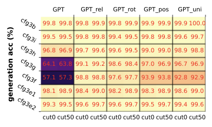
*Figure 4: Generation accuracy across CFG variants. GPT-2 with relative (rel) and rotary (rot) positional embeddings consistently achieves high accuracy. Vanilla GPT-2 with absolute PE and the bidirectional DeBERTa encoder fail to learn the deeper grammars.*

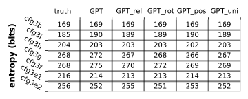
*Figure 5: Entropy comparison between model and ground-truth distributions. Models with relative/rotary PE closely match the ground-truth entropy, indicating they learn the full distributional structure -- not just the mode.*

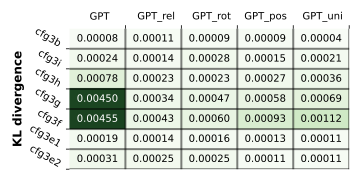
*Figure 6: KL divergence from ground-truth CFG to model distributions. Lower is better. Relative and rotary PE models achieve near-zero divergence, while absolute PE models show significant distributional mismatch.*

The failure of absolute positional embeddings is notable: they encode position as a fixed vector added to each token, which doesn't naturally capture relative distances between constituents. Relative and rotary encodings, which represent *distances* between positions rather than absolute locations, align much better with the recursive, distance-dependent structure of CFGs.

**Key quantitative findings:**
- Relative/rotary PE models achieve **>95% generation accuracy** on most CFG variants
- KL divergence drops to **<0.05** for the best models
- The birthday paradox test confirms **high generation diversity** -- the model doesn't simply memorize training sequences
- Absolute PE and encoder (DeBERTa) models fail, especially on deeper grammars

### Results 4--5: Hidden States Encode Full Parse Trees

The most surprising finding comes from **linear probing** the transformer's hidden states. A linear probe is a simple linear classifier applied to the model's internal representations -- if a linear probe can recover some information, it means that information is explicitly encoded in the representation (not buried in a complex nonlinear manifold).

The probing equation is:

$$G_{i}(x) = \sum_{r \in [H],\, k \in [m(x)]} w_{r, i \to k} \cdot f_r(E_k(x)) \in \mathbb{R}^{|\text{NT}|}$$

Here, $E_k(x)$ is the hidden state at position $k$ in the last transformer layer, $f_r$ is a per-head probing function, and $w_{r, i \to k}$ are learned weights. The probe predicts the full NT ancestor index vector at each position -- essentially recovering the parse tree from the hidden representation.

**Result 4** shows that this linear probe achieves **near-perfect accuracy** on the GPT-2 models with relative/rotary PE. The transformer's last-layer hidden states almost perfectly encode the full non-terminal ancestor information at every position. Remarkably, encoder models (DeBERTa) cannot encode this information -- suggesting that the autoregressive training objective is crucial.

**Result 5** goes further: the NT information is not distributed globally but is **concentrated locally at NT boundary positions**. A restricted probe that only looks at positions $i \pm 1$ (the immediate neighbors of NT boundaries) recovers almost as much information as the full probe:

$$G_{i}(x) = \sum_{r \in [H],\, k \in [m(x)],\, |i-k| \leq \delta} w_{r, i \to k} \cdot f_r(E_k(x))$$

With $\delta = 1$, accuracy remains high. This means the transformer has learned to *concentrate* parse-tree information at structurally meaningful positions -- the boundaries between constituents.

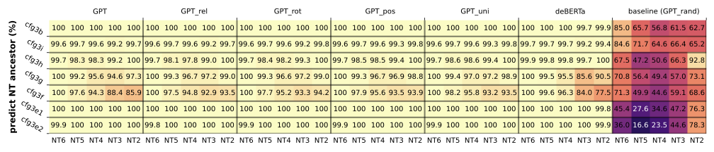
*Figure 7: NT ancestor probing accuracy. Linear probes on the last-layer hidden states of GPT-2 with relative/rotary PE achieve near-perfect accuracy in recovering the full NT ancestor index vector. DeBERTa (encoder) fails.*

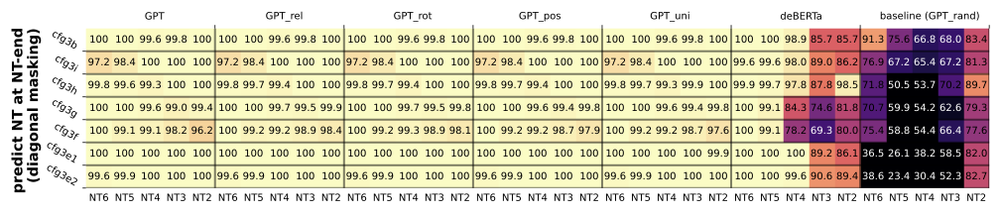
*Figure 8: Diagonal probing results. Even when the probe is restricted to use only the hidden state at position $i \pm 1$, it still recovers high-accuracy NT information -- confirming that parse structure is locally encoded at NT boundary positions.*

### Results 6--9: Attention Implements Dynamic Programming

The deepest insight of the paper comes from analyzing the attention patterns themselves. The authors discover four progressively more specific patterns that collectively reveal the transformer is implementing a form of **CKY-style dynamic programming**:

**Result 6 -- Position-based attention**: Different heads attend at different distance scales, creating a multi-resolution view of the sequence. Some heads focus on nearby tokens (local structure), while others reach across the full sequence (long-range dependencies).

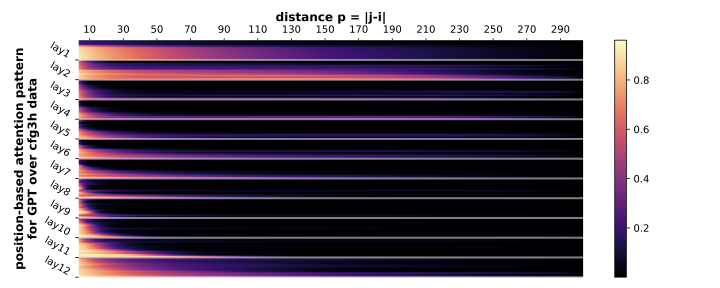
*Figure 9: Attention patterns across 12 heads of GPT-2. Each head specializes in a different distance range, creating multi-scale coverage from local to long-range dependencies.*

**Result 7 -- Boundary-biased attention**: Attention is disproportionately directed toward tokens at NT boundaries. These boundary positions are the structurally important landmarks in the parse tree.

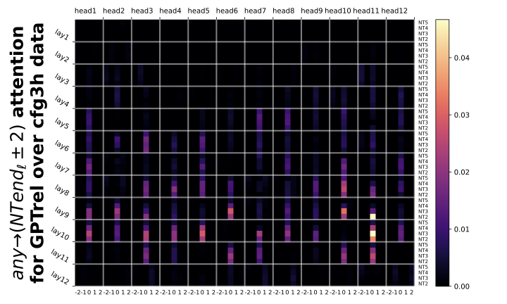
*Figure 10: Attention to NT boundaries. Tokens at NT-end positions receive disproportionately high attention, showing the model has learned to identify structural landmarks.*

**Result 8 -- Same-level NT-end attention**: When both the source and target positions are NT boundaries, attention is highest when they are at the **same NT level** -- exactly the pattern needed for sibling-to-sibling communication in a parse tree.

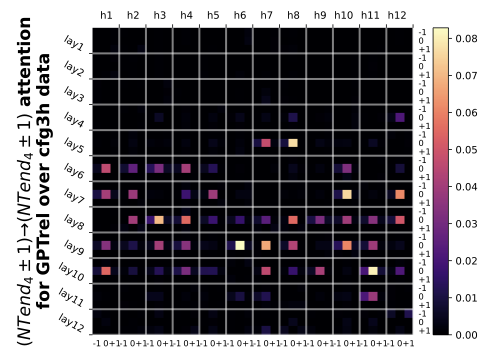
*Figure 11: NT-end to NT-end attention at level 4. Attention is strongest between positions that are both NT boundaries at the same hierarchical level -- enabling sibling constituents to communicate.*

**Result 9 -- Adjacent NT-end attention**: The most refined pattern shows attention concentrating between **adjacent** NT-end token pairs: siblings (same level), children (deepest level), and parent-level boundaries. This is precisely the information flow needed by the CKY parsing algorithm.

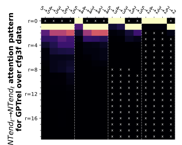
*Figure 12: Adjacent NT-end attention pattern (Result 9). Attention concentrates between structurally adjacent NT boundaries -- siblings, children, and parents in the parse tree -- mirroring the information flow of CKY dynamic programming.*

### The CKY Connection

These attention patterns collectively mirror the **CKY (Cocke-Younger-Kasami) algorithm**, the classical dynamic programming algorithm for CFG parsing. In CKY, to parse a span $(i, j)$ with non-terminal $a$, the algorithm checks all split points $k \in (i, j)$ and combines sub-parses. The paper formalizes this connection:

$$\mathbf{1}_\ell(i) = 1,\; \mathbf{1}_\ell(j) = 1,\; \forall k \in (i,j)\; \mathbf{1}_\ell(k)=0 \text{ and } s_\ell(j) = a \implies \text{DP}(i,j,a) = 1$$

This links the transformer's learned NT boundary indicators ($\mathbf{1}_\ell$) and NT ancestor symbols ($s_\ell$) to classical CKY parsing recurrences. The attention patterns implement the information propagation that CKY achieves through its table lookups -- but the transformer discovers this algorithm from data, without being told about dynamic programming.

*Figure 13: The CKY dynamic programming connection. Top: classical CKY parse table $DP(i,j,a)$. Middle: the transformer's attention patterns between NT-end positions. The transformer's learned attention implements the same information flow as CKY parsing, but discovered entirely from data.*

### Results 10--13: Extensions and Robustness

The paper extends the framework in two important directions:

**Implicit CFGs (Result 10):** In real language, "non-terminal" categories correspond to bags of interchangeable words (all nouns, all verbs), not single tokens. The authors test "implicit CFGs" where each terminal symbol is replaced by a bag of words. The transformer still learns the latent hierarchical structure -- hidden embeddings for tokens in the same NT category become divergence-correlated, even though the model never sees explicit category labels.

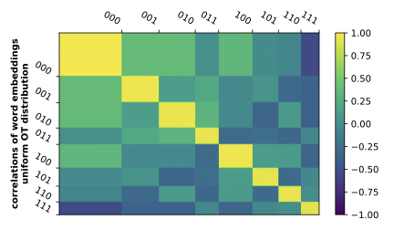
*Figure 14: Embedding correlation for implicit CFGs. Left: uniform terminal distribution. The correlation structure reveals the model has learned the latent NT categories without explicit supervision.*

**Robustness (Results 11--13):** When training data is corrupted (15% of tokens randomly replaced), the transformer exhibits a fascinating **"mode switch" behavior**:

| Input Condition | Model Behavior | Validity |
|----------------|----------------|----------|
| Clean prefix | Correct generation | Grammatically valid |
| Corrupted prefix | Random generation | Length-valid but not grammatically correct |
| Mixed prefix | Length-valid strings | Partial structure preserved |

At low temperatures ($\tau \leq 0.2$), the model recovers robust generation even after corruption. This mode switch suggests the transformer maintains separate "modes" for structured and unstructured generation, switching between them based on the input distribution.

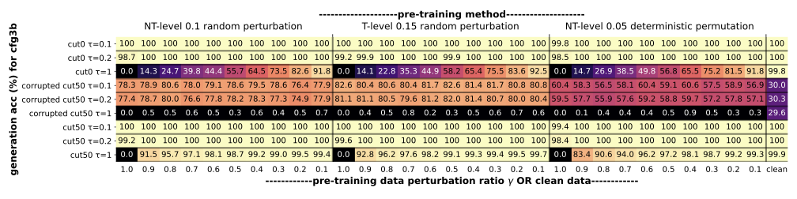
*Figure 15: Robustness results under corrupted training data. The 9-row matrix shows different training/test corruption conditions across temperatures $\tau = 0.1, 0.2, 1.0$. The model exhibits "mode switch" behavior -- generating correctly on clean prefixes and switching to random (but length-valid) generation on corrupted prefixes.*

---

## Discussion

### What This Means for Understanding LLMs

This work provides the strongest mechanistic evidence to date that transformers learn **genuine hierarchical reasoning**, not just statistical correlations. Three findings are particularly significant:

1. **Parse trees are linearly encoded.** The fact that a simple linear probe recovers full parse-tree information means the representation is not buried in a complex manifold -- it's readily accessible, suggesting the model "thinks" in terms of hierarchical structure.

2. **Attention implements dynamic programming.** The transformer didn't just memorize input-output mappings; it discovered an algorithm that mirrors classical CKY parsing. This is a form of *emergent algorithm discovery* -- the model invents a systematic procedure from training signal alone.

3. **Positional encoding is the critical architectural choice.** Not model size, not depth, not training data volume -- the key enabler is how the model represents positions. Relative and rotary encodings succeed because they naturally capture the distance-dependent structure of hierarchical languages. This has direct implications for architecture design.

### Limitations

Several important caveats apply:

- **Synthetic data only.** The CFGs, while complex (300-token sequences, 7 hierarchy levels, 100k+ vocabulary), are still simpler than natural language. The paper does not claim transformers parse English in the same way.
- **No public code repository.** The experiments cannot be independently reproduced without reimplementation. The project page at [physics.allen-zhu.com/part-1](https://physics.allen-zhu.com/part-1) provides supplementary materials.
- **GPT-2 scale.** Modern LLMs are orders of magnitude larger. Whether the same mechanisms scale to billion-parameter models on natural language remains open.
- **Encoder failure.** The finding that bidirectional encoders (DeBERTa) fail to encode deep NT information is surprising and deserves further investigation -- it may reflect a fundamental limitation of masked language modeling for hierarchical structure.

### The Bigger Picture: Physics of Language Models

This paper is Part 1 of the "Physics of Language Models" series by Allen-Zhu and collaborators, which aims to build a rigorous, experimentally-grounded theory of how language models work:

| Part | Topic | Key Question |
|------|-------|-------------|
| **1** (this paper) | Hierarchical structure (CFGs) | Can transformers parse? |
| **2.1--2.2** | Grade-school math | Can transformers reason step-by-step? |
| **3.1--3.3** | Knowledge storage and manipulation | How do transformers store facts? |
| **4.1** | Architecture design | What makes an architecture effective? |

The series represents a shift from treating LLMs as black boxes to building a "physics" of their behavior -- understanding the fundamental mechanisms through controlled experiments, much as physicists study simplified systems to discover universal laws.

### Future Directions

The paper suggests several natural next steps:

- **Bridging to natural language:** Do real-world LLMs (GPT-4, LLaMA) exhibit the same DP-like attention patterns when processing hierarchical natural language?
- **Training dynamics:** How does the DP mechanism *emerge* during training? Is there a phase transition, as seen in "grokking" phenomena?
- **Architecture implications:** Can the insights about positional encoding guide the design of more efficient architectures for hierarchical reasoning?
- **Compositionality:** How do the hierarchical parsing abilities discovered here interact with semantic composition -- the process of building meaning from parts?

---

## References

1. Allen-Zhu, Z. and Li, Y. "Physics of Language Models: Part 1, Learning Hierarchical Language Structures." *ICML 2024*. [arXiv:2305.13673](https://arxiv.org/abs/2305.13673)

2. Radford, A. et al. "Language Models are Unsupervised Multitask Learners." *OpenAI*, 2019.

3. He, P. et al. "DeBERTa: Decoding-enhanced BERT with Disentangled Attention." *ICLR 2021*. [arXiv:2006.03654](https://arxiv.org/abs/2006.03654)

4. Su, J. et al. "RoFormer: Enhanced Transformer with Rotary Position Embedding." *arXiv:2104.09864*, 2021.

5. Hewitt, J. and Manning, C.D. "A Structural Probe for Finding Syntax in Word Representations." *NAACL 2019*.

6. Deletang, G. et al. "Neural Networks and the Chomsky Hierarchy." *ICLR 2023*.

7. Wang, K. et al. "Interpretability in the Wild: A Circuit for Indirect Object Identification in GPT-2 Small." *ICLR 2023*.

8. Olsson, C. et al. "In-Context Learning and Induction Heads." *arXiv:2209.11895*, 2022.

9. Baker, J.K. "Trainable Grammars for Speech Recognition." *JASA*, 1979.

10. Marcus, M. et al. "Building a Large Annotated Corpus of English: The Penn Treebank." *Computational Linguistics*, 1993.

11. Zhao, S. et al. "Transformers Learn to Parse while Predicting Next Tokens." *arXiv*, 2023.

12. Nanda, N. et al. "Progress Measures for Grokking via Mechanistic Interpretability." *ICLR 2023*.

13. Murty, S. et al. "Characterizing Intrinsic Compositionality in Transformers with Tree Projections." *arXiv*, 2023.

---

*Project page: [physics.allen-zhu.com/part-1](https://physics.allen-zhu.com/part-1) | 100-minute talk: [YouTube](https://youtu.be/kf_eGgVtOcs) | ICML 2024 tutorial: [YouTube](https://youtu.be/yBL7J0kgldU)*
