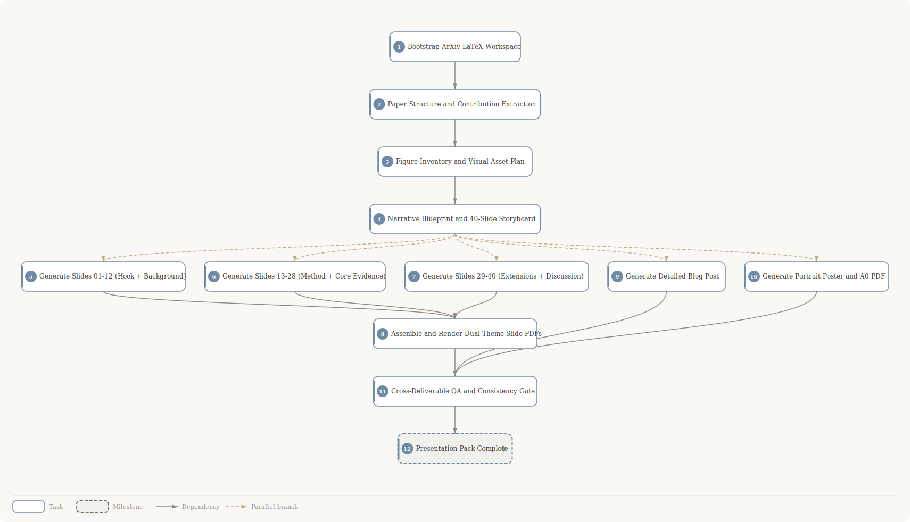

<div align="center">

# Physics LLM Presentation Pack

**12 tasks** &bull; **15 dependencies** &bull; Exported March 11, 2026

</div>

## DAG Overview



### At a Glance

| Metric | Value |
|---|---|
| Tasks | 11 |
| Milestones | 1 |
| Dependencies | 10 |
| Parallel branches | 5 |

### Execution Flow

```
● #1 Bootstrap ArXiv LaTeX Workspace
  ● #2 Paper Structure and Contribution Extraction
    ● #3 Figure Inventory and Visual Asset Plan
      ● #4 Narrative Blueprint and 40-Slide Storyboard
        ┬─ ● #5 Generate Slides 01-12 (Hook + Background)
        ├─ ● #6 Generate Slides 13-28 (Method + Core Evidence)
        ├─ ● #7 Generate Slides 29-40 (Extensions + Discussion)
        ├─ ● #9 Generate Detailed Blog Post
        └─ ● #10 Generate Portrait Poster and A0 PDF
              ● #8 Assemble and Render Dual-Theme Slide PDFs
                    ● #11 Cross-Deliverable QA and Consistency Gate
                      ◆ #12 Presentation Pack Complete
```

---

## Task Details

### ● Task #1: Bootstrap ArXiv LaTeX Workspace

`Planned` &nbsp; `high`

| | |
|---|---|
| **Unlocks** | → #2 *Paper Structure and Contribution Extraction* |
| **Schedule** | 2026-03-11 → 2026-03-11 |

<details>
<summary><strong>Task Description</strong> <em>(click to expand)</em></summary>

Initialize the project from arXiv first: download and extract https://arxiv.org/e-print/2305.13673 into `source/arxiv-2305.13673/`, then create working folders `outline/`, `assets/figures/`, `assets/svg/`, `output/slides/`, `output/blog/`, `output/poster/`. Do not start content generation yet. Done means the LaTeX source (including `cfg-ob4.tex` and figure assets) is present and directory scaffolding is ready.

</details>

---

### ● Task #2: Paper Structure and Contribution Extraction

`Planned` &nbsp; `high`

| | |
|---|---|
| **Depends on** | ← #1 *Bootstrap ArXiv LaTeX Workspace* |
| **Unlocks** | → #3 *Figure Inventory and Visual Asset Plan* |
| **Schedule** | 2026-03-11 → 2026-03-11 |

<details>
<summary><strong>Task Description</strong> <em>(click to expand)</em></summary>

Parse `source/arxiv-2305.13673/cfg-ob4.tex` and extract: section hierarchy, key equations, bibliography signals, and all `\includegraphics` references. Write `outline/paper-structure.md` with 3-5 key contributions and evidence anchors (section/equation/figure refs). If a real GitHub URL is provided (not `{{githubUrl}}`), clone into `external/repo/` and add `outline/repo-notes.md` identifying key code files; otherwise record repo as unavailable in `outline/repo-notes.md`.

</details>

---

### ● Task #3: Figure Inventory and Visual Asset Plan

`Planned` &nbsp; `high`

| | |
|---|---|
| **Depends on** | ← #2 *Paper Structure and Contribution Extraction* |
| **Unlocks** | → #4 *Narrative Blueprint and 40-Slide Storyboard* |
| **Schedule** | 2026-03-11 → 2026-03-11 |

<details>
<summary><strong>Task Description</strong> <em>(click to expand)</em></summary>

Create `outline/figure-inventory.md` by mapping paper figures to presentation needs using the rubric (original vs original+annotated vs new SVG). Require a 40-slide-ready plan with at least 22 visuals and >60% content slides visualized. Include per-slide visual tags like `[original: path]`, `[SVG: description]`, or `[none]`. Prioritize original experimental figures and define beginner-focused new SVGs for Transformer basics and CFG parsing examples.

</details>

---

### ● Task #4: Narrative Blueprint and 40-Slide Storyboard

`Planned` &nbsp; `high`

| | |
|---|---|
| **Depends on** | ← #3 *Figure Inventory and Visual Asset Plan* |
| **Unlocks** | ⇢ #5 *Generate Slides 01-12 (Hook + Background)*<br>⇢ #6 *Generate Slides 13-28 (Method + Core Evidence)*<br>⇢ #7 *Generate Slides 29-40 (Extensions + Discussion)*<br>⇢ #9 *Generate Detailed Blog Post*<br>⇢ #10 *Generate Portrait Poster and A0 PDF* |
| **Schedule** | 2026-03-11 → 2026-03-11 |

<details>
<summary><strong>Task Description</strong> <em>(click to expand)</em></summary>

Write `outline/narrative-outline.md` with a 500+ word comprehension summary and full 40-slide storyboard following Motivation → Methodology → Results → Discussion. For each slide specify title, layout type (1-5), 3-5 key points, equation plan, figure plan, and transition line. Must include beginner-friendly but concise background section on Transformer setup and CFG concepts with concrete examples/visualization specs.

</details>

---

### ● Task #5: Generate Slides 01-12 (Hook + Background)

`Planned` &nbsp; `high`

| | |
|---|---|
| **Depends on** | ⇠ #4 *Narrative Blueprint and 40-Slide Storyboard* |
| **Unlocks** | → #8 *Assemble and Render Dual-Theme Slide PDFs* |
| **Schedule** | 2026-03-11 → 2026-03-11 |

<details>
<summary><strong>Task Description</strong> <em>(click to expand)</em></summary>

Create `output/slides/slide_01.html` through `slide_12.html` using the 5 required layouts and palette/typography rules. Focus on title, motivation, prior gap, and beginner-friendly foundations (Transformer architecture, context-free grammar intuition, concrete parsing examples). Add high-quality custom SVGs for prerequisite concepts and early pipeline visuals.

</details>

---

### ● Task #6: Generate Slides 13-28 (Method + Core Evidence)

`Planned` &nbsp; `high`

| | |
|---|---|
| **Depends on** | ⇠ #4 *Narrative Blueprint and 40-Slide Storyboard* |
| **Unlocks** | → #8 *Assemble and Render Dual-Theme Slide PDFs* |
| **Schedule** | 2026-03-11 → 2026-03-11 |

<details>
<summary><strong>Task Description</strong> <em>(click to expand)</em></summary>

Create `output/slides/slide_13.html` through `slide_28.html` covering CFG family design, model behavior interpretation, attention pattern findings, and dynamic-programming connection. Reuse many original paper figures (authoritative results/plots) and add SVG simplifications where paper visuals are too dense. Ensure equations are annotated in plain language.

</details>

---

### ● Task #7: Generate Slides 29-40 (Extensions + Discussion)

`Planned` &nbsp; `medium`

| | |
|---|---|
| **Depends on** | ⇠ #4 *Narrative Blueprint and 40-Slide Storyboard* |
| **Unlocks** | → #8 *Assemble and Render Dual-Theme Slide PDFs* |
| **Schedule** | 2026-03-11 → 2026-03-11 |

<details>
<summary><strong>Task Description</strong> <em>(click to expand)</em></summary>

Create `output/slides/slide_29.html` through `slide_40.html` for robustness, implicit CFGs, PTB/other CFG extensions, uniform-attention findings, limitations, implications, and future directions. Keep researcher-level detail while preserving beginner clarity through recap visuals and concise takeaways.

</details>

---

### ● Task #8: Assemble and Render Dual-Theme Slide PDFs

`Planned` &nbsp; `high`

| | |
|---|---|
| **Depends on** | ← #5 *Generate Slides 01-12 (Hook + Background)*<br>← #6 *Generate Slides 13-28 (Method + Core Evidence)*<br>← #7 *Generate Slides 29-40 (Extensions + Discussion)* |
| **Unlocks** | → #11 *Cross-Deliverable QA and Consistency Gate* |
| **Schedule** | 2026-03-11 → 2026-03-11 |

<details>
<summary><strong>Task Description</strong> <em>(click to expand)</em></summary>

Combine all 40 slide HTML files into print-ready combined HTML and render PDFs for both themes: `output/slides/slides-light.pdf` and `output/slides/slides-dark.pdf` (1280x720 pages). Ensure no clipping/overflow and preserve figure legibility. Keep source HTML self-contained and consistent with the skill styling spec.

</details>

---

### ● Task #9: Generate Detailed Blog Post

`Planned` &nbsp; `high`

| | |
|---|---|
| **Depends on** | ⇠ #4 *Narrative Blueprint and 40-Slide Storyboard* |
| **Unlocks** | → #11 *Cross-Deliverable QA and Consistency Gate* |
| **Schedule** | 2026-03-11 → 2026-03-11 |

<details>
<summary><strong>Task Description</strong> <em>(click to expand)</em></summary>

Write `output/blog/post.md` (2000-4000 words) with TL;DR, Motivation, Approach, Key Results, Discussion, References. Include equation blocks with plain-English explanation, quantitative tables, and all figures used in slides (original + new SVGs) with standalone captions. Keep terminology aligned with slide deck.

</details>

---

### ● Task #10: Generate Portrait Poster and A0 PDF

`Planned` &nbsp; `high`

| | |
|---|---|
| **Depends on** | ⇠ #4 *Narrative Blueprint and 40-Slide Storyboard* |
| **Unlocks** | → #11 *Cross-Deliverable QA and Consistency Gate* |
| **Schedule** | 2026-03-11 → 2026-03-11 |

<details>
<summary><strong>Task Description</strong> <em>(click to expand)</em></summary>

Create `output/poster/poster.html` using portrait A0 3-column CSS grid and render `output/poster/poster.pdf`. Include header, motivation/background, method, key insight, results, discussion, limitations, and QR/citation block. Enforce column balancing (>=95% fill per column) with real content (figures/callouts), not stretched whitespace.

</details>

---

### ● Task #11: Cross-Deliverable QA and Consistency Gate

`Planned` &nbsp; `high`

| | |
|---|---|
| **Depends on** | ← #8 *Assemble and Render Dual-Theme Slide PDFs*<br>← #9 *Generate Detailed Blog Post*<br>← #10 *Generate Portrait Poster and A0 PDF* |
| **Unlocks** | → #12 *Presentation Pack Complete* |
| **Schedule** | 2026-03-11 → ? |

<details>
<summary><strong>Task Description</strong> <em>(click to expand)</em></summary>

Run final quality checks across slides, blog, and poster: narrative consistency, claim-number consistency, equation explanation coverage, figure coverage targets, citation completeness, and rendering sanity checks. Produce `output/qa/report.md` with pass/fail checklist and required fixes if any.

</details>

---

### ◆ Task #12: Presentation Pack Complete

`Planned` &nbsp; `Milestone`

| | |
|---|---|
| **Depends on** | ← #11 *Cross-Deliverable QA and Consistency Gate* |
| **Schedule** | 2026-03-11 → 2026-03-11 |

<details>
<summary><strong>Task Description</strong> <em>(click to expand)</em></summary>

Slides (light+dark PDFs), detailed blog post, and portrait poster are complete and quality-reviewed.

</details>

---

