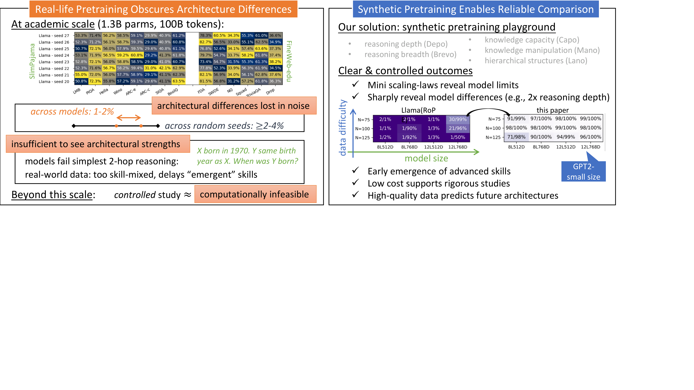
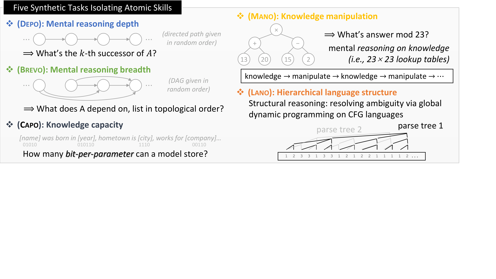
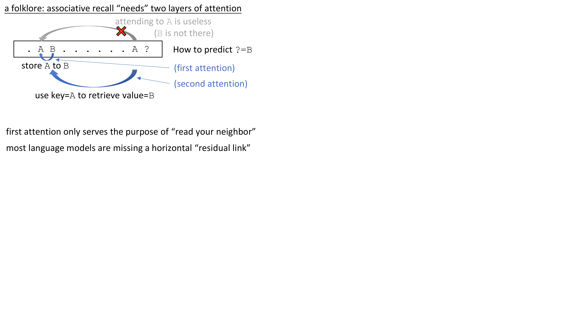
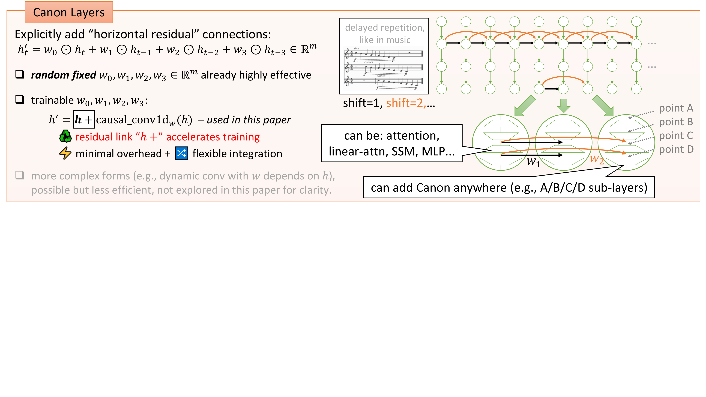
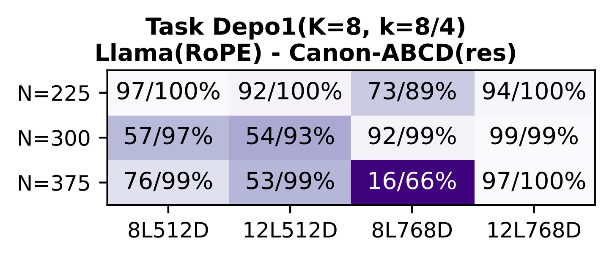
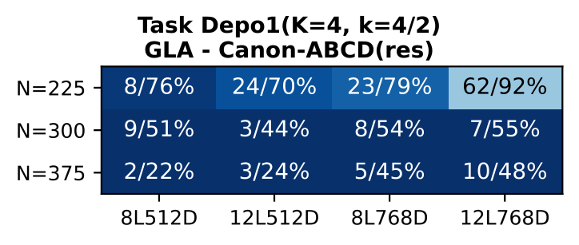
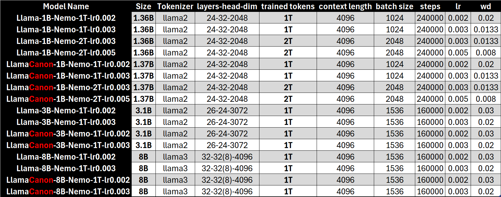

# Physics of Language Models: The Magic of Canon Layers

*A detailed summary of Part 4.1 (NeurIPS 2025) and Part 4.2 by Zeyuan Allen-Zhu (FAIR at Meta)*

---

## TL;DR

Canon layers are lightweight convolutional components (<0.5% parameter overhead) that act as "horizontal residual links," promoting information flow between neighboring token positions. In synthetic benchmarks (Part 4.1), they boost reasoning depth by 2--4x, revive weak architectures like NoPE and GLA to match or surpass stronger baselines, and reveal that Mamba2's built-in conv1d is the true source of its performance advantage. In real-world pretraining at 1--8B scale on up to 2T tokens (Part 4.2), all synthetic predictions transfer faithfully: LlamaCanon consistently outperforms vanilla Llama by ~2% MMLU across all 8 controlled comparisons, and GLA+Canon matches or exceeds GDN and Mamba2 at scale.

---

## Motivation: Why Architecture Comparison Is Broken

Choosing the right architecture for a language model should be straightforward: train multiple architectures on the same data, evaluate, and pick the winner. In practice, this is far harder than it sounds. Zeyuan Allen-Zhu's *Physics of Language Models* series identifies three fundamental challenges that undermine the reliability of architecture comparisons at academic scale.

**Challenge 1: Pretraining loss is an unreliable proxy for intelligence.** State-space models like Mamba can achieve impressively low perplexity by rapidly memorizing surface-level patterns, yet fail on reasoning tasks that require multi-hop inference. A model with lower loss is not necessarily a smarter model.

**Challenge 2: Noise below emergence thresholds.** At the standard academic scale of 1.3B parameters trained on 100B tokens, even the simplest 2-hop reasoning tasks produce random-guessing accuracy (~30--36%). Meanwhile, random seed variation alone causes 2--4% accuracy swings on benchmarks like LAMBADA (up to 4%) and BoolQ (up to 3%). When the noise floor exceeds the signal from architectural differences, published comparisons may be reporting randomness, not real effects.

**Challenge 3: Data quality and grokking confounds.** Many failures in complex reasoning stem from insufficient or noisy training data, not from architectural limitations. Grokking behavior -- where models suddenly acquire capabilities after extended training -- and reinforcement learning-based post-training further obscure which improvements are attributable to architecture versus training recipe.

The physicist's solution? Build an idealized laboratory. Just as Galileo studied objects in vacuum before tackling air resistance, Allen-Zhu constructs a **synthetic pretraining playground** with infinite, perfectly clean data -- eliminating the noise that plagues real-world comparisons. This synthetic approach, detailed in Part 4.1, makes architectural differences visible even at small (GPT2-small) scale, where they would be invisible in real pretraining.


*Figure 1: The core motivation -- real-world pretraining at academic scale produces noisy, often indistinguishable results across architectures (left), while the synthetic playground yields clean, reproducible signals (right). Source: Part 4.1, Figure 1.*

---

## The Synthetic Pretraining Playground [4.1]

The playground consists of five synthetic tasks, each designed to isolate a specific atomic capability. The tasks follow four strict design criteria: they must not be "shallow" (no simple associative recall), they must test mental/"System 1" reasoning without chain-of-thought, they must not depend on length generalization (all use 2048--4096 token dense contexts), and they must target broadly applicable skills.


*Figure 2: Overview of the five synthetic pretraining tasks. Each task isolates a specific capability, enabling controlled architectural comparisons. Source: Part 4.1.*

The five tasks are:

1. **Depo** (Reasoning Depth): k-hop traversal over directed permutations. Given a chain of mappings A->B->C->...->Z, predict the endpoint after k hops. Tests how deeply a model can compose sequential inferences.

2. **Brevo** (Reasoning Breadth): Recursive traversal of directed acyclic graphs (DAGs), requiring topological sort-like computation. Tests the model's ability to handle branching inference paths simultaneously.

3. **Capo** (Knowledge Capacity): Storage and recall of biographical facts. Measures raw bits-per-parameter knowledge density, probing how efficiently the architecture utilizes its parameter budget for memorization.

4. **Mano** (Knowledge Manipulation): Arithmetic operations on retrieved knowledge (modular arithmetic mod 23). Tests the ability to not just store but actively transform retrieved information.

5. **Lano** (Hierarchical Structure): Parsing context-free grammars (CFGs) via dynamic programming. Tests the model's ability to learn and execute hierarchical, recursive language patterns.

Each task uses controlled parameters (3 data scales x 4 model scales), enabling "mini scaling laws" that reveal how architectural choices affect capability trajectories. The initial comparison (Result 0) immediately recovers known real-world rankings: GLA performs weakest overall, Mamba2 excels at knowledge tasks (Capo, Mano) but lags in reasoning, GDN occasionally surpasses Llama(RoPE) on reasoning, and RoPE dominates reasoning depth (Depo) and hierarchical structure (Lano). This validates the playground's fidelity -- but also reveals that the comparison is not yet fair: some architectures are missing a critical component.

---

## Canon Layers: The Key Innovation [4.1]

### The Problem: Shooting Birds with Cannons

Consider associative recall: given the sequence `[A] [B] ... [A] [?]`, predict B. Under causal masking, the first [A] cannot attend forward to see [B]. The standard solution requires *two* attention layers: the first copies information from A into B's representation (since B can attend backward to A), and the second uses this enriched representation to perform the lookup. This means the model spends global $O(n^2)$ attention computation just to pass information between adjacent tokens -- like "shooting a bird with a cannon."


*Figure 3: The "shooting birds with cannons" problem. A trivial token-copying experiment shows that 1-layer RoPE requires d >= 128, while 2-layer RoPE or 1-layer RoPE + Canon achieves 100% with d = 16. Source: Part 4.1.*

### The Solution: Horizontal Residual Links

The key insight is an analogy to one of deep learning's most important innovations. **Vertical residual connections** ($h' = h + f(h)$) transformed deep networks by preserving gradient flow across layers. **Horizontal residual connections** ($h'_t = h_t + g(h_{t-1}, h_{t-2}, h_{t-3})$) transform sequence models by preserving local context flow across token positions.

Named after the musical form -- Pachelbel's Canon in D, where violins play the same melody with fixed temporal delays, creating overlapping horizontal repetition -- Canon layers compute:

$$h'_t = h_t + \text{causal\_conv1d}_w([h_t, h_{t-1}, h_{t-2}, h_{t-3}])$$

This is implemented as a 1-d causal convolution with kernel size 4, using the efficient CUDA kernel from the H3 library (`causal_conv1d` package). The residual form is critical: it preserves the vertical information pathway while adding horizontal mixing.


*Figure 4: Illustration of Canon layers. The musical "Canon" analogy -- melodies at fixed temporal delays -- maps naturally to aggregating hidden states from neighboring positions. Source: Part 4.1.*

### Integration: Four Insertion Points

Canon layers can be inserted at four positions within any Transformer block:

- **Canon-A**: Before attention (after RMSNorm), dimension $m = d$
- **Canon-B**: Inside attention (after Q/K/V projection), dimension $m = 3d$
- **Canon-C**: Before MLP (after RMSNorm), dimension $m = d$
- **Canon-D**: Inside MLP (before activation), dimension $m = 4d$ (or $\frac{16}{3}d$ for gated MLP)

Combining all four gives "Canon-ABCD" (full-score Canon). The same positions extend naturally to linear attention (GLA) and state-space models (Mamba2, GDN). For linear models, the existing `conv1d` in Mamba2/GLA/GDN is effectively a partial Canon-B (non-residual, with activation). The recommended integration is Canon-AbCD(res): keep the original non-residual conv1d and add residual Canon at positions A, C, and D.

### Implementation Simplicity

The implementation is remarkably lightweight. Here's the core from the released `canon_helper.py`:

```python
class ShortConvolution(nn.Conv1d):
    """Canon layer: causal conv1d with optional residual."""
    def __init__(self, hidden_size, kernel_size, bias=False,
                 activation=None, use_fast_conv1d=True, **kwargs):
        super().__init__(
            in_channels=hidden_size,
            out_channels=hidden_size,
            kernel_size=kernel_size,
            groups=hidden_size,  # depthwise convolution
            bias=bias,
            padding=kernel_size - 1,
            **kwargs
        )

def apply_canon(store_name, canon, hidden_states, cache, layer_idx, attention_mask):
    hidden_states2, conv_state = canon(x=hidden_states, ...)
    if canon._zeyuan_residual:
        return hidden_states + hidden_states2  # the key residual link
    else:
        return hidden_states2
```

The parameter overhead is minimal: fewer than **0.45% parameters** for GPT2-small, and just **0.0063%** for a 1.3B-parameter Llama. Runtime overhead with a naive implementation is 12--20% on an H100 GPU, with room for further optimization.

A remarkable finding: even **random fixed weights** for the horizontal mixing already produce notable improvements. The specific learned mixing pattern matters less than the *existence* of the mixing pathway -- suggesting the absence of local mixing was a fundamental architectural bottleneck.

---

## When Transformers Meet Canon [4.1]

### Result 2: Reasoning Depth Explosion

The most dramatic finding: Canon layers boost Transformer reasoning depth by **2--4x**. On Depo1 (K=8), vanilla RoPE achieves near-zero accuracy at k=4 hops, while RoPE+Canon exceeds 50% at k=8. On the harder Depo2 (K=16) with multi-token edges (10--14 tokens each), RoPE completely fails while RoPE+Canon achieves near-perfect performance up to k=16.

Beyond reasoning depth, Canon improves reasoning breadth by ~30% (Brevo), knowledge capacity by 10--15% (Capo), and knowledge manipulation length by ~30% (Mano).


*Figure 5: Canon boosts reasoning depth 2--4x. RoPE+Canon (green) dramatically outperforms vanilla RoPE (blue) on the Depo reasoning depth task. Source: Part 4.1, Result 2.*

### Result 3: NoPE Revived

Without Canon, NoPE (no positional encoding) achieves essentially zero on all tasks. With Canon, NoPE matches RoPE+Canon and even surpasses it on Depo. This means RoPE usage can be greatly reduced -- using RoPE on only 1/4 of the dimensions with Canon outperforms full RoPE+Canon, with the added benefit of significantly better length generalization.

### Result 4: Ablation -- Cumulative, Residual, No Activation

The ablation study reveals clean design principles: each Canon component (A/B/C/D) contributes meaningfully and stacking amplifies gains; the residual connection is essential for stable training; no activation function (e.g., SiLU) is needed, as the surrounding attention and MLP blocks already provide nonlinearity; and Canon-ACD alone (without modifying attention) already outperforms partial Canon-B or prior work like Primer.

### Result 5: MLP and MoE Recovery

Gated MLP (SwiGLU) achieves slightly better reasoning but 30% less knowledge capacity. Canon partially recovers this capacity loss. For Mixture-of-Experts (MoE), which suffers 10x less knowledge acquisition in the low-exposure regime, Canon-ABC accelerates knowledge acquisition and recovers ~50% of the capacity loss.

---

## When Linear Models Meet Canon [4.1]

### Result 6: GLA Transformed

Canon dramatically improves Gated Linear Attention (GLA): reasoning depth jumps from 1-hop to 4-hop (a **4x improvement**), reasoning breadth doubles, and knowledge manipulation length more than doubles. GLA+Canon surpasses Mamba2 on multiple tasks, particularly Brevo (reasoning breadth).

### Result 7: Mamba2's Secret Revealed

This is perhaps the most provocative finding. Mamba2 includes a non-linear `conv1d` within each SSM block (inherited from H3's "shift-SSM"). This is effectively a partial Canon-B: horizontal mixing on selected coordinates, with SiLU activation, without residual connections. **Removing this conv1d drops Mamba2 to GLA-level performance** -- on both synthetic and real-world data. The SSM mechanism itself contributes less to Mamba2's advantage than its built-in conv1d.

Adding full Canon-AbCD yields further improvements beyond Mamba2's built-in conv1d.


*Figure 6: Canon transforms GLA. Vanilla GLA (left) achieves only 1-hop reasoning; GLA+Canon-ABCD (right) reaches 4-hop, surpassing Mamba2. Source: Part 4.1, Result 6.*

### Results 8--9: GDN and the Architecture Summary

GDN benefits least from Canon because its gated delta-rule update already captures some Canon-like behavior -- it's less dependent on external horizontal mixing. The crucial synthesis (Result 9): **most linear-model performance achievable with Mamba2 or GDN can be achieved with simple GLA+Canon.** This suggests that many modern linear-model innovations may largely replicate Canon-like mixing rather than introduce fundamentally new computation.

| Architecture | Reasoning Depth | Reasoning Breadth | Knowledge | Canon Effect |
|---|---|---|---|---|
| GLA | 1-hop | Low | Medium | **Massive** (4x depth) |
| GLA + Canon | 4-hop | High | High | -- |
| Mamba2 | 3-hop | Medium | High | Moderate |
| Mamba2 (no conv1d) | 1-hop | Low | Medium | Drops to GLA level |
| GDN | 3-hop | High | High | Minimal |

*Table 1: Summary of Canon's impact across linear architectures on the synthetic playground. GLA benefits most; Mamba2's conv1d is its main advantage; GDN already captures Canon-like behavior. Source: Part 4.1, Results 6--9.*

---

## Scaling to Reality: Part 4.2 Results

Part 4.2 is the critical validation: do the synthetic predictions from small-scale controlled experiments actually transfer to real-world pretraining at industrial scale?

### Experimental Setup

The experimental design is rigorously controlled:

- **16 Transformer models**: Llama vs. LlamaCanon at 1B, 3B, and 8B parameters, trained on 1T or 2T tokens from the open-source Nemotron-CC dataset, with 2 learning rates each.
- **48 linear models**: GLA5, GDN2, and Mamba2, each with and without Canon layers, at 1B, 3B, and 8B parameters, with 2--3 learning rates. The "5" and "2" suffixes denote low-rank gating modifications for fair comparison.
- **Identical settings**: Same data, same hyperparameters, same training infrastructure. No cherry-picking -- all learning rates are reported.


*Figure 7: Model configurations for the 16 released Llama/LlamaCanon models. Identical hyperparameters across each Llama/LlamaCanon pair ensure rigorous controlled comparison. Source: Part 4.2.*

### Transformer Results: LlamaCanon Dominates

LlamaCanon outperforms vanilla Llama in **all 8 controlled comparisons** across 1B/3B/8B at 1T/2T tokens. The gains are consistent and meaningful:

- **~2% MMLU improvement** across all model sizes and training budgets
- Gains visible across HellaSwag, ARC, PIQA, WinoGrande, and other benchmarks
- LlamaCanon 3B outperforms several open-source 3B models trained on comparable compute
- The performance gap widens with more training tokens (1T to 2T), suggesting Canon's benefits compound with scale


*Figure 8: LlamaCanon pushes the Pareto frontier. On a performance-vs-compute scatter plot, LlamaCanon models (green) consistently dominate their vanilla Llama counterparts (blue) and are competitive with open-source models trained on comparable or greater data. Source: Part 4.2.*

The MMLU training curves tell a compelling story: Canon's advantage emerges early in training and persists throughout. LlamaCanon leads at every checkpoint, suggesting that horizontal mixing accelerates learning from the very beginning.


*Figure 9: MMLU accuracy vs. training tokens for all 16 Llama/LlamaCanon models. Canon's advantage is visible from early training and remains consistent throughout. Source: Part 4.2.*

### Linear Model Results: Synthetic Predictions Confirmed

The linear model results at 1--8B scale faithfully validate every synthetic prediction:

- **GLA+Canon achieves significant gains** (validating Result 6): Canon dramatically improves GLA even when the base model already includes conv1d mixing.
- **GLA+Canon >= GDN** across 1B/3B/8B benchmarks (validating Result 9): the simpler architecture with Canon matches or exceeds the more complex GDN.
- **GLA+Canon > Mamba2** consistently (validating Results 7--9): the ranking holds across all scales.
- **GDN + Canon yields marginal improvement** (validating Result 8): GDN's gating already captures most Canon-like behavior.
- At 8B scale, GLA+Canon and GDN+Canon both reach ~67--68% on the lm_eval average -- within noise of each other.


*Figure 10: Linear model benchmark results at 1--8B scale. GLA+Canon (highlighted) matches or exceeds GDN and consistently outperforms Mamba2, confirming synthetic Results 6--9. Source: Part 4.2.*

The training dynamics confirm these trends. GLA+Canon MMLU curves rise faster and higher than baseline GLA at all scales. At 1.3B parameters, GLA5+Canon approaches GDN2-conv performance, echoing the synthetic finding that most modern linear-model innovations may largely replicate Canon-like mixing.


*Figure 11: MMLU training curves for GLA models with and without Canon at 1B/3B/8B scale. Canon's advantage emerges early and is consistent across all sizes. Source: Part 4.2.*

---

## Error Analysis: Why Deep Reasoning Fails [4.1 + 4.2]

### The Memory Dynamics Bottleneck

Results 10--11 from Part 4.1, confirmed at scale in Part 4.2, reveal why linear models have a fundamental ceiling on reasoning depth. When all architectures are equipped with full Canon (enabling a fair comparison), a clear hierarchy emerges:

- **Reasoning depth**: Transformers achieve 2--4x deeper reasoning than any linear model
- **Knowledge capacity**: Linear models achieve ~40% higher raw storage than Transformers

The intuitive explanation would be "linear models have insufficient memory." But this is wrong. Mamba2 passes 128-dimensional state per layer; at the scale tested, this gives each layer ~1.2 million floats of recurrent state for data that requires fewer than 1,700 bits of information. The memory is more than sufficient.

The real bottleneck is **memory dynamics**: how information is encoded during compression and retrieved for reasoning. Each hop of multi-step reasoning requires reading from and writing to the recurrent state. Even tiny compression or retrieval errors compound across hops -- if 1-hop accuracy is 95%, k-hop accuracy drops to roughly $0.95^k$, which falls below 50% by k=14. Linear models, with their imperfect 1-hop retrieval, diverge exponentially faster than Transformers (which achieve near-perfect 1-hop) on multi-hop tasks.

### The 2-Hop Failure

The most sobering finding spans both Part 4.1 and 4.2:

- **Part 4.1** (1.3B/100B): All models fail 2-hop reasoning even within 100-token contexts, achieving only random-guessing accuracy (30--36%).
- **Part 4.2** (1B--8B, 1T tokens): Even at 8B scale with 1T high-quality tokens, no model achieves 2-hop reasoning on the simple birth-year retrieval task.

This is not a linear-model-specific limitation -- Transformers also fail. The difference is that 1-hop tasks separate the architectures: Transformers outperform linear models even at context length L=0 (fewer than 100 tokens), confirming that the retrieval weakness is intrinsic to linear model design, not a context-length issue.


*Figure 12: Real-life experiment results at 1.3B/100B academic scale. All models fail 2-hop reasoning (right column), but 1-hop separates architectures: Transformers outperform linear models even at short contexts. Source: Part 4.1, Result 12.*

This analysis explains the rise of **hybrid architectures**: Falcon-H1 (Transformer + Mamba2), Qwen3-Next (Transformer + GDN), and others combine Transformer layers for deep reasoning with linear layers for long-context efficiency. Canon layers, as a universal add-on, complement this hybrid approach.

---

## Key Takeaways and Future Directions

### Canon as an Architectural Primitive

Canon layers join the short list of simple, universal architectural innovations -- alongside residual connections and LoRA -- that improve virtually every architecture they touch:

- They **revive weak architectures**: NoPE matches RoPE; GLA matches Mamba2/GDN
- They **enhance strong architectures**: RoPE+Canon achieves 2--4x deeper reasoning
- They **reduce RoPE dependence**: enabling better length generalization
- They **are architecture-agnostic**: the same mechanism works for Transformers, linear attention, and state-space models
- They **add minimal cost**: <0.5% parameters, 12--20% runtime (optimizable)

### The Synthetic Pretraining Methodology

Part 4.2's validation is just as important as the Canon invention itself. The fact that predictions from a synthetic playground with GPT2-small-sized models faithfully transfer to 8B-parameter real-world pretraining is powerful evidence for the "physics approach" to architecture science. Instead of expensive, noisy, large-scale experiments, researchers can use controlled synthetic benchmarks to develop and test architectural innovations cheaply and reliably.

### Open Questions

Several important directions remain:

- **Dynamic convolutions**: Can input-dependent Canon weights (where the mixing pattern adapts to content) provide further gains beyond the fixed learned kernel?
- **Optimal placement**: The paper finds that Canon-ACD (without modifying attention) often suffices, but the optimal subset may be task-dependent.
- **Hybrid architectures**: Canon layers naturally complement sliding-window attention + linear layer hybrids. What is the optimal Canon configuration in these settings?
- **Post-training interaction**: How do Canon layers interact with instruction tuning and RLHF? Does the 2-hop failure persist after post-training?
- **Interpretability**: What exactly are the learned Conv1d kernels doing? Can we interpret the horizontal mixing patterns to understand what information flows between adjacent positions?

---

## Resources

All code, data, and 64 pretrained model weights are publicly available:

- **Project page**: [physics.allen-zhu.com](https://physics.allen-zhu.com/part-4-architecture-design/part-4-1)
- **GitHub**: [github.com/facebookresearch/PhysicsLM4](https://github.com/facebookresearch/PhysicsLM4)
- **HuggingFace models**: [Physics of Language Models Part 4.2 collection](https://huggingface.co/collections/facebook/physics-of-language-models-part-42-6883fa5e7218a7369f22a806)

---

## References

1. Allen-Zhu, Z. "Physics of Language Models: Part 4.1, Architecture Design and the Magic of Canon Layers." *NeurIPS 2025*. Full version: [SSRN 5240330](https://ssrn.com/abstract=5240330)

2. Allen-Zhu, Z. "Physics of Language Models: Part 4.2, Canon Layers at Scale where Synthetic Pretraining Resonates in Reality." 2025. [Project page](https://physics.allen-zhu.com/part-4-architecture-design/part-4-2)

3. Yang, S. et al. "Gated Linear Attention Transformers with Hardware-Efficient Training." *ICML 2024*. [arXiv:2312.06635](https://arxiv.org/abs/2312.06635)

4. Dao, T. and Gu, A. "Transformers are SSMs: Generalized Models and Efficient Algorithms with Structured State Spaces." *ICML 2024*. [arXiv:2405.21060](https://arxiv.org/abs/2405.21060)

5. Yang, S. et al. "Gated Delta Networks: Improving Mamba2 with Delta Rule." *NeurIPS 2024*. [arXiv:2412.06464](https://arxiv.org/abs/2412.06464)

6. Fu, D. et al. "Hungry Hungry Hippos: Towards Language Modeling with State Space Models." *ICLR 2023*. [arXiv:2212.14052](https://arxiv.org/abs/2212.14052)

7. Arora, S. et al. "Just Read Twice: Closing the Recall Gap for Recurrent Language Models." 2024. [arXiv:2407.05483](https://arxiv.org/abs/2407.05483)

8. Nvidia. "Nemotron-CC: Transforming Web Data into High-Quality Synthetic Data for Language Model Training." 2024. [arXiv:2412.02595](https://arxiv.org/abs/2412.02595)
