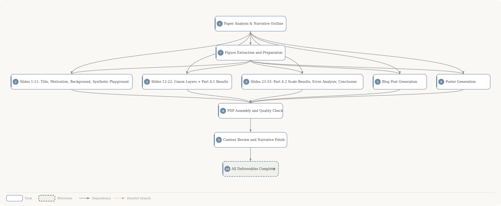

## Planning DAG

**10 tasks** &bull; **18 dependencies**

| # | Task | Depends on |
|:---:|------|------------|
| 1 | Paper Analysis & Narrative Outline | -- |
| 2 | Slides 1-11: Title, Motivation, Background, Synthetic Playground | #1, #7 |
| 3 | Slides 12-22: Canon Layers + Part 4.1 Results | #1, #7 |
| 4 | Slides 23-33: Part 4.2 Scale Results, Error Analysis, Conclusion | #1, #7 |
| 5 | Blog Post Generation | #1, #7 |
| 6 | Poster Generation | #1, #7 |
| 7 | Figure Extraction and Preparation | #1 |
| 8 | PDF Assembly and Quality Check | #2, #3, #4, #5, #6 |
| 9 | Content Review and Narrative Polish | #8 |
| 10 | ◆ **All Deliverables Complete** | #9 |

> ◆ = milestone
>
> **[View full task descriptions and prompts →](plan-detail.md)**
