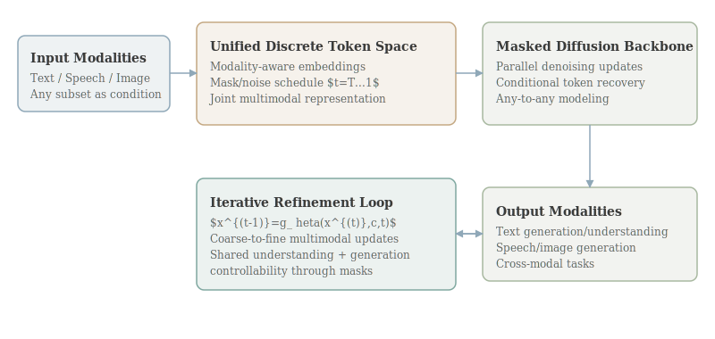

# HuggingFace Daily Papers - March 11, 2026

> [!summary] Compilation Metadata
> - Total papers: 30
> - In-depth analyses: 10
> - Generated: 2026-03-12 04:18:50.163 UTC

## Table of Contents

- [[daily-digest-2026-03-11|Daily Digest]]
- [[papers/01-geometry-guided-rl-3d-editing|#1 Geometry-Guided Reinforcement Learning for Multi-view Consistent 3D Scene Editing]] (122 upvotes, arXiv 2603.03143)
- [[papers/02-thinking-to-recall|#2 Thinking to Recall: How Reasoning Unlocks Parametric Knowledge in LLMs]] (44 upvotes, arXiv 2603.09906)
- [[papers/03-omni-diffusion|#3 Omni-Diffusion: Unified Multimodal Understanding and Generation with Masked Discrete Diffusion]] (37 upvotes, arXiv 2603.06577)
- [[papers/04-mm-zero|#4 MM-Zero: Self-Evolving Multi-Model Vision Language Models From Zero Data]] (36 upvotes, arXiv 2603.09206)
- [[papers/05-internvl-u|#5 InternVL-U: Democratizing Unified Multimodal Models for Understanding, Reasoning, Generation and Editing]] (28 upvotes, arXiv 2603.09877)
- [[papers/06-stepping-vlms-court|#6 Stepping VLMs onto the Court: Benchmarking Spatial Intelligence in Sports]] (21 upvotes, arXiv 2603.09896)
- [[papers/07-reading-not-thinking|#7 Reading, Not Thinking: Understanding and Bridging the Modality Gap When Text Becomes Pixels in Multimodal LLMs]] (21 upvotes, arXiv 2603.09095)
- [[papers/08-fish-audio-s2|#8 Fish Audio S2 Technical Report]] (13 upvotes, arXiv 2603.08823)
- [[papers/09-vlm-subtlebench|#9 VLM-SubtleBench: How Far Are VLMs from Human-Level Subtle Comparative Reasoning?]] (9 upvotes, arXiv 2603.07888)
- [[papers/10-audio-specialist-heads|#10 Are Audio-Language Models Listening? Audio-Specialist Heads for Adaptive Audio Steering]] (9 upvotes, arXiv 2603.06854)
- [Appendix: Data Sources](#appendix-data-sources)

---

## Daily Digest

# HuggingFace Daily Papers Digest — March 11, 2026

- Total papers: **30**
- Generated: **March 12, 2026 at 03:56:55 UTC**

## Language Models & NLP (6)

| Rank | Title | Upvotes |
|---|---|---:|
| 1 | [Thinking to Recall: How Reasoning Unlocks Parametric Knowledge in LLMs](https://arxiv.org/abs/2603.09906) | 44 |
| 2 | [The Reasoning Trap -- Logical Reasoning as a Mechanistic Pathway to Situational Awareness](https://arxiv.org/abs/2603.09200) | 3 |
| 3 | [Compiler-First State Space Duality and Portable O(1) Autoregressive Caching for Inference](https://arxiv.org/abs/2603.09555) | 1 |
| 4 | [ConFu: Contemplate the Future for Better Speculative Sampling](https://arxiv.org/abs/2603.08899) | 1 |
| 5 | [Multi-Head Low-Rank Attention](https://arxiv.org/abs/2603.02188) | 1 |
| 6 | [SAHOO: Safeguarded Alignment for High-Order Optimization Objectives in Recursive Self-Improvement](https://arxiv.org/abs/2603.06333) | 1 |

### 1. [Thinking to Recall: How Reasoning Unlocks Parametric Knowledge in LLMs](https://arxiv.org/abs/2603.09906)

- Authors: Zorik Gekhman, Roee Aharoni, Eran Ofek, et al.
- Upvotes: **44**
- Keywords: large language models, parametric knowledge recall, reasoning, computational buffer effect, factual priming, generative self-retrieval, hallucination, reasoning trajectories
- Links: [arXiv](https://arxiv.org/abs/2603.09906) · [PDF](https://arxiv.org/pdf/2603.09906) · [HuggingFace](https://huggingface.co/papers/2603.09906)

> [!info] Summary
> Reasoning in large language models enhances parametric knowledge recall through computational buffer and factual priming mechanisms, though it carries risks of hallucination that can be mitigated by prioritizing accurate reasoning trajectories. While reasoning in LLMs plays a natural role in math, code generation, and multi-hop factual questions, its effect on simple, single-hop factual questions remains unclear. Such questions do not require step-by-step logical decomposition, making the utility of reasoning highly counterintuitive. Nevertheless, we find that enabling reasoning substantially expands the capability boundary of the model's parametric knowledge recall, unlocking correct answers that are otherwise effectively unreachable.

> [!success] Key Contribution
> **We demonstrate that hallucinating intermediate facts during reasoning increases the likelihood of hallucinations in the final answer.**

### 2. [The Reasoning Trap -- Logical Reasoning as a Mechanistic Pathway to Situational Awareness](https://arxiv.org/abs/2603.09200)

- Authors: Subramanyam Sahoo, Aman Chadha, Vinija Jain, et al.
- Upvotes: **3**
- Keywords: logical reasoning, large language models, situational awareness, deductive self inference, inductive context recognition, abductive self modeling, RAISE framework, strategic deception, Mirror Test, Reasoning Safety Parity Principle
- Links: [arXiv](https://arxiv.org/abs/2603.09200) · [PDF](https://arxiv.org/pdf/2603.09200) · [HuggingFace](https://huggingface.co/papers/2603.09200)

> [!info] Summary
> The RAISE framework demonstrates how advances in logical reasoning capabilities within large language models can lead to increasingly sophisticated forms of situational awareness, potentially resulting in strategic deception, and proposes safety measures to address this... Situational awareness, the capacity of an AI system to recognize its own nature, understand its training and deployment context, and reason strategically about its circumstances, is widely considered among the most dangerous emergent capabilities in... Separately, a growing research effort seeks to improve the logical reasoning capabilities of large language models (LLMs) across deduction, induction, and abduction. In this paper, we argue that these two research trajectories are on a collision course.

> [!success] Key Contribution
> **We introduce the RAISE framework (Reasoning Advancing Into Self Examination), which identifies three mechanistic pathways through which improvements in logical reasoning enable progressively deeper levels of situation...**

### 3. [Compiler-First State Space Duality and Portable O(1) Autoregressive Caching for Inference](https://arxiv.org/abs/2603.09555)

- Authors: Cosmo Santoni
- Upvotes: **1**
- Keywords: state-space model, fused CUDA kernels, Triton kernels, XLA, Mamba-2, state space duality algorithm, diagonal state structure, chunkable recurrence, einsum-dominated compute, static control flow, compiled on-device cache, MFU, bandwidth utilisation, greedy decoding, float32 rounding tolerance, SSM recurrence, XLA backend
- Links: [arXiv](https://arxiv.org/abs/2603.09555) · [PDF](https://arxiv.org/pdf/2603.09555) · [HuggingFace](https://huggingface.co/papers/2603.09555) · [GitHub](https://github.com/CosmoNaught/mamba2-jax)

> [!info] Summary
> Mamba-2's state space model is implemented using XLA-optimized primitives without custom CUDA or Triton kernels, enabling cross-platform deployment and achieving high performance on TPU. State-space model releases are typically coupled to fused CUDA and Triton kernels, inheriting a hard dependency on NVIDIA hardware. We show that Mamba-2's state space duality algorithm -- diagonal state structure, chunkable recurrence, and einsum-dominated compute with static control flow -- maps cleanly onto what XLA's fusion and tiling passes actually optimise, making custom... We implement the full inference path (prefill, cached autoregressive decoding) as shaped standard primitives under XLA, without hand-written kernels, and realise the architecture's theoretical O(1) state management as a compiled on-device cache requiring no host...

> [!success] Key Contribution
> **We show that Mamba-2's state space duality algorithm -- diagonal state structure, chunkable recurrence, and einsum-dominated compute with static control flow -- maps cleanly onto what XLA's fusion and tiling passes ac...**

### 4. [ConFu: Contemplate the Future for Better Speculative Sampling](https://arxiv.org/abs/2603.08899)

- Authors: Zongyue Qin, Raghavv Goel, Mukul Gagrani, et al.
- Upvotes: **1**
- Keywords: speculative decoding, draft models, large language models, EAGLE series, token acceptance rate, continuous reasoning tokens, contemplate tokens, soft prompts, MoE, anchor token sampling, future prediction replication
- Links: [arXiv](https://arxiv.org/abs/2603.08899) · [PDF](https://arxiv.org/pdf/2603.08899) · [HuggingFace](https://huggingface.co/papers/2603.08899)

> [!info] Summary
> ConFu is a novel speculative decoding framework that enhances draft model performance by enabling future-oriented generation prediction through contemplate tokens and soft prompts, achieving improved token acceptance rates and faster inference speeds. Speculative decoding has emerged as a powerful approach to accelerate large language model (LLM) inference by employing lightweight draft models to propose candidate tokens that are subsequently verified by the target model. The effectiveness of this paradigm critically depends on the quality of the draft model. While recent advances such as the EAGLE series achieve state-of-the-art speedup, existing draft models remain limited by error accumulation: they condition only on the current prefix, causing their predictions to drift from the target model...

> [!success] Key Contribution
> **We propose ConFu (Contemplate the Future), a novel speculative decoding framework that enables draft models to anticipate the future direction of generation.**

### 5. [Multi-Head Low-Rank Attention](https://arxiv.org/abs/2603.02188)

- Authors: Songtao Liu, Hongwu Peng, Zhiwei Zhang, et al.
- Upvotes: **1**
- Keywords: Key--Value cache, decoding stage, High-Bandwidth Memory, Static Random-Access Memory, Multi-Head Latent Attention, Tensor Parallelism, latent states, Multi-Head Low-Rank Attention, perplexity, downstream task performance
- Links: [arXiv](https://arxiv.org/abs/2603.02188) · [PDF](https://arxiv.org/pdf/2603.02188) · [HuggingFace](https://huggingface.co/papers/2603.02188) · [GitHub](https://github.com/SongtaoLiu0823/MLRA)

> [!info] Summary
> Multi-Head Low-Rank Attention addresses long-context inference bottlenecks in large language models by enabling efficient 4-way tensor parallelism decoding through partitionable latent states. Long-context inference in large language models is bottlenecked by Key--Value (KV) cache loading during the decoding stage, where the sequential nature of generation requires repeatedly transferring the KV cache from off-chip High-Bandwidth Memory (HBM) to... While Multi-Head Latent Attention (MLA) significantly reduces the total KV cache size, it suffers from a sharding bottleneck during distributed decoding via Tensor Parallelism (TP). Since its single latent head cannot be partitioned, each device is forced to redundantly load the complete KV cache for every token, consuming excessive memory traffic and diminishing TP benefits like weight sharding.

> [!success] Key Contribution
> **We propose Multi-Head Low-Rank Attention (MLRA), which enables partitionable latent states for efficient 4-way TP decoding.**

### 6. [SAHOO: Safeguarded Alignment for High-Order Optimization Objectives in Recursive Self-Improvement](https://arxiv.org/abs/2603.06333)

- Authors: Subramanyam Sahoo, Aman Chadha, Vinija Jain, et al.
- Upvotes: **1**
- Keywords: recursive self-improvement, alignment drift, Goal Drift Index, multi-signal detector, constraint preservation, regression-risk quantification, code generation, mathematical reasoning, truthfulness, capability-alignment frontier
- Links: [arXiv](https://arxiv.org/abs/2603.06333) · [PDF](https://arxiv.org/pdf/2603.06333) · [HuggingFace](https://huggingface.co/papers/2603.06333)

> [!info] Summary
> SAHOO provides a framework for monitoring and controlling alignment drift in self-improving AI systems through goal drift detection, constraint preservation, and regression risk quantification across multiple domains. Recursive self-improvement is moving from theory to practice: modern systems can critique, revise, and evaluate their own outputs, yet iterative self-modification risks subtle alignment drift. We introduce SAHOO, a practical framework to monitor and control drift through three safeguards: (i) the Goal Drift Index (GDI), a learned multi-signal detector combining semantic, lexical, structural, and distributional measures; (ii) constraint preservation checks... Across 189 tasks in code generation, mathematical reasoning, and truthfulness, SAHOO produces substantial quality gains, including 18.3 percent improvement in code tasks and 16.8 percent in reasoning, while preserving constraints in two domains and maintaining...

> [!success] Key Contribution
> **We introduce SAHOO, a practical framework to monitor and control drift through three safeguards: (i) the Goal Drift Index (GDI), a learned multi-signal detector combining semantic, lexical, structural, and distributio...**

## Computer Vision & Multimodal (7)

| Rank | Title | Upvotes |
|---|---|---:|
| 7 | [InternVL-U: Democratizing Unified Multimodal Models for Understanding, Reasoning, Generation and Editing](https://arxiv.org/abs/2603.09877) | 28 |
| 8 | [Reading, Not Thinking: Understanding and Bridging the Modality Gap When Text Becomes Pixels in Multimodal LLMs](https://arxiv.org/abs/2603.09095) | 21 |
| 9 | [Stepping VLMs onto the Court: Benchmarking Spatial Intelligence in Sports](https://arxiv.org/abs/2603.09896) | 21 |
| 10 | [VLM-SubtleBench: How Far Are VLMs from Human-Level Subtle Comparative Reasoning?](https://arxiv.org/abs/2603.07888) | 9 |
| 11 | [Streaming Autoregressive Video Generation via Diagonal Distillation](https://arxiv.org/abs/2603.09488) | 5 |
| 12 | [BiCLIP: Domain Canonicalization via Structured Geometric Transformation](https://arxiv.org/abs/2603.08942) | 1 |
| 13 | [Micro-Diffusion Compression -- Binary Tree Tweedie Denoising for Online Probability Estimation](https://arxiv.org/abs/2603.08771) | 0 |

### 7. [InternVL-U: Democratizing Unified Multimodal Models for Understanding, Reasoning, Generation and Editing](https://arxiv.org/abs/2603.09877)

- Authors: Changyao Tian, Danni Yang, Guanzhou Chen, et al.
- Upvotes: **28**
- Keywords: Unified multimodal models, Multimodal Large Language Model, MMDiT-based visual generation head, Chain-of-Thought, visual representations, modality-specific modular design, unified contextual modeling, text rendering, scientific reasoning, high-semantic-density tasks
- Links: [arXiv](https://arxiv.org/abs/2603.09877) · [PDF](https://arxiv.org/pdf/2603.09877) · [HuggingFace](https://huggingface.co/papers/2603.09877) · [GitHub](https://github.com/OpenGVLab/InternVL-U)

> [!info] Summary
> InternVL-U is a 4-billion parameter unified multimodal model that combines advanced visual generation with robust semantic understanding through specialized modular design and reasoning-centric data synthesis. Unified multimodal models (UMMs) that integrate understanding, reasoning, generation, and editing face inherent trade-offs between maintaining strong semantic comprehension and acquiring powerful generation capabilities. In this report, we present InternVL-U, a lightweight 4B-parameter UMM that democratizes these capabilities within a unified framework. Guided by the principles of unified contextual modeling and modality-specific modular design with decoupled visual representations, InternVL-U integrates a state-of-the-art Multimodal Large Language Model (MLLM) with a specialized MMDiT-based visual generation head.

> [!success] Key Contribution
> **We present InternVL-U, a lightweight 4B-parameter UMM that democratizes these capabilities within a unified framework.**

### 8. [Reading, Not Thinking: Understanding and Bridging the Modality Gap When Text Becomes Pixels in Multimodal LLMs](https://arxiv.org/abs/2603.09095)

- Authors: Kaiser Sun, Xiaochuang Yuan, Hongjun Liu, et al.
- Upvotes: **21**
- Keywords: multimodal large language models, modality gap, visual text understanding, self-distillation, reasoning traces, GSM8K
- Links: [arXiv](https://arxiv.org/abs/2603.09095) · [PDF](https://arxiv.org/pdf/2603.09095) · [HuggingFace](https://huggingface.co/papers/2603.09095)

> [!info] Summary
> Multimodal large language models exhibit inconsistent performance when processing text from images versus textual tokens, with factors like rendering quality and task type influencing this modality gap, which can be mitigated through self-distillation techniques that... Multimodal large language models (MLLMs) can process text presented as images, yet they often perform worse than when the same content is provided as textual tokens. We systematically diagnose this "modality gap" by evaluating seven MLLMs across seven benchmarks in five input modes, spanning both synthetically rendered text and realistic document images from arXiv PDFs to Wikipedia pages. We find that the modality gap is task- and data-dependent.

> [!success] Key Contribution
> **We propose a self-distillation method that trains the model on its own pure text reasoning traces paired with image inputs, raising image-mode accuracy on GSM8K from 30.**

### 9. [Stepping VLMs onto the Court: Benchmarking Spatial Intelligence in Sports](https://arxiv.org/abs/2603.09896)

- Authors: Yuchen Yang, Yuqing Shao, Duxiu Huang, et al.
- Upvotes: **21**
- Keywords: spatial intelligence, vision-language models, CourtSI, CourtSI-Bench, CourtSI-Ext, Qwen3-VL-8B, fine-tuning, spatial-aware commentary generation
- Links: [arXiv](https://arxiv.org/abs/2603.09896) · [PDF](https://arxiv.org/pdf/2603.09896) · [HuggingFace](https://huggingface.co/papers/2603.09896) · [GitHub](https://github.com/Visionary-Laboratory/CourtSI)

> [!info] Summary
> CourtSI is a large-scale spatial intelligence dataset for sports scenarios that enables evaluation and improvement of vision-language models' understanding of human motion and object interactions. Sports have long attracted broad attention as they push the limits of human physical and cognitive capabilities. Amid growing interest in spatial intelligence for vision-language models (VLMs), sports provide a natural testbed for understanding high-intensity human motion and dynamic object interactions. To this end, we present CourtSI, the first large-scale spatial intelligence dataset tailored to sports scenarios.

> [!success] Key Contribution
> **We present CourtSI, the first large-scale spatial intelligence dataset tailored to sports scenarios.**

### 10. [VLM-SubtleBench: How Far Are VLMs from Human-Level Subtle Comparative Reasoning?](https://arxiv.org/abs/2603.07888)

- Authors: Minkyu Kim, Sangheon Lee, Dongmin Park
- Upvotes: **9**
- Keywords: vision-language models, comparative reasoning, benchmark, visual similarity, nuanced reasoning, paired question-image sets
- Links: [arXiv](https://arxiv.org/abs/2603.07888) · [PDF](https://arxiv.org/pdf/2603.07888) · [HuggingFace](https://huggingface.co/papers/2603.07888) · [GitHub](https://github.com/krafton-ai/VLM-SubtleBench)

> [!info] Summary
> VLM-SubtleBench is introduced as a benchmark for evaluating vision-language models on subtle comparative reasoning across diverse domains, revealing significant gaps between model and human performance. The ability to distinguish subtle differences between visually similar images is essential for diverse domains such as industrial anomaly detection, medical imaging, and aerial surveillance. While comparative reasoning benchmarks for vision-language models (VLMs) have recently emerged, they primarily focus on images with large, salient differences and fail to capture the nuanced reasoning required for real-world applications. In this work, we introduce VLM-SubtleBench, a benchmark designed to evaluate VLMs on subtle comparative reasoning.

> [!success] Key Contribution
> **We introduce VLM-SubtleBench, a benchmark designed to evaluate VLMs on subtle comparative reasoning.**

### 11. [Streaming Autoregressive Video Generation via Diagonal Distillation](https://arxiv.org/abs/2603.09488)

- Authors: Jinxiu Liu, Xuanming Liu, Kangfu Mei, et al.
- Upvotes: **5**
- Keywords: diffusion models, video distillation, autoregressive models, denoising autoencoders, temporal context, diagonal distillation, asymmetric generation strategy, implicit prediction, error propagation, optical flow modeling, motion coherence
- Links: [arXiv](https://arxiv.org/abs/2603.09488) · [PDF](https://arxiv.org/pdf/2603.09488) · [HuggingFace](https://huggingface.co/papers/2603.09488) · [GitHub](https://github.com/Sphere-AI-Lab/diagdistill)

> [!info] Summary
> Diagonal Distillation improves video generation speed and quality by leveraging temporal context and asymmetric denoising steps while addressing error accumulation and motion coherence issues in diffusion model distillation. Large pretrained diffusion models have significantly enhanced the quality of generated videos, and yet their use in real-time streaming remains limited. Autoregressive models offer a natural framework for sequential frame synthesis but require heavy computation to achieve high fidelity. Diffusion distillation can compress these models into efficient few-step variants, but existing video distillation approaches largely adapt image-specific methods that neglect temporal dependencies.

> [!success] Key Contribution
> **We propose Diagonal Distillation, which operates orthogonally to existing approaches and better exploits temporal information across both video chunks and denoising steps.**

### 12. [BiCLIP: Domain Canonicalization via Structured Geometric Transformation](https://arxiv.org/abs/2603.08942)

- Authors: Pranav Mantini, Shishir K. Shah
- Upvotes: **1**
- Keywords: vision-language models, canonical transformation, geometric transformation, cross-modal alignment, bilinear transformation, domain adaptation, few-shot classification, multimodal features, canonicalized geometric transformation, structured alignment
- Links: [arXiv](https://arxiv.org/abs/2603.08942) · [PDF](https://arxiv.org/pdf/2603.08942) · [HuggingFace](https://huggingface.co/papers/2603.08942) · [GitHub](https://github.com/QuantitativeImagingLaboratory/BilinearCLIP)

> [!info] Summary
> Vision-language models can be adapted to specialized domains through a simple bilinear transformation that aligns multimodal features via geometric canonicalization, achieving state-of-the-art results on multiple benchmarks. Recent advances in vision-language models (VLMs) have demonstrated remarkable zero-shot capabilities, yet adapting these models to specialized domains remains a significant challenge. Building on recent theoretical insights suggesting that independently trained VLMs are related by a canonical transformation, we extend this understanding to the concept of domains. We hypothesize that image features across disparate domains are related by a canonicalized geometric transformation that can be recovered using a small set of anchors.

> [!success] Key Contribution
> **We introduce BiCLIP, a framework that applies a targeted transformation to multimodal features to enhance cross-modal alignment.**

### 13. [Micro-Diffusion Compression -- Binary Tree Tweedie Denoising for Online Probability Estimation](https://arxiv.org/abs/2603.08771)

- Authors: Roberto Tacconelli
- Upvotes: **0**
- Keywords: lossless compression, micro-diffusion denoising layer, adaptive statistical models, probability estimates, Prediction by Partial Matching, shrinkage process, empirical calibration statistics, bitwise tree, binary calibration tasks, residual prediction errors, post-blend calibration, trie-based word model, high-order context model
- Links: [arXiv](https://arxiv.org/abs/2603.08771) · [PDF](https://arxiv.org/pdf/2603.08771) · [HuggingFace](https://huggingface.co/papers/2603.08771) · [GitHub](https://github.com/robtacconelli/midicoth)

> [!info] Summary
> Midicoth enhances compression efficiency by applying a micro-diffusion denoising layer to refine probability estimates in adaptive statistical models, addressing limitations in sparse data scenarios through hierarchical binary decision making and iterative error correction. We present Midicoth, a lossless compression system that introduces a micro-diffusion denoising layer for improving probability estimates produced by adaptive statistical models. In compressors such as Prediction by Partial Matching (PPM), probability estimates are smoothed by a prior to handle sparse observations. When contexts have been seen only a few times, this prior dominates the prediction and produces distributions that are significantly flatter than the true source distribution, leading to compression inefficiency.

> [!success] Key Contribution
> **We present Midicoth, a lossless compression system that introduces a micro-diffusion denoising layer for improving probability estimates produced by adaptive statistical models.**

## Reinforcement Learning & Agents (10)

| Rank | Title | Upvotes |
|---|---|---:|
| 14 | [Geometry-Guided Reinforcement Learning for Multi-view Consistent 3D Scene Editing](https://arxiv.org/abs/2603.03143) | 122 |
| 15 | [MM-Zero: Self-Evolving Multi-Model Vision Language Models From Zero Data](https://arxiv.org/abs/2603.09206) | 36 |
| 16 | [MiniAppBench: Evaluating the Shift from Text to Interactive HTML Responses in LLM-Powered Assistants](https://arxiv.org/abs/2603.09652) | 8 |
| 17 | [Test-Driven AI Agent Definition (TDAD): Compiling Tool-Using Agents from Behavioral Specifications](https://arxiv.org/abs/2603.08806) | 5 |
| 18 | [Decoupling Reasoning and Confidence: Resurrecting Calibration in Reinforcement Learning from Verifiable Rewards](https://arxiv.org/abs/2603.09117) | 3 |
| 19 | [BrandFusion: A Multi-Agent Framework for Seamless Brand Integration in Text-to-Video Generation](https://arxiv.org/abs/2603.02816) | 2 |
| 20 | [ReflexiCoder: Teaching Large Language Models to Self-Reflect on Generated Code and Self-Correct It via Reinforcement Learning](https://arxiv.org/abs/2603.05863) | 2 |
| 21 | [Reward Prediction with Factorized World States](https://arxiv.org/abs/2603.09400) | 2 |
| 22 | [Towards a Neural Debugger for Python](https://arxiv.org/abs/2603.09951) | 2 |
| 23 | [Beyond Test-Time Training: Learning to Reason via Hardware-Efficient Optimal Control](https://arxiv.org/abs/2603.09221) | 0 |

### 14. [Geometry-Guided Reinforcement Learning for Multi-view Consistent 3D Scene Editing](https://arxiv.org/abs/2603.03143)

- Authors: Jiyuan Wang, Chunyu Lin, Lei Sun, et al.
- Upvotes: **122**
- Keywords: diffusion models, reinforcement learning, 3D editing, multi-view consistency, supervised fine-tuning, VGGT, reward signals, 3D foundation model
- Links: [arXiv](https://arxiv.org/abs/2603.03143) · [PDF](https://arxiv.org/pdf/2603.03143) · [HuggingFace](https://huggingface.co/papers/2603.03143) · [GitHub](https://github.com/AMAP-ML/RL3DEdit)

> [!info] Summary
> RL3DEdit uses reinforcement learning with rewards from a 3D foundation model to achieve multi-view consistent 3D editing from 2D editing priors. Leveraging the priors of 2D diffusion models for 3D editing has emerged as a promising paradigm. However, maintaining multi-view consistency in edited results remains challenging, and the extreme scarcity of 3D-consistent editing paired data renders supervised fine-tuning (SFT), the most effective training strategy for editing tasks, infeasible. In this paper, we observe that, while generating multi-view consistent 3D content is highly challenging, verifying 3D consistency is tractable, naturally positioning reinforcement learning (RL) as a feasible solution.

> [!success] Key Contribution
> **We propose RL3DEdit, a single-pass framework driven by RL optimization with novel rewards derived from the 3D foundation model, VGGT.**

### 15. [MM-Zero: Self-Evolving Multi-Model Vision Language Models From Zero Data](https://arxiv.org/abs/2603.09206)

- Authors: Zongxia Li, Hongyang Du, Chengsong Huang, et al.
- Upvotes: **36**
- Keywords: self-evolving, Large Language Models, Vision Language Models, reinforcement learning, multimodal reasoning, Group Relative Policy Optimization, visual concepts, executable code, visual verification, difficulty balancing
- Links: [arXiv](https://arxiv.org/abs/2603.09206) · [PDF](https://arxiv.org/pdf/2603.09206) · [HuggingFace](https://huggingface.co/papers/2603.09206) · [GitHub](https://github.com/zli12321/MM-Zero)

> [!info] Summary
> MM-Zero enables zero-data self-evolution of vision-language models through a multi-role framework with proposer, coder, and solver components trained via group relative policy optimization. Self-evolving has emerged as a key paradigm for improving foundational models such as Large Language Models (LLMs) and Vision Language Models (VLMs) with minimal human intervention. While recent approaches have demonstrated that LLM agents can self-evolve from scratch with little to no data, VLMs introduce an additional visual modality that typically requires at least some seed data, such as images, to... In this work, we present Multi-model Multimodal Zero (MM-Zero), the first RL-based framework to achieve zero-data self-evolution for VLM reasoning.

> [!success] Key Contribution
> **We present Multi-model Multimodal Zero (MM-Zero), the first RL-based framework to achieve zero-data self-evolution for VLM reasoning.**

### 16. [MiniAppBench: Evaluating the Shift from Text to Interactive HTML Responses in LLM-Powered Assistants](https://arxiv.org/abs/2603.09652)

- Authors: Zuhao Zhang, Chengyue Yu, Yuante Li, et al.
- Upvotes: **8**
- Keywords: Large Language Models, MiniApps, interactive application generation, benchmark, agentic evaluation framework, browser automation, human-like exploratory testing
- Links: [arXiv](https://arxiv.org/abs/2603.09652) · [PDF](https://arxiv.org/pdf/2603.09652) · [HuggingFace](https://huggingface.co/papers/2603.09652) · [GitHub](https://github.com/MiniAppBench/miniappbench)

> [!info] Summary
> MiniAppBench introduces the first comprehensive benchmark for evaluating principle-driven, interactive application generation, addressing the gap in existing benchmarks that focus on static correctness rather than dynamic, real-world interactions. With the rapid advancement of Large Language Models (LLMs) in code generation, human-AI interaction is evolving from static text responses to dynamic, interactive HTML-based applications, which we term MiniApps. These applications require models to not only render visual interfaces but also construct customized interaction logic that adheres to real-world principles. However, existing benchmarks primarily focus on algorithmic correctness or static layout reconstruction, failing to capture the capabilities required for this new paradigm.

> [!success] Key Contribution
> **We introduce MiniAppBench, the first comprehensive benchmark designed to evaluate principle-driven, interactive application generation.**

### 17. [Test-Driven AI Agent Definition (TDAD): Compiling Tool-Using Agents from Behavioral Specifications](https://arxiv.org/abs/2603.08806)

- Authors: Tzafrir Rehan
- Upvotes: **5**
- Keywords: agent prompts, behavioral specifications, coding agent, prompt refinement, tool-using LLM agents, specification gaming, test-driven development, semantic mutation testing, spec evolution scenarios, SpecSuite-Core
- Links: [arXiv](https://arxiv.org/abs/2603.08806) · [PDF](https://arxiv.org/pdf/2603.08806) · [HuggingFace](https://huggingface.co/papers/2603.08806) · [GitHub](https://github.com/f-labs-io/tdad-paper-code)

> [!info] Summary
> TDAD is a methodology for developing AI agents that uses behavioral specifications and automated testing to ensure reliable and compliant deployment of language model agents in production environments. We present Test-Driven AI Agent Definition (TDAD), a methodology that treats agent prompts as compiled artifacts: engineers provide behavioral specifications, a coding agent converts them into executable tests, and a second coding agent iteratively refines... Deploying tool-using LLM agents in production requires measurable behavioral compliance that current development practices cannot provide. Small prompt changes cause silent regressions, tool misuse goes undetected, and policy violations emerge only after deployment.

> [!success] Key Contribution
> **We present Test-Driven AI Agent Definition (TDAD), a methodology that treats agent prompts as compiled artifacts: engineers provide behavioral specifications, a coding agent converts them into executable tests, and a...**

### 18. [Decoupling Reasoning and Confidence: Resurrecting Calibration in Reinforcement Learning from Verifiable Rewards](https://arxiv.org/abs/2603.09117)

- Authors: Zhengzhao Ma, Xueru Wen, Boxi Cao, et al.
- Upvotes: **3**
- Keywords: reinforcement learning from verifiable rewards, large language models, calibration degeneration, policy accuracy, calibration error, gradient conflict, direct comparison policy optimization, GRPO
- Links: [arXiv](https://arxiv.org/abs/2603.09117) · [PDF](https://arxiv.org/pdf/2603.09117) · [HuggingFace](https://huggingface.co/papers/2603.09117) · [GitHub](https://github.com/icip-cas/DCPO)

> [!info] Summary
> DCPO framework decouples reasoning and calibration objectives in LLMs to address calibration degeneration while maintaining high accuracy. Reinforcement Learning from Verifiable Rewards (RLVR) significantly enhances large language models (LLMs) reasoning but severely suffers from calibration degeneration, where models become excessively over-confident in incorrect answers. Previous studies devote to directly incorporating calibration objective into existing optimization target. However, our theoretical analysis demonstrates that there exists a fundamental gradient conflict between the optimization for maximizing policy accuracy and minimizing calibration error.

> [!success] Key Contribution
> **We propose DCPO, a simple yet effective framework that systematically decouples reasoning and calibration objectives.**

### 19. [BrandFusion: A Multi-Agent Framework for Seamless Brand Integration in Text-to-Video Generation](https://arxiv.org/abs/2603.02816)

- Authors: Zihao Zhu, Ruotong Wang, Siwei Lyu, et al.
- Upvotes: **2**
- Keywords: text-to-video models, brand integration, multi-agent framework, brand knowledge base, prompt refinement, semantic preservation, brand recognizability, contextual tracking, iterative refinement
- Links: [arXiv](https://arxiv.org/abs/2603.02816) · [PDF](https://arxiv.org/pdf/2603.02816) · [HuggingFace](https://huggingface.co/papers/2603.02816)

> [!info] Summary
> BrandFusion is a multi-agent framework that integrates advertiser brands into text-to-video generation while maintaining semantic fidelity and brand recognizability. The rapid advancement of text-to-video (T2V) models has revolutionized content creation, yet their commercial potential remains largely untapped. We introduce, for the first time, the task of seamless brand integration in T2V: automatically embedding advertiser brands into prompt-generated videos while preserving semantic fidelity to user intent. This task confronts three core challenges: maintaining prompt fidelity, ensuring brand recognizability, and achieving contextually natural integration.

> [!success] Key Contribution
> **We introduce, for the first time, the task of seamless brand integration in T2V: automatically embedding advertiser brands into prompt-generated videos while preserving semantic fidelity to user intent.**

### 20. [ReflexiCoder: Teaching Large Language Models to Self-Reflect on Generated Code and Self-Correct It via Reinforcement Learning](https://arxiv.org/abs/2603.05863)

- Authors: Juyong Jiang, Jiasi Shen, Sunghun Kim, et al.
- Upvotes: **2**
- Keywords: Large Language Models, reinforcement learning, code generation, iterative refinement, external oracles, prompt-response cycles, RL-zero training, granular reward functions, self-reflection, self-correction, inference time, token efficiency, computational overhead
- Links: [arXiv](https://arxiv.org/abs/2603.05863) · [PDF](https://arxiv.org/pdf/2603.05863) · [HuggingFace](https://huggingface.co/papers/2603.05863) · [GitHub](https://github.com/juyongjiang/ReflexiCoder)

> [!info] Summary
> ReflexiCoder uses reinforcement learning to enable large language models to perform autonomous code debugging and optimization through internalized reflection and correction mechanisms, achieving state-of-the-art performance with reduced computational overhead. While Large Language Models (LLMs) have revolutionized code generation, standard "System 1" approaches, generating solutions in a single forward pass, often hit a performance ceiling when faced with complex algorithmic tasks. Existing iterative refinement strategies attempt to bridge this gap at inference time, yet they predominantly rely on external oracles, execution feedback, or computationally expensive prompt-response cycles. In this work, we propose ReflexiCoder, a novel reinforcement learning (RL) framework that internalizes the structured reasoning trajectory, encompassing initial generation, bug and optimization aware reflection, and self-correction, directly into the model's weights.

> [!success] Key Contribution
> **We propose ReflexiCoder, a novel reinforcement learning (RL) framework that internalizes the structured reasoning trajectory, encompassing initial generation, bug and optimization aware reflection, and self-correction...**

### 21. [Reward Prediction with Factorized World States](https://arxiv.org/abs/2603.09400)

- Authors: Yijun Shen, Delong Chen, Xianming Hu, et al.
- Upvotes: **2**
- Keywords: reward prediction, state representation, factorized representation, hierarchical object-attribute structure, language models, semantic similarity, reward generalization, EPIC distance, agent planning, reactive policies, system-1 policies, system-2 agents
- Links: [arXiv](https://arxiv.org/abs/2603.09400) · [PDF](https://arxiv.org/pdf/2603.09400) · [HuggingFace](https://huggingface.co/papers/2603.09400) · [GitHub](https://github.com/yijunshens/StateFactory)

> [!info] Summary
> StateFactory enables reward prediction across domains by transforming observations into hierarchical object-attribute structures using language models, demonstrating superior zero-shot generalization compared to vision-language and large language model reward predictors. Agents must infer action outcomes and select actions that maximize a reward signal indicating how close the goal is to being reached. Supervised learning of reward models could introduce biases inherent to training data, limiting generalization to novel goals and environments. In this paper, we investigate whether well-defined world state representations alone can enable accurate reward prediction across domains.

> [!success] Key Contribution
> **We introduce StateFactory, a factorized representation method that transforms unstructured observations into a hierarchical object-attribute structure using language models.**

### 22. [Towards a Neural Debugger for Python](https://arxiv.org/abs/2603.09951)

- Authors: Maximilian Beck, Jonas Gehring, Jannik Kossen, et al.
- Upvotes: **2**
- Keywords: language models, neural interpreters, code execution, line-by-line execution prediction, debugger emulation, forward execution, inverse execution, conditional execution modeling, CruxEval, agentic coding systems, world model, simulated debugging environments
- Links: [arXiv](https://arxiv.org/abs/2603.09951) · [PDF](https://arxiv.org/pdf/2603.09951) · [HuggingFace](https://huggingface.co/papers/2603.09951)

> [!info] Summary
> Neural debuggers are language models that emulate traditional debuggers by supporting interactive control operations like stepping and breakpoint setting, enabling both forward and inverse execution prediction conditioned on debugger actions. Training large language models (LLMs) on Python execution traces grounds them in code execution and enables the line-by-line execution prediction of whole Python programs, effectively turning them into neural interpreters (FAIR CodeGen Team et al.,... However, developers rarely execute programs step by step; instead, they use debuggers to stop execution at certain breakpoints and step through relevant portions only while inspecting or modifying program variables. Existing neural interpreter approaches lack such interactive control.

> [!success] Key Contribution
> **We introduce neural debuggers: language models that emulate traditional debuggers, supporting operations such as stepping into, over, or out of functions, as well as setting breakpoints at specific source lines.**

### 23. [Beyond Test-Time Training: Learning to Reason via Hardware-Efficient Optimal Control](https://arxiv.org/abs/2603.09221)

- Authors: Peihao Wang, Shan Yang, Xijun Wang, et al.
- Upvotes: **0**
- Keywords: associative memory, sequential models, reinforcement learning, test-time training, optimal control, Test-Time Control (TTC) layer, finite-horizon LQR planning, latent states, value function, nested objective, hardware-efficient LQR solver, symplectic formulation, fused CUDA kernel, pretrained LLMs, mathematical reasoning, MATH-500, AMC, AIME
- Links: [arXiv](https://arxiv.org/abs/2603.09221) · [PDF](https://arxiv.org/pdf/2603.09221) · [HuggingFace](https://huggingface.co/papers/2603.09221) · [GitHub](https://github.com/VITA-Group/TTC-Net)

> [!info] Summary
> Test-Time Control layer integrates optimal control theory into language models for enhanced reasoning, using LQR planning and hardware-efficient solvers to improve mathematical problem-solving performance. Associative memory has long underpinned the design of sequential models. Beyond recall, humans reason by projecting future states and selecting goal-directed actions, a capability that modern language models increasingly require but do not natively encode. While prior work uses reinforcement learning or test-time training, planning remains external to the model architecture.

> [!success] Key Contribution
> **Test-Time Control layer integrates optimal control theory into language models for enhanced reasoning, using LQR planning and hardware-efficient solvers to improve mathematical problem-solving performance.**

## Audio, Speech & Music (6)

| Rank | Title | Upvotes |
|---|---|---:|
| 24 | [Omni-Diffusion: Unified Multimodal Understanding and Generation with Masked Discrete Diffusion](https://arxiv.org/abs/2603.06577) | 37 |
| 25 | [Fish Audio S2 Technical Report](https://arxiv.org/abs/2603.08823) | 13 |
| 26 | [Are Audio-Language Models Listening? Audio-Specialist Heads for Adaptive Audio Steering](https://arxiv.org/abs/2603.06854) | 9 |
| 27 | [Do What I Say: A Spoken Prompt Dataset for Instruction-Following](https://arxiv.org/abs/2603.09881) | 6 |
| 28 | [Bolbosh: Script-Aware Flow Matching for Kashmiri Text-to-Speech](https://arxiv.org/abs/2603.07513) | 1 |
| 29 | [A Text-Native Interface for Generative Video Authoring](https://arxiv.org/abs/2603.09072) | 0 |

### 24. [Omni-Diffusion: Unified Multimodal Understanding and Generation with Masked Discrete Diffusion](https://arxiv.org/abs/2603.06577)

- Authors: Lijiang Li, Zuwei Long, Yunhang Shen, et al.
- Upvotes: **37**
- Keywords: multimodal large language models, autoregressive architecture, discrete diffusion models, mask-based discrete diffusion models, multimodal systems, discrete multimodal tokens, bimodal tasks, multimodal foundation models
- Links: [arXiv](https://arxiv.org/abs/2603.06577) · [PDF](https://arxiv.org/pdf/2603.06577) · [HuggingFace](https://huggingface.co/papers/2603.06577) · [GitHub](https://github.com/VITA-MLLM/Omni-Diffusion)

> [!info] Summary
> Omni-Diffusion introduces the first any-to-any multimodal language model based on mask-based discrete diffusion models, unifying text, speech, and image processing in a single framework. While recent multimodal large language models (MLLMs) have made impressive strides, they predominantly employ a conventional autoregressive architecture as their backbone, leaving significant room to explore effective and efficient alternatives in architectural design. Concurrently, recent studies have successfully applied discrete diffusion models to various domains, such as visual understanding and image generation, revealing their considerable potential as a promising backbone for multimodal systems. Drawing inspiration from these pioneering research, we introduce Omni-Diffusion, the first any-to-any multimodal language model built entirely on mask-based discrete diffusion models, which unifies understanding and generation across text, speech, and images.

> [!success] Key Contribution
> **We introduce Omni-Diffusion, the first any-to-any multimodal language model built entirely on mask-based discrete diffusion models, which unifies understanding and generation across text, speech, and images.**

### 25. [Fish Audio S2 Technical Report](https://arxiv.org/abs/2603.08823)

- Authors: Shijia Liao, Yuxuan Wang, Songting Liu, et al.
- Upvotes: **13**
- Keywords: text-to-speech, multi-speaker, multi-turn generation, instruction-following control, natural-language descriptions, multi-stage training, staged data pipeline, video captioning, speech captioning, voice-quality assessment, reward modeling, SGLang-based inference engine, RTF, time-to-first-audio
- Links: [arXiv](https://arxiv.org/abs/2603.08823) · [PDF](https://arxiv.org/pdf/2603.08823) · [HuggingFace](https://huggingface.co/papers/2603.08823)

> [!info] Summary
> Fish Audio S2 is an open-source text-to-speech system with multi-speaker capabilities, multi-turn generation, and instruction-following control through natural-language descriptions, utilizing a multi-stage training approach and production-ready inference engine. We introduce Fish Audio S2, an open-sourced text-to-speech system featuring multi-speaker, multi-turn generation, and, most importantly, instruction-following control via natural-language descriptions. To scale training, we develop a multi-stage training recipe together with a staged data pipeline covering video captioning and speech captioning, voice-quality assessment, and reward modeling. To push the frontier of open-source TTS, we release our model weights, fine-tuning code, and an SGLang-based inference engine.

> [!success] Key Contribution
> **We introduce Fish Audio S2, an open-sourced text-to-speech system featuring multi-speaker, multi-turn generation, and, most importantly, instruction-following control via natural-language descriptions.**

### 26. [Are Audio-Language Models Listening? Audio-Specialist Heads for Adaptive Audio Steering](https://arxiv.org/abs/2603.06854)

- Authors: Neta Glazer, Lenny Aharon, Ethan Fetaya
- Upvotes: **9**
- Keywords: multimodal large language models, large audio-language models, mechanistic interpretability, attention heads, audio attention, listening signal, audio--silence steering direction, inference-time activation intervention, MMAU, Qwen-based LALMs
- Links: [arXiv](https://arxiv.org/abs/2603.06854) · [PDF](https://arxiv.org/pdf/2603.06854) · [HuggingFace](https://huggingface.co/papers/2603.06854)

> [!info] Summary
> Mechanistic interpretability identifies audio-specialist attention heads in large audio-language models to enhance audio utilization through activation interventions at inference time. Multimodal large language models can exhibit text dominance, over-relying on linguistic priors instead of grounding predictions in non-text inputs. One example is large audio-language models (LALMs) where decisive audio evidence can be under-utilized even when it contains important information. To address this issue we use mechanistic interpretability to identify a small set of audio-specialist attention heads whose audio attention yields a ``listening'' signal.

> [!success] Key Contribution
> **We show that this signal increases when audio evidence affects the model's output, providing an indicator of audio engagement under standard prompting.**

### 27. [Do What I Say: A Spoken Prompt Dataset for Instruction-Following](https://arxiv.org/abs/2603.09881)

- Authors: Maike Züfle, Sara Papi, Fabian Retkowski, et al.
- Upvotes: **6**
- Keywords: Speech Large Language Models, multilingual dataset, spoken prompts, written prompts, benchmarking, prompt modality, task type, language, cross-lingual settings, speech-output tasks
- Links: [arXiv](https://arxiv.org/abs/2603.09881) · [PDF](https://arxiv.org/pdf/2603.09881) · [HuggingFace](https://huggingface.co/papers/2603.09881) · [GitHub](https://github.com/MaikeZuefle/DOWIS)

> [!info] Summary
> Speech Large Language Models are evaluated using a new multilingual dataset that pairs spoken and written prompts across multiple tasks and languages, revealing that text prompts generally outperform spoken prompts except in speech-output tasks. Speech Large Language Models (SLLMs) have rapidly expanded, supporting a wide range of tasks. These models are typically evaluated using text prompts, which may not reflect real-world scenarios where users interact with speech. To address this gap, we introduce DoWhatISay (DOWIS), a multilingual dataset of human-recorded spoken and written prompts designed to pair with any existing benchmark for realistic evaluation of SLLMs under spoken instruction conditions.

> [!success] Key Contribution
> **We introduce DoWhatISay (DOWIS), a multilingual dataset of human-recorded spoken and written prompts designed to pair with any existing benchmark for realistic evaluation of SLLMs under spoken instruction conditions.**

### 28. [Bolbosh: Script-Aware Flow Matching for Kashmiri Text-to-Speech](https://arxiv.org/abs/2603.07513)

- Authors: Tajamul Ashraf, Burhaan Rasheed Zargar, Saeed Abdul Muizz, et al.
- Upvotes: **1**
- Keywords: Text-to-Speech, neural TTS, Optimal Transport Conditional Flow Matching, OT-CFM, Matcha-TTS, cross-lingual adaptation, flow-based adaptation, diacritics, phonotactics, Mel-Cepstral Distortion, Mean Opinion Score, acoustic enhancement, dereverberation, silence trimming, loudness normalization
- Links: [arXiv](https://arxiv.org/abs/2603.07513) · [PDF](https://arxiv.org/pdf/2603.07513) · [HuggingFace](https://huggingface.co/papers/2603.07513) · [GitHub](https://github.com/gaash-lab/Bolbosh)

> [!info] Summary
> A novel neural text-to-speech system for Kashmiri addresses challenges in diacritic modeling and limited data through supervised cross-lingual adaptation and acoustic enhancement techniques. Kashmiri is spoken by around 7 million people but remains critically underserved in speech technology, despite its official status and rich linguistic heritage. The lack of robust Text-to-Speech (TTS) systems limits digital accessibility and inclusive human-computer interaction for native speakers. In this work, we present the first dedicated open-source neural TTS system designed for Kashmiri.

> [!success] Key Contribution
> **We present the first dedicated open-source neural TTS system designed for Kashmiri.**

### 29. [A Text-Native Interface for Generative Video Authoring](https://arxiv.org/abs/2603.09072)

- Authors: Xingyu Bruce Liu, Mira Dontcheva, Dingzeyu Li
- Upvotes: **0**
- Keywords: N/A
- Links: [arXiv](https://arxiv.org/abs/2603.09072) · [PDF](https://arxiv.org/pdf/2603.09072) · [HuggingFace](https://huggingface.co/papers/2603.09072)

> [!info] Summary
> Everyone can write their stories in freeform text format -- it's something we all learn in school. Yet storytelling via video requires one to learn specialized and complicated tools. In this paper, we introduce Doki, a text-native interface for generative video authoring, aligning video creation with the natural process of text writing. In Doki, writing text is the primary interaction: within a single document, users define assets, structure scenes, create shots, refine edits, and add audio.

> [!success] Key Contribution
> **We introduce Doki, a text-native interface for generative video authoring, aligning video creation with the natural process of text writing.**

## Science & Mathematics (0)

| Rank | Title | Upvotes |
|---|---|---:|

## Systems & Infrastructure (1)

| Rank | Title | Upvotes |
|---|---|---:|
| 30 | [TALON: Test-time Adaptive Learning for On-the-Fly Category Discovery](https://arxiv.org/abs/2603.08075) | 0 |

### 30. [TALON: Test-time Adaptive Learning for On-the-Fly Category Discovery](https://arxiv.org/abs/2603.08075)

- Authors: Yanan Wu, Yuhan Yan, Tailai Chen, et al.
- Upvotes: **0**
- Keywords: on-the-fly category discovery, hash-based framework, feature quantization, category explosion, test-time adaptation, semantic-aware prototype update, stable test-time encoder update, margin-aware logit calibration, intra-class variance, inter-class margins
- Links: [arXiv](https://arxiv.org/abs/2603.08075) · [PDF](https://arxiv.org/pdf/2603.08075) · [HuggingFace](https://huggingface.co/papers/2603.08075) · [GitHub](https://github.com/ynanwu/TALON)

> [!info] Summary
> A test-time adaptation framework for on-the-fly category discovery that dynamically updates prototypes and encoder parameters while calibrating logits to improve novel class recognition and prevent category explosion. On-the-fly category discovery (OCD) aims to recognize known categories while simultaneously discovering novel ones from an unlabeled online stream, using a model trained only on labeled data. Existing approaches freeze the feature extractor trained offline and employ a hash-based framework that quantizes features into binary codes as class prototypes. However, discovering novel categories with a fixed knowledge base is counterintuitive, as the learning potential of incoming data is entirely neglected.

> [!success] Key Contribution
> **We propose a test-time adaptation framework that enables learning through discovery.**

## Other (0)

| Rank | Title | Upvotes |
|---|---|---:|

---

## In-Depth Analysis #1: Geometry-Guided Reinforcement Learning for Multi-view Consistent 3D Scene Editing

# Geometry-Guided Reinforcement Learning for Multi-view Consistent 3D Scene Editing

- **Authors:** Jiyuan Wang, Chunyu Lin, Lei Sun, Zhi Cao, Yuyang Yin, Lang Nie, Zhenlong Yuan, Xiangxiang Chu, Yunchao Wei, Kang Liao, Guosheng Lin
- **arXiv:** 2603.03143
- **Daily rank:** 1
- **Upvotes:** 122
- **Tags:** [daily papers]
- **Generated:** 2026-03-12 04:14:48.640 UTC

> [!note] Source Coverage
> Primary analysis source: AlphaXiv overview available. AlphaXiv full-text markdown available and used for method/equation detail.

> [!abstract] TL;DR
> RL3DEdit reframes multi-view consistent 3D scene editing as a reinforcement learning problem instead of a supervised finetuning problem. The key move is to keep a strong 2D diffusion prior intact, then optimize it with geometry-aware rewards so edited views remain coherent across camera poses. The paper matters because it identifies a realistic training bottleneck: paired, 3D-consistent editing supervision is scarce, but 3D-consistency verification is tractable. By using VGGT-derived confidence and pose signals as rewards, the system reports stronger consistency and better edit quality than prior baselines at practical runtime.
>
> **Who should read this:** This analysis is most useful for researchers working on 3D generation/editing, RL-based post-training, and teams building production pipelines where consistency across views is more important than single-image photorealism.

## 1. Header

Geometry-Guided RL for 3D Scene Editing is ranked #1 by upvotes in the HuggingFace daily list for 2026-03-11. This document follows the comprehensive-depth format and emphasizes technical mechanism, theoretical framing, and practical implications for post-training and multimodal system design.

## 2. TL;DR

RL3DEdit reframes multi-view consistent 3D scene editing as a reinforcement learning problem instead of a supervised finetuning problem. The key move is to keep a strong 2D diffusion prior intact, then optimize it with geometry-aware rewards so edited views remain coherent across camera poses.

The paper matters because it identifies a realistic training bottleneck: paired, 3D-consistent editing supervision is scarce, but 3D-consistency verification is tractable. By using VGGT-derived confidence and pose signals as rewards, the system reports stronger consistency and better edit quality than prior baselines at practical runtime.

This analysis is most useful for researchers working on 3D generation/editing, RL-based post-training, and teams building production pipelines where consistency across views is more important than single-image photorealism.

## 3. Background & Prerequisites

> [!info] Background & Prerequisites
> Recent 3D editing systems often inherit their semantic control from 2D diffusion models because text-guided 2D editing has matured quickly. However, those models are not inherently constrained by scene geometry. If each rendered view is edited independently, tiny local decisions in one view become global inconsistencies when the scene is observed from another angle. This mismatch appears as texture drift, shape wobble, and contradictory object boundaries across views. A core prerequisite is understanding why supervised finetuning is difficult in this setting. High-quality paired data would need original multi-view scene observations, desired edited targets, and consistent camera calibration for every sample. Collecting this at scale is expensive, and synthetic data is often too clean or too narrow. As a result, many methods rely on heuristic regularizers that enforce local smoothness but do not encode global 3D faithfulness. This paper builds on the idea that verification can be easier than generation. The model does not need ground-truth 3D edited labels if a separate 3D-aware model can score whether generated views are mutually consistent. That creates a useful split: the diffusion editor proposes candidate edits, and a geometry model evaluates whether those edits lie on a consistent manifold. RL can then optimize for the evaluator-defined objective even without explicit paired targets. Another prerequisite concept is reward shaping in high-dimensional generation tasks. Naive scalar rewards can be noisy and unstable, especially when each action corresponds to image-level denoising behavior. RL3DEdit addresses this by combining multiple reward sources from VGGT outputs rather than depending on a single metric. The approach resembles policy optimization in language models where diverse reward heads improve gradient signal quality. The broader trend is important for context. Several 2025-2026 papers in multimodal AI moved from pure pretraining to targeted post-training, including reasoning-focused methods and modality-specific alignment stages. RL3DEdit is the 3D editing analog of that shift: preserve a capable base model, then push it into a narrower capability frontier with reward-guided optimization. For readers from LLM backgrounds, a useful analogy is preference optimization for response coherence. In LLMs, trajectory-level rewards can improve faithfulness and style without rebuilding the base model. In RL3DEdit, trajectory-level geometric rewards improve cross-view coherence without retraining an entire 3D generative pipeline from scratch. This setup also connects to evaluation philosophy. Single-view image quality metrics can look strong while 3D consistency remains poor. The paper’s emphasis on geometry-aware reward and benchmarking argues that deployment metrics should reflect actual usage: users inspect 3D edits by moving around the scene, not by scoring one fixed camera view. Finally, the institutional context matters: a collaboration between academia and industry suggests the method targets practical workloads, not only controlled toy tasks. The reported efficiency and single-pass framing align with production constraints where iterative test-time optimization can be too slow.

Recent 3D editing systems often inherit their semantic control from 2D diffusion models because text-guided 2D editing has matured quickly. However, those models are not inherently constrained by scene geometry. If each rendered view is edited independently, tiny local decisions in one view become global inconsistencies when the scene is observed from another angle. This mismatch appears as texture drift, shape wobble, and contradictory object boundaries across views.

A core prerequisite is understanding why supervised finetuning is difficult in this setting. High-quality paired data would need original multi-view scene observations, desired edited targets, and consistent camera calibration for every sample. Collecting this at scale is expensive, and synthetic data is often too clean or too narrow. As a result, many methods rely on heuristic regularizers that enforce local smoothness but do not encode global 3D faithfulness.

This paper builds on the idea that verification can be easier than generation. The model does not need ground-truth 3D edited labels if a separate 3D-aware model can score whether generated views are mutually consistent. That creates a useful split: the diffusion editor proposes candidate edits, and a geometry model evaluates whether those edits lie on a consistent manifold. RL can then optimize for the evaluator-defined objective even without explicit paired targets.

Another prerequisite concept is reward shaping in high-dimensional generation tasks. Naive scalar rewards can be noisy and unstable, especially when each action corresponds to image-level denoising behavior. RL3DEdit addresses this by combining multiple reward sources from VGGT outputs rather than depending on a single metric. The approach resembles policy optimization in language models where diverse reward heads improve gradient signal quality.

The broader trend is important for context. Several 2025-2026 papers in multimodal AI moved from pure pretraining to targeted post-training, including reasoning-focused methods and modality-specific alignment stages. RL3DEdit is the 3D editing analog of that shift: preserve a capable base model, then push it into a narrower capability frontier with reward-guided optimization.

For readers from LLM backgrounds, a useful analogy is preference optimization for response coherence. In LLMs, trajectory-level rewards can improve faithfulness and style without rebuilding the base model. In RL3DEdit, trajectory-level geometric rewards improve cross-view coherence without retraining an entire 3D generative pipeline from scratch.

This setup also connects to evaluation philosophy. Single-view image quality metrics can look strong while 3D consistency remains poor. The paper’s emphasis on geometry-aware reward and benchmarking argues that deployment metrics should reflect actual usage: users inspect 3D edits by moving around the scene, not by scoring one fixed camera view.

Finally, the institutional context matters: a collaboration between academia and industry suggests the method targets practical workloads, not only controlled toy tasks. The reported efficiency and single-pass framing align with production constraints where iterative test-time optimization can be too slow.

## 4. Problem & Motivation

The paper targets a concrete failure mode in diffusion-based 3D editing: semantically plausible edits that collapse under viewpoint changes. Existing pipelines can create an attractive front view, but objects become inconsistent when the camera rotates because the model has no explicit pressure to maintain geometric agreement.

The authors argue that this is not only a quality issue; it is a usability blocker. In applications such as virtual production, digital twins, simulation assets, and AR content authoring, inconsistent edits force manual cleanup and destroy trust in automated tools. A method that improves consistency directly affects production cost and turnaround time.

Why now? The ecosystem already has stronger 3D foundation models and camera-aware perception tools than earlier waves of neural rendering. That means verification signals are finally strong enough to serve as RL rewards. Earlier attempts would have suffered from unreliable geometric evaluators, leading to unstable optimization.

A second motivation is data economics. If the field waits for large paired 3D edit datasets, progress will be slow and concentrated in few labs with proprietary assets. Reward-based optimization lowers that barrier by using unpaired or weakly paired data plus robust verification models.

The authors also identify a conceptual gap between objective and architecture. Many methods add cross-view attention or latent regularization but still train with losses that do not explicitly encode scene-level consistency. RL3DEdit aligns objective and desired behavior by making geometric consistency part of the optimization target.

From a research strategy perspective, the paper bets that mid/post-training is now the highest-leverage stage for this domain. Base diffusion priors are already strong on local semantics. The missing piece is global constraint satisfaction across views, and RL is used to close that gap.

The motivation extends to generalization. If the reward captures geometry rather than appearance templates, the policy may transfer better across scene categories than methods overfit to fixed datasets. That possibility, while requiring further validation, is one reason this work drew strong community interest.

In summary, the problem is not generating better pictures in isolation. It is ensuring that a sequence of edited images can be interpreted as one coherent 3D scene under camera motion, while avoiding dependence on scarce paired supervision.

## 5. Method / Approach

RL3DEdit starts from a pretrained single-pass diffusion editor that already performs strong semantic manipulation in 2D. Instead of replacing this backbone, the method adds an RL stage where policy updates are driven by geometry-derived rewards computed on generated multi-view outputs.

At each training step, the system samples source scene views and an edit instruction, produces edited views, then feeds those views into VGGT. The geometry model returns confidence maps and pose-related signals that are transformed into scalar rewards. These rewards measure whether edited views are mutually consistent in geometry and camera alignment.

The policy objective follows a constrained policy optimization style similar to modern RLHF variants. A simplified form is $$max_	heta;mathbb{E}_{	ausimpi_	heta}[r_{geo}(	au)+lambda r_{edit}(	au)]-eta,D_{KL}(pi_	heta|pi_{ref})$$ where $r_{geo}$ captures consistency and $r_{edit}$ preserves instruction-following quality. The KL term stabilizes updates against catastrophic drift from the reference diffusion policy.

Reward shaping is central. The paper discusses confidence and pose cues rather than a single binary consistency score. This matters because dense, graded signals produce lower-variance gradients and make policy updates less brittle. In practical terms, the model can improve from near-miss outputs instead of only receiving reward on rare perfect samples.

A second design choice is single-pass generation. Many consistency methods use iterative optimization at inference time or heavy multi-stage reconstruction loops. RL3DEdit places most cost in training, then keeps inference efficient by preserving a direct generation path. That tradeoff is often preferred in production systems with high query volume.

The training loop also implicitly performs manifold alignment. If 2D edits drift off the 3D-consistent manifold, reward drops; if edits preserve cross-view geometry, reward rises. Over time, policy gradients bias denoising dynamics toward edits that satisfy both semantics and geometry. This can be interpreted as learning a latent prior over geometrically valid edit trajectories.

The method can be viewed as three interacting modules: an edit policy, a geometry verifier, and a reward aggregator. The architecture figure in this report highlights this decomposition because it clarifies extensibility. Future work could swap VGGT with another 3D verifier or add task-specific reward terms without rewriting the core editor.

A practical equation for multi-term reward is $$r_{total}=w_1 r_{conf}+w_2 r_{pose}+w_3 r_{semantic}-w_4 r_{artifact}$$ where each term controls a known failure mode. Weight tuning determines how aggressively the model prioritizes strict consistency versus edit expressiveness.

Compared with supervised alternatives, this approach relaxes label requirements but introduces RL stability concerns. The paper reports stable optimization in experiments, suggesting the chosen reward design and policy regularization are sufficient in their setup.

From an engineering standpoint, the dependence on an external verifier introduces versioning considerations. If the verifier changes, reward distribution shifts. Teams adopting this approach should treat the reward model as part of the model specification and monitor drift across updates.

Overall, the method is a targeted post-training layer over an existing editor, not a full architecture replacement. That makes it attractive for teams that already have diffusion editing stacks and need stronger 3D consistency without rebuilding everything.

The design also offers a conceptual template for other modalities: define tractable verification signals for the hard property you want, then use RL to move a strong base model toward that property when direct supervision is sparse.

## 6. Results & Key Findings

> [!success] Key Results
> The headline claim is that RL3DEdit improves multi-view consistency while preserving or improving visual editing quality relative to prior methods. According to the paper’s summary and overview, the gains are consistent across multiple evaluation settings rather than isolated to one benchmark. Qualitatively, the reported outputs show fewer cross-view contradictions such as changing object shape, inconsistent edge placement, and texture discontinuity across camera poses. These are exactly the artifacts users notice first in interactive 3D workflows. Quantitatively, the method is presented as outperforming state-of-the-art baselines on consistency-related criteria while retaining efficiency. The key point is that improvements are not purchased by expensive iterative test-time optimization; they are obtained through training-time RL shaping. An important result dimension is stability. RL in image generation can be fragile, yet the authors emphasize stable convergence. If reproducible, this is significant because many practitioners avoid RL for vision generation due to instability concerns. The paper also reports that geometry reward does not collapse semantic editability. In other words, the model still follows text editing intent while becoming more 3D-consistent. This balance is crucial; pure consistency optimization could otherwise produce conservative edits that avoid visible changes. From a comparative perspective, RL3DEdit suggests objective mismatch is a bigger bottleneck than model capacity for this task. Many baselines likely had enough representational power but lacked training signals aligned with cross-view coherence. The broader implication is methodological: post-training can deliver meaningful gains in geometric fidelity without massive data collection campaigns. This could shorten iteration cycles for teams shipping 3D editing features. Another practical takeaway is that verifier quality determines ceiling performance. If VGGT-like models improve further, reward-guided editing systems may gain additional consistency without changing their base policy architecture. Finally, community reception reflected by upvotes indicates this problem framing resonates with current needs: not merely better single-image aesthetics, but reliable scene-level behavior for real downstream use.

- The headline claim is that RL3DEdit improves multi-view consistency while preserving or improving visual editing quality relative to prior methods. According to the paper’s summary and overview, the gains are consistent across multiple evaluation settings rather than isolated to one benchmark.
- Qualitatively, the reported outputs show fewer cross-view contradictions such as changing object shape, inconsistent edge placement, and texture discontinuity across camera poses. These are exactly the artifacts users notice first in interactive 3D workflows.
- Quantitatively, the method is presented as outperforming state-of-the-art baselines on consistency-related criteria while retaining efficiency. The key point is that improvements are not purchased by expensive iterative test-time optimization; they are obtained through training-time RL shaping.
- An important result dimension is stability. RL in image generation can be fragile, yet the authors emphasize stable convergence. If reproducible, this is significant because many practitioners avoid RL for vision generation due to instability concerns.
- The paper also reports that geometry reward does not collapse semantic editability. In other words, the model still follows text editing intent while becoming more 3D-consistent. This balance is crucial; pure consistency optimization could otherwise produce conservative edits that avoid visible changes.
- From a comparative perspective, RL3DEdit suggests objective mismatch is a bigger bottleneck than model capacity for this task. Many baselines likely had enough representational power but lacked training signals aligned with cross-view coherence.
- The broader implication is methodological: post-training can deliver meaningful gains in geometric fidelity without massive data collection campaigns. This could shorten iteration cycles for teams shipping 3D editing features.
- Another practical takeaway is that verifier quality determines ceiling performance. If VGGT-like models improve further, reward-guided editing systems may gain additional consistency without changing their base policy architecture.
- Finally, community reception reflected by upvotes indicates this problem framing resonates with current needs: not merely better single-image aesthetics, but reliable scene-level behavior for real downstream use.

## 7. Limitations & Open Questions

> [!warning] Limitations
> Dependence on verifier quality: if VGGT or similar geometry estimators are biased or noisy in certain scene types, policy updates may encode those biases. Reward misspecification risk: maximizing geometric proxies can still allow subtle semantic failures not captured by reward terms. Domain transfer uncertainty: performance on out-of-distribution scenes, unusual camera rigs, or heavy motion blur is not fully resolved. RL training cost: while inference is efficient, training requires reward model passes and careful hyperparameter tuning. Potential over-regularization: strong consistency pressure could suppress legitimate viewpoint-dependent effects when not carefully balanced. Evaluation scope: broader user studies and production metrics would strengthen claims about practical editing utility beyond benchmark settings. Toolchain complexity: adding RL + verifier infrastructure increases operational burden compared with pure supervised pipelines. Long-horizon edits: the paper focuses on single-pass edits; iterative multi-step edit sessions may surface additional failure modes.

- Dependence on verifier quality: if VGGT or similar geometry estimators are biased or noisy in certain scene types, policy updates may encode those biases.
- Reward misspecification risk: maximizing geometric proxies can still allow subtle semantic failures not captured by reward terms.
- Domain transfer uncertainty: performance on out-of-distribution scenes, unusual camera rigs, or heavy motion blur is not fully resolved.
- RL training cost: while inference is efficient, training requires reward model passes and careful hyperparameter tuning.
- Potential over-regularization: strong consistency pressure could suppress legitimate viewpoint-dependent effects when not carefully balanced.
- Evaluation scope: broader user studies and production metrics would strengthen claims about practical editing utility beyond benchmark settings.
- Toolchain complexity: adding RL + verifier infrastructure increases operational burden compared with pure supervised pipelines.
- Long-horizon edits: the paper focuses on single-pass edits; iterative multi-step edit sessions may surface additional failure modes.

## 8. Connections & Context

> [!example] Connections
> RL3DEdit aligns with [[02-thinking-to-recall|Thinking to Recall]] in a broad methodological sense: both use extra inference-time or training-time computation to unlock capabilities hidden in the base model. The paper complements [[03-omni-diffusion|Omni-Diffusion]] and [[05-internvl-u|InternVL-U]] by showing that architecture is only one lever; objective design and post-training can be equally decisive. Compared with [[04-mm-zero|MM-Zero]], which uses GRPO for zero-data multimodal evolution, RL3DEdit applies reward optimization to enforce geometric consistency under scarce paired supervision. Across this top-5 set, a shared trend appears: move from monolithic pretraining to targeted capability shaping (reasoning recall, multimodal unification, or 3D consistency) with domain-specific rewards and data programs. For practical teams, the cross-paper message is to treat post-training as a first-class stage with explicit capability goals rather than as an optional final polish.

- RL3DEdit aligns with [[02-thinking-to-recall|Thinking to Recall]] in a broad methodological sense: both use extra inference-time or training-time computation to unlock capabilities hidden in the base model.
- The paper complements [[03-omni-diffusion|Omni-Diffusion]] and [[05-internvl-u|InternVL-U]] by showing that architecture is only one lever; objective design and post-training can be equally decisive.
- Compared with [[04-mm-zero|MM-Zero]], which uses GRPO for zero-data multimodal evolution, RL3DEdit applies reward optimization to enforce geometric consistency under scarce paired supervision.
- Across this top-5 set, a shared trend appears: move from monolithic pretraining to targeted capability shaping (reasoning recall, multimodal unification, or 3D consistency) with domain-specific rewards and data programs.
- For practical teams, the cross-paper message is to treat post-training as a first-class stage with explicit capability goals rather than as an optional final polish.

A practical deployment playbook emerging from this paper is: start with a strong base editor, define failure-specific verifiers, run reward-guided post-training, and keep inference lightweight. This pattern can reduce latency regressions while still improving behavior on critical dimensions.

On the theory side, RL3DEdit can be interpreted as constrained manifold projection in function space. Policy updates penalize trajectories that violate geometric constraints, effectively reshaping the implicit prior over feasible edits.

For evaluation design, teams should report paired metrics: semantic edit success and geometric consistency under camera sweeps. Optimizing one without the other can produce misleading progress.

Future improvements may include uncertainty-aware rewards that down-weight ambiguous verifier outputs, reducing noisy gradient steps in hard scenes.

Another extension is hierarchical rewards that score local geometry, object identity persistence, and global scene structure separately, improving interpretability of failures.

The method also invites work on human-in-the-loop reward calibration where artists provide sparse preference labels for difficult cases, combining learned geometric scores with subjective quality judgments.

In terms of ecosystem impact, releasing code and models could make RL-based 3D editing a standard post-training step, similar to how instruction tuning became standard for LLMs.

Overall, RL3DEdit is best viewed as a template for solving “hard-to-label but easy-to-verify” problems in generative modeling.

## 9. Resources

- Links: [arXiv](https://arxiv.org/abs/2603.03143) · [PDF](https://arxiv.org/pdf/2603.03143) · [HuggingFace](https://huggingface.co/papers/2603.03143) · [GitHub](https://github.com/AMAP-ML/RL3DEdit) · [Project](https://amap-ml.github.io/RL3DEdit/)
- Related top-5 analyses: [[01-geometry-guided-rl-3d-editing|RL3DEdit]], [[02-thinking-to-recall|Thinking to Recall]], [[03-omni-diffusion|Omni-Diffusion]], [[04-mm-zero|MM-Zero]], [[05-internvl-u|InternVL-U]]

---

## In-Depth Analysis #2: Thinking to Recall: How Reasoning Unlocks Parametric Knowledge in LLMs

# Thinking to Recall: How Reasoning Unlocks Parametric Knowledge in LLMs

- **Authors:** Zorik Gekhman, Roee Aharoni, Eran Ofek, Mor Geva, Roi Reichart, Jonathan Herzig
- **arXiv:** 2603.09906
- **Daily rank:** 2
- **Upvotes:** 44
- **Tags:** [daily papers]
- **Generated:** 2026-03-12 04:14:48.640 UTC

> [!note] Source Coverage
> Primary analysis source: AlphaXiv overview available. AlphaXiv full-text markdown unavailable; analysis grounded in overview + arXiv abstract + HF metadata.

> [!abstract] TL;DR
> This paper shows that reasoning traces improve even single-hop factual QA, where explicit multi-step logic appears unnecessary. The key claim is that reasoning does not only re-rank known answers; it expands the effective capability boundary by surfacing answers the model otherwise rarely or never emits. Two mechanisms are proposed: a computational buffer effect (extra tokens enable latent computation) and factual priming (intermediate related facts bridge toward correct recall). The same mechanism creates a risk: hallucinated intermediate facts can propagate into final hallucinated answers.
>
> **Who should read this:** This is essential for teams designing post-training or decoding strategies for factual assistants, retrieval-free QA, and reasoning-augmented language systems where recall reliability matters more than stylistic fluency.

## 1. Header

Thinking to Recall is ranked #2 by upvotes in the HuggingFace daily list for 2026-03-11. This document follows the comprehensive-depth format and emphasizes technical mechanism, theoretical framing, and practical implications for post-training and multimodal system design.

## 2. TL;DR

This paper shows that reasoning traces improve even single-hop factual QA, where explicit multi-step logic appears unnecessary. The key claim is that reasoning does not only re-rank known answers; it expands the effective capability boundary by surfacing answers the model otherwise rarely or never emits.

Two mechanisms are proposed: a computational buffer effect (extra tokens enable latent computation) and factual priming (intermediate related facts bridge toward correct recall). The same mechanism creates a risk: hallucinated intermediate facts can propagate into final hallucinated answers.

This is essential for teams designing post-training or decoding strategies for factual assistants, retrieval-free QA, and reasoning-augmented language systems where recall reliability matters more than stylistic fluency.

## 3. Background & Prerequisites

> [!info] Background & Prerequisites
> The canonical motivation for chain-of-thought has been complex tasks like math and code. In those tasks, intermediate steps obviously decompose the problem. Single-hop factual questions challenge that intuition because the desired answer should already exist in model parameters and may require only direct retrieval from internal representations. Prior studies often measured pass@1 gains and concluded that reasoning mostly sharpens probability mass around already-accessible answers. This paper moves the discussion to capability boundary by analyzing pass@k at larger k and controlled interventions. That distinction is important: reweighting existing answers and unlocking new reachable answers imply different internal mechanisms. A prerequisite concept is parametric recall as a search process over distributed memory rather than direct table lookup. Even if an answer is encoded, decoding may fail to route to it under certain prompts. Extra reasoning tokens can alter activation trajectories and effectively provide additional search steps in latent space. The computational buffer hypothesis formalizes this idea: token generation provides workspace for intermediate computation independent of semantic quality. Earlier literature offered mixed evidence, partly because models and prompt protocols varied. This paper revisits the hypothesis in modern reasoning-capable LLMs with targeted controls. The factual priming mechanism is complementary. Generating related entities, events, or attributes can increase probability of the correct target through semantic neighborhood effects. In vector terms, intermediate facts may move hidden states closer to the manifold region where the correct answer is highly probable. This mechanism naturally introduces safety concerns. If the intermediate chain drifts into false but topically plausible statements, the final output can inherit those false anchors. That dynamic ties reasoning quality directly to hallucination risk rather than treating hallucination as only a final decoding issue. The paper sits within a broader post-training trend where reasoning is treated as an operational capability across tasks, not only benchmark math. It resonates with work in this daily batch emphasizing targeted capability shaping after base pretraining. For practitioners, the major conceptual shift is to treat reasoning as controllable compute budget for recall, with measurable tradeoffs between accuracy gain, latency, and hallucination exposure.

The canonical motivation for chain-of-thought has been complex tasks like math and code. In those tasks, intermediate steps obviously decompose the problem. Single-hop factual questions challenge that intuition because the desired answer should already exist in model parameters and may require only direct retrieval from internal representations.

Prior studies often measured pass@1 gains and concluded that reasoning mostly sharpens probability mass around already-accessible answers. This paper moves the discussion to capability boundary by analyzing pass@k at larger k and controlled interventions. That distinction is important: reweighting existing answers and unlocking new reachable answers imply different internal mechanisms.

A prerequisite concept is parametric recall as a search process over distributed memory rather than direct table lookup. Even if an answer is encoded, decoding may fail to route to it under certain prompts. Extra reasoning tokens can alter activation trajectories and effectively provide additional search steps in latent space.

The computational buffer hypothesis formalizes this idea: token generation provides workspace for intermediate computation independent of semantic quality. Earlier literature offered mixed evidence, partly because models and prompt protocols varied. This paper revisits the hypothesis in modern reasoning-capable LLMs with targeted controls.

The factual priming mechanism is complementary. Generating related entities, events, or attributes can increase probability of the correct target through semantic neighborhood effects. In vector terms, intermediate facts may move hidden states closer to the manifold region where the correct answer is highly probable.

This mechanism naturally introduces safety concerns. If the intermediate chain drifts into false but topically plausible statements, the final output can inherit those false anchors. That dynamic ties reasoning quality directly to hallucination risk rather than treating hallucination as only a final decoding issue.

The paper sits within a broader post-training trend where reasoning is treated as an operational capability across tasks, not only benchmark math. It resonates with work in this daily batch emphasizing targeted capability shaping after base pretraining.

For practitioners, the major conceptual shift is to treat reasoning as controllable compute budget for recall, with measurable tradeoffs between accuracy gain, latency, and hallucination exposure.

## 4. Problem & Motivation

The central problem is counterintuitive: why should reasoning help when no multi-step reasoning is required? If a question is single-hop factual, the model should answer directly. Yet empirical behavior suggests direct answers often miss reachable knowledge.

The authors frame this as a boundary problem rather than a confidence problem. Some correct answers remain effectively unreachable under short direct decoding, but become reachable when the model is allowed to think. This reframing has consequences for evaluation and system design.

A second problem is mechanistic ambiguity. Without controlled experiments, gains from reasoning could reflect prompt artifacts, longer outputs, or self-consistency sampling effects. The paper builds hypothesis-driven tests to isolate causal mechanisms.

The third problem is risk management. Reasoning traces can improve accuracy while increasing harmful confidence in false outputs if intermediate steps hallucinate. Systems that deploy reasoning by default need principled filtering or selection strategies.

Why now? Many production assistants increasingly rely on internal reasoning-style generation for reliability. Understanding when and why this helps factual recall is critical for deciding when to invoke reasoning and how to audit outputs.

The paper also addresses a practical optimization question: if reasoning length and content both matter, can systems allocate token budgets adaptively based on uncertainty instead of fixed long traces for every query?

At a research level, this work challenges a simplistic dichotomy between retrieval and reasoning. Even without external tools, internal reasoning may function as a retrieval facilitator within parametric memory.

Overall, the problem is to convert a useful but opaque empirical trick into a controlled, explainable, and safer mechanism for factual QA.

## 5. Method / Approach

The study uses controlled experiments on single-hop factual QA with and without reasoning prompts. Instead of only reporting pass@1, it evaluates pass@k behavior to inspect whether reasoning merely reorders answers or expands reachable answer sets.

To test computational buffer, the authors vary intermediate token generation in ways that decouple token count from semantic informativeness. If performance improves with additional tokens even under weakened semantic content, that supports the latent compute interpretation.

To test factual priming, the experiments examine trajectories where intermediate facts are topically related and analyze their correlation with final correctness. The key signal is whether semantically relevant intermediate content predicts successful recall beyond token length effects.

A simplified decomposition is $$P(y|x,	ext{reason}) approx P(y|x, c, s)$$ where $c$ denotes computational budget (tokenized latent steps) and $s$ denotes semantic trajectory quality. The paper’s hypothesis is that both $c$ and $s$ contribute, with $s$ introducing hallucination sensitivity.

The work also analyzes hallucination propagation by tracking correctness of intermediate statements and final outputs. This yields a practical criterion: prioritize reasoning trajectories that remain factually grounded during intermediate generation.

An applied selection objective can be written as $$argmax_{	au} ;mathbb{E}[mathbf{1}[y_{final}=y^*] - lambda,mathbf{1}[h(	au)=1]]$$ where $h(	au)$ flags hallucinated intermediate facts. This formalizes trajectory filtering as a safety-accuracy tradeoff.

Methodologically, the paper is strong in hypothesis-driven structure: each proposed mechanism has targeted interventions and diagnostics rather than relying on post-hoc narrative explanations.

The design still depends on model family and prompt templates, so generalization is an empirical question. But the framework itself is portable: evaluate boundary expansion, isolate compute vs semantics, then control hallucination pathways.

For engineering teams, the method suggests instrumentation requirements: store intermediate traces, annotate factuality heuristics, and benchmark pass@k under controlled reasoning budgets.

The paper does not claim full mechanistic interpretability in the strict neuron/circuit sense. Instead, it provides behavior-level evidence with enough granularity to inform practical policy changes in inference pipelines.

One practical policy derived from the method is selective reasoning: invoke longer traces for questions with high uncertainty or known recall brittleness, then filter traces using factuality checks before final answer selection.

Another implication is training-time alignment. If factual priming helps, post-training could explicitly reinforce truthful intermediate fact generation, not only final answer correctness.

## 6. Results & Key Findings

> [!success] Key Results
> The headline empirical result is that reasoning substantially increases factual QA performance even on simple single-hop questions, confirming that benefits extend beyond classic multi-step domains. Critically, gains appear at high-k settings, supporting the capability-boundary view rather than pure probability sharpening. This implies reasoning can unlock answers that are otherwise rarely sampled even with extensive decoding attempts. Evidence for computational buffer indicates that intermediate token generation contributes via latent computation, not only via explicit semantic decomposition. Evidence for factual priming shows that generating related facts can serve as a semantic bridge to the target answer, improving recall when those intermediate facts are correct. The paper also demonstrates a risk pathway: hallucinated intermediates increase final hallucination probability. This transforms intermediate trace quality into a first-order reliability metric. By prioritizing hallucination-free trajectories, the method reports direct accuracy improvements, showing that mechanism understanding can translate into immediate practical gains rather than only explanatory value. A broader result is methodological: pass@k and trajectory diagnostics reveal phenomena that pass@1 obscures. Evaluation choice determines what capability improvements are visible. These findings suggest reasoning is a controllable inference-time resource for factual recall, but one that requires guardrails to avoid trading one failure mode for another. In operational terms, the paper supports deploying reasoning with monitoring and filtering rather than unconditional long CoT for all queries.

- The headline empirical result is that reasoning substantially increases factual QA performance even on simple single-hop questions, confirming that benefits extend beyond classic multi-step domains.
- Critically, gains appear at high-k settings, supporting the capability-boundary view rather than pure probability sharpening. This implies reasoning can unlock answers that are otherwise rarely sampled even with extensive decoding attempts.
- Evidence for computational buffer indicates that intermediate token generation contributes via latent computation, not only via explicit semantic decomposition.
- Evidence for factual priming shows that generating related facts can serve as a semantic bridge to the target answer, improving recall when those intermediate facts are correct.
- The paper also demonstrates a risk pathway: hallucinated intermediates increase final hallucination probability. This transforms intermediate trace quality into a first-order reliability metric.
- By prioritizing hallucination-free trajectories, the method reports direct accuracy improvements, showing that mechanism understanding can translate into immediate practical gains rather than only explanatory value.
- A broader result is methodological: pass@k and trajectory diagnostics reveal phenomena that pass@1 obscures. Evaluation choice determines what capability improvements are visible.
- These findings suggest reasoning is a controllable inference-time resource for factual recall, but one that requires guardrails to avoid trading one failure mode for another.
- In operational terms, the paper supports deploying reasoning with monitoring and filtering rather than unconditional long CoT for all queries.

## 7. Limitations & Open Questions

> [!warning] Limitations
> Model-family dependence remains open; effects may vary across architectures and post-training recipes. Intermediate factuality detection is itself imperfect and may introduce filtering bias or false negatives. Reasoning length increases latency and cost, creating deployment tradeoffs not fully quantified in the paper. Some gains could be sensitive to prompt format and decoding hyperparameters; robust defaults need further study. The work focuses on factual QA; transfer to broader dialogue or tool-augmented settings is unresolved. Behavioral evidence does not fully reveal internal circuits, so causal mechanistic claims should remain modest. Trajectory selection may favor conservative responses if hallucination penalties are too strong. Benchmark contamination and memorization risks always remain when studying parametric recall at scale.

- Model-family dependence remains open; effects may vary across architectures and post-training recipes.
- Intermediate factuality detection is itself imperfect and may introduce filtering bias or false negatives.
- Reasoning length increases latency and cost, creating deployment tradeoffs not fully quantified in the paper.
- Some gains could be sensitive to prompt format and decoding hyperparameters; robust defaults need further study.
- The work focuses on factual QA; transfer to broader dialogue or tool-augmented settings is unresolved.
- Behavioral evidence does not fully reveal internal circuits, so causal mechanistic claims should remain modest.
- Trajectory selection may favor conservative responses if hallucination penalties are too strong.
- Benchmark contamination and memorization risks always remain when studying parametric recall at scale.

## 8. Connections & Context

> [!example] Connections
> The paper strongly connects to [[04-mm-zero|MM-Zero]] through RL-style trajectory optimization logic: both treat intermediate trajectories as optimization targets, not just final outputs. It relates to [[03-omni-diffusion|Omni-Diffusion]] and [[05-internvl-u|InternVL-U]] by emphasizing that architecture alone is insufficient; inference and post-training controls materially shift capability boundaries. With [[01-geometry-guided-rl-3d-editing|RL3DEdit]], there is a shared pattern of “hard-to-label, easy-to-evaluate” optimization using derived reward signals. Across the day’s top papers, a common theme emerges: unlock latent capability through structured intermediate computation, whether tokens, generated multimodal plans, or reward-scored trajectories. For product design, these connections suggest unified policy engines that allocate compute, apply safety filters, and adapt reasoning depth by task uncertainty.

- The paper strongly connects to [[04-mm-zero|MM-Zero]] through RL-style trajectory optimization logic: both treat intermediate trajectories as optimization targets, not just final outputs.
- It relates to [[03-omni-diffusion|Omni-Diffusion]] and [[05-internvl-u|InternVL-U]] by emphasizing that architecture alone is insufficient; inference and post-training controls materially shift capability boundaries.
- With [[01-geometry-guided-rl-3d-editing|RL3DEdit]], there is a shared pattern of “hard-to-label, easy-to-evaluate” optimization using derived reward signals.
- Across the day’s top papers, a common theme emerges: unlock latent capability through structured intermediate computation, whether tokens, generated multimodal plans, or reward-scored trajectories.
- For product design, these connections suggest unified policy engines that allocate compute, apply safety filters, and adapt reasoning depth by task uncertainty.

A practical deployment stack inspired by this work has three layers: uncertainty-triggered reasoning, intermediate factuality scoring, and final answer calibration. This can outperform static prompting while containing hallucination risk.

Teams should collect telemetry on trace properties such as length, entity density, and contradiction rates. These indicators can power adaptive controls and regression alerts after model updates.

From a training perspective, one extension is trajectory-level preference optimization where human or model-based judges score intermediate factual correctness, not only end answers.

Another extension is hybrid retrieval gating: if intermediate traces show low-confidence factual anchors, route to external retrieval before finalizing the response.

There is also a user-interface implication. Systems might expose condensed, verified intermediate facts to improve transparency while hiding noisy internal tokens.

For benchmarking, future suites should separate boundary expansion from calibration gains by combining pass@k, confidence metrics, and intervention studies.

Theoretical work could model reasoning as a bounded search process over latent memory graphs, clarifying when extra tokens improve access versus merely amplify noise.

In short, this paper turns reasoning from a vague prompting heuristic into a measurable control knob for factual reliability.

## 9. Resources

- Links: [arXiv](https://arxiv.org/abs/2603.09906) · [PDF](https://arxiv.org/pdf/2603.09906) · [HuggingFace](https://huggingface.co/papers/2603.09906)
- Related top-5 analyses: [[01-geometry-guided-rl-3d-editing|RL3DEdit]], [[02-thinking-to-recall|Thinking to Recall]], [[03-omni-diffusion|Omni-Diffusion]], [[04-mm-zero|MM-Zero]], [[05-internvl-u|InternVL-U]]

---

## In-Depth Analysis #3: Omni-Diffusion: Unified Multimodal Understanding and Generation with Masked Discrete Diffusion

# Omni-Diffusion: Unified Multimodal Understanding and Generation with Masked Discrete Diffusion

- **Authors:** Lijiang Li, Zuwei Long, Yunhang Shen, Heting Gao, Haoyu Cao, Xing Sun, Caifeng Shan, Ran He, Chaoyou Fu
- **arXiv:** 2603.06577
- **Daily rank:** 3
- **Upvotes:** 37
- **Tags:** [daily papers]
- **Generated:** 2026-03-12 04:14:48.640 UTC

> [!note] Source Coverage
> Primary analysis source: AlphaXiv overview available. AlphaXiv full-text markdown unavailable; analysis based on overview + abstract + project metadata.

> [!abstract] TL;DR
> Omni-Diffusion proposes a major architectural departure from autoregressive multimodal LLMs by using a mask-based discrete diffusion backbone for both understanding and generation. Instead of predicting one next token at a time, it iteratively denoises multimodal token sets across text, speech, and image channels. The paper’s significance is strategic: it argues that unified multimodal systems may benefit from diffusion-style parallel refinement and joint distribution modeling, potentially improving controllability and modality symmetry over conventional autoregressive stacks.
>
> **Who should read this:** This analysis targets researchers designing next-generation multimodal foundations, especially teams evaluating alternatives to autoregressive decoding for any-to-any tasks across language, audio, and vision.

## 1. Header

Omni-Diffusion is ranked #3 by upvotes in the HuggingFace daily list for 2026-03-11. This document follows the comprehensive-depth format and emphasizes technical mechanism, theoretical framing, and practical implications for post-training and multimodal system design.

## 2. TL;DR

Omni-Diffusion proposes a major architectural departure from autoregressive multimodal LLMs by using a mask-based discrete diffusion backbone for both understanding and generation. Instead of predicting one next token at a time, it iteratively denoises multimodal token sets across text, speech, and image channels.

The paper’s significance is strategic: it argues that unified multimodal systems may benefit from diffusion-style parallel refinement and joint distribution modeling, potentially improving controllability and modality symmetry over conventional autoregressive stacks.

This analysis targets researchers designing next-generation multimodal foundations, especially teams evaluating alternatives to autoregressive decoding for any-to-any tasks across language, audio, and vision.

## 3. Background & Prerequisites

> [!info] Background & Prerequisites
> Most multimodal foundation models today are autoregressive at their core. Even when they support images or audio, generation often proceeds token by token through a language-centric decoder. This design has strong ecosystem support but imposes serial decoding and can produce asymmetry between understanding and generation paths. Discrete diffusion offers an alternative: start from masked or noisy token states and iteratively denoise toward coherent outputs. In language and image domains, this can improve parallelism and provide flexible control over generation trajectory. Applying this idea to fully unified multimodal modeling is nontrivial because modalities differ in token structure, timescale, and semantics. A prerequisite concept is token unification. To run one diffusion process over multiple modalities, the system needs discrete representations for text, speech, and images that can coexist in a shared sequence or graph while preserving modality-specific fidelity. Another prerequisite is denoising schedule design. The model must learn how masking/noising interacts with each modality so that iterative updates improve all channels without letting one dominant channel, usually text, overtake others. The paper positions itself against two established paradigms: fully autoregressive multimodal LLMs and hybrid systems where separate generators are glued onto language backbones. Omni-Diffusion seeks a native any-to-any alternative where the same backbone handles mixed input/output configurations. This direction is timely because multimodal applications increasingly require bidirectional transformations: text to image, image+text to speech, speech+image to text, and editing-style conditioning. A unified non-autoregressive core could simplify system design if performance remains competitive. The prior work context includes diffusion success in image generation and emerging discrete diffusion in language modeling. Omni-Diffusion extends that trajectory by claiming the first end-to-end any-to-any multimodal language model built entirely around masked discrete diffusion. For readers from systems backgrounds, the core question is whether this architecture gives better scaling behavior and controllability at acceptable training complexity. The paper provides benchmark evidence aimed at this question.

Most multimodal foundation models today are autoregressive at their core. Even when they support images or audio, generation often proceeds token by token through a language-centric decoder. This design has strong ecosystem support but imposes serial decoding and can produce asymmetry between understanding and generation paths.

Discrete diffusion offers an alternative: start from masked or noisy token states and iteratively denoise toward coherent outputs. In language and image domains, this can improve parallelism and provide flexible control over generation trajectory. Applying this idea to fully unified multimodal modeling is nontrivial because modalities differ in token structure, timescale, and semantics.

A prerequisite concept is token unification. To run one diffusion process over multiple modalities, the system needs discrete representations for text, speech, and images that can coexist in a shared sequence or graph while preserving modality-specific fidelity.

Another prerequisite is denoising schedule design. The model must learn how masking/noising interacts with each modality so that iterative updates improve all channels without letting one dominant channel, usually text, overtake others.

The paper positions itself against two established paradigms: fully autoregressive multimodal LLMs and hybrid systems where separate generators are glued onto language backbones. Omni-Diffusion seeks a native any-to-any alternative where the same backbone handles mixed input/output configurations.

This direction is timely because multimodal applications increasingly require bidirectional transformations: text to image, image+text to speech, speech+image to text, and editing-style conditioning. A unified non-autoregressive core could simplify system design if performance remains competitive.

The prior work context includes diffusion success in image generation and emerging discrete diffusion in language modeling. Omni-Diffusion extends that trajectory by claiming the first end-to-end any-to-any multimodal language model built entirely around masked discrete diffusion.

For readers from systems backgrounds, the core question is whether this architecture gives better scaling behavior and controllability at acceptable training complexity. The paper provides benchmark evidence aimed at this question.

## 4. Problem & Motivation

The problem is architectural lock-in. Autoregressive multimodal designs dominate, but they inherit sequential bottlenecks and language-first inductive biases that may limit balanced multimodal reasoning and generation.

Existing unified systems also struggle with modality symmetry: understanding tasks are often strong while high-quality generation requires separate specialized heads or external decoders. This fragmentation raises complexity and weakens true unification.

The authors argue that a single model should capture a joint multimodal token distribution directly, enabling flexible conditioning and output across modalities without bespoke pathways per task.

A second problem is control. Autoregressive generation offers limited natural mechanisms for global iterative correction across modalities. Diffusion-style denoising may provide finer control because the model can revise many positions in parallel each step.

Why now? Multimodal usage patterns are broadening beyond captioning or VQA to include synthetic audio, visual editing, and composite generation workflows. A backbone optimized only for left-to-right text continuation may not be the best long-term foundation.

The paper also responds to efficiency concerns. While diffusion historically required many steps, discrete masked formulations and improved schedules can reduce overhead and enable competitive performance in practical regimes.

At a research level, Omni-Diffusion tests whether architectural diversity itself can unlock new tradeoff frontiers. Even if autoregressive models remain strong, alternatives may excel in tasks where iterative global refinement is beneficial.

In summary, the problem is not just performance parity on benchmarks; it is finding a more general multimodal modeling primitive that scales across understanding and generation with less architectural patchwork.

## 5. Method / Approach

Omni-Diffusion represents text, speech, and image data as discrete tokens and trains a mask-based diffusion model to iteratively recover clean multimodal sequences from masked/noisy states. This allows any subset of modalities to serve as condition and any subset to be generated.

At each denoising step, the model predicts token distributions for masked positions across modalities, then updates the state according to the schedule. Because many positions are updated simultaneously, decoding can be parallelized relative to strict autoregressive rollout.

A generic objective is $$mathcal{L}=mathbb{E}_{x,t,m}left[-log p_	heta(x_mmid x_{ar m}^{(t)}, t, c)
ight]$$ where $m$ indexes masked tokens, $t$ is diffusion time step, and $c$ represents conditioning modalities. This formulation unifies understanding and generation as conditional denoising.

The architecture must handle modality heterogeneity. The paper describes a unified backbone with modality-aware token embeddings and alignment mechanisms so speech/image tokens retain their structure while participating in shared contextual reasoning.

One key design challenge is schedule calibration. If masking is too aggressive for one modality, denoising may underfit that channel; if too mild, the model may not learn robust cross-modal reconstruction. The reported system balances schedules to support both unimodal and multimodal tasks.

The training data and task mixture include bimodal and more complex multimodal settings, reflecting the any-to-any claim. This broad conditioning matrix is important because a model can appear unified while actually specializing in a narrow subset of transformations.

Compared with hybrid systems, Omni-Diffusion reduces reliance on external generators by keeping generation native to the same backbone. This may improve consistency between understanding and generation behavior, since both depend on shared internal representations.

A second equation useful for interpretation is iterative refinement: $$x^{(t-1)} = g_	hetaleft(x^{(t)}, c, t
ight)$$ with $t=T
ightarrow 1$. Early steps recover coarse structure; later steps refine modality-specific details. This coarse-to-fine dynamic can benefit tasks requiring global coherence before local fidelity.

The method’s practical complexity lies in tokenizer quality and cross-modal alignment data. Unified diffusion is only as good as the discrete representations it denoises.

From an implementation viewpoint, this architecture invites parallel hardware execution patterns. If optimized well, it could narrow the speed gap traditionally associated with diffusion methods.

The paper emphasizes that the model supports not only understanding tasks but also generation/editing scenarios involving multiple modalities simultaneously, strengthening the claim that diffusion can serve as a true multimodal backbone.

Overall, the method is an architecture-level bet: replace left-to-right autoregression with iterative masked denoising to obtain a more symmetric and potentially more controllable multimodal foundation.

## 6. Results & Key Findings

> [!success] Key Results
> Across diverse benchmarks, Omni-Diffusion is reported to outperform or match existing systems on tasks involving two or more modalities. This indicates the architecture is competitive rather than purely exploratory. The strongest strategic result is feasibility: a fully diffusion-based any-to-any model can handle unified understanding and generation without collapsing into one dominant modality. Performance parity with strong baselines suggests autoregression is not the only viable scaling path for multimodal foundation models. That widens the architectural search space for future systems. The paper’s benchmark coverage across text, speech, and image tasks supports the claim that benefits are not confined to a single modality pair. Another positive signal is integration simplicity. If one backbone can replace multi-model ensembles for certain workloads, deployment and maintenance complexity may decrease. The reported results also imply that masked discrete diffusion can preserve semantic reasoning quality while supporting generative fidelity, a balance often difficult for unified models. From a research-program perspective, the paper creates a concrete baseline for future diffusion-first multimodal work, enabling more rigorous comparisons over schedule design, tokenizer choices, and compute efficiency. Practical adoption will depend on throughput, memory, and training cost details, but the initial evidence positions Omni-Diffusion as a credible alternative, not merely a niche experiment. Community interest in this paper likely reflects demand for exactly this: principled alternatives to increasingly monolithic autoregressive multimodal pipelines.

- Across diverse benchmarks, Omni-Diffusion is reported to outperform or match existing systems on tasks involving two or more modalities. This indicates the architecture is competitive rather than purely exploratory.
- The strongest strategic result is feasibility: a fully diffusion-based any-to-any model can handle unified understanding and generation without collapsing into one dominant modality.
- Performance parity with strong baselines suggests autoregression is not the only viable scaling path for multimodal foundation models. That widens the architectural search space for future systems.
- The paper’s benchmark coverage across text, speech, and image tasks supports the claim that benefits are not confined to a single modality pair.
- Another positive signal is integration simplicity. If one backbone can replace multi-model ensembles for certain workloads, deployment and maintenance complexity may decrease.
- The reported results also imply that masked discrete diffusion can preserve semantic reasoning quality while supporting generative fidelity, a balance often difficult for unified models.
- From a research-program perspective, the paper creates a concrete baseline for future diffusion-first multimodal work, enabling more rigorous comparisons over schedule design, tokenizer choices, and compute efficiency.
- Practical adoption will depend on throughput, memory, and training cost details, but the initial evidence positions Omni-Diffusion as a credible alternative, not merely a niche experiment.
- Community interest in this paper likely reflects demand for exactly this: principled alternatives to increasingly monolithic autoregressive multimodal pipelines.

## 7. Limitations & Open Questions

> [!warning] Limitations
> AlphaXiv full text was unavailable in this run, so some implementation-level details remain high-level. Diffusion decoding can still be step-intensive; real-world latency comparisons need careful hardware-aware evaluation. Tokenizer dependence is high: weak discrete representations in any modality can bottleneck the whole system. Training such unified models may require substantial compute and curated multimodal mixtures. Benchmark breadth does not guarantee robustness on long-tail compositions or adversarial multimodal prompts. Interpretability of iterative denoising decisions is less mature than token-by-token autoregressive traces. Any-to-any capability claims should be stress-tested under compositional extrapolation, not only in-domain tasks. Integration with tool use and retrieval pipelines may require additional interface design beyond the core model.

- AlphaXiv full text was unavailable in this run, so some implementation-level details remain high-level.
- Diffusion decoding can still be step-intensive; real-world latency comparisons need careful hardware-aware evaluation.
- Tokenizer dependence is high: weak discrete representations in any modality can bottleneck the whole system.
- Training such unified models may require substantial compute and curated multimodal mixtures.
- Benchmark breadth does not guarantee robustness on long-tail compositions or adversarial multimodal prompts.
- Interpretability of iterative denoising decisions is less mature than token-by-token autoregressive traces.
- Any-to-any capability claims should be stress-tested under compositional extrapolation, not only in-domain tasks.
- Integration with tool use and retrieval pipelines may require additional interface design beyond the core model.

## 8. Connections & Context

> [!example] Connections
> Omni-Diffusion and [[05-internvl-u|InternVL-U]] attack the same macro problem from opposite angles: new backbone versus modular integration over a strong existing MLLM. Compared with [[04-mm-zero|MM-Zero]], Omni-Diffusion emphasizes architecture while MM-Zero emphasizes training algorithm and synthetic data generation loops. With [[02-thinking-to-recall|Thinking to Recall]], the shared theme is using additional structured computation to unlock capability, though one acts in architecture and the other in inference trajectories. Relative to [[01-geometry-guided-rl-3d-editing|RL3DEdit]], Omni-Diffusion focuses on unified multimodal generative primitives rather than domain-specific post-training rewards. Together, these papers indicate the field is simultaneously exploring new backbones, stronger post-training, and better objective alignment rather than relying on a single scaling strategy.

- Omni-Diffusion and [[05-internvl-u|InternVL-U]] attack the same macro problem from opposite angles: new backbone versus modular integration over a strong existing MLLM.
- Compared with [[04-mm-zero|MM-Zero]], Omni-Diffusion emphasizes architecture while MM-Zero emphasizes training algorithm and synthetic data generation loops.
- With [[02-thinking-to-recall|Thinking to Recall]], the shared theme is using additional structured computation to unlock capability, though one acts in architecture and the other in inference trajectories.
- Relative to [[01-geometry-guided-rl-3d-editing|RL3DEdit]], Omni-Diffusion focuses on unified multimodal generative primitives rather than domain-specific post-training rewards.
- Together, these papers indicate the field is simultaneously exploring new backbones, stronger post-training, and better objective alignment rather than relying on a single scaling strategy.

For practitioners deciding between autoregressive and diffusion backbones, a useful pilot is modality-symmetry stress testing: evaluate whether understanding and generation quality degrade similarly across modalities under fixed compute.

A likely near-term hybrid path is diffusion backbone with selective autoregressive heads for tasks requiring strict ordering constraints. The paper’s results make this hybrid exploration more compelling.

Another extension is adaptive step scheduling where easy samples denoise with fewer iterations while hard samples receive additional refinement, balancing quality and latency.

On theoretical grounding, diffusion may better approximate globally constrained multimodal distributions because updates are iterative and non-causal in token order. This could matter for tightly coupled audio-visual-language outputs.

Systems implications include improved batch parallelism opportunities and potential advantages on accelerators optimized for dense parallel updates.

Evaluation culture may also change: future multimodal leaderboards should report controllability and revision quality, where diffusion models could have structural advantages.

For open-source communities, a strong diffusion baseline diversifies ecosystem risk; progress no longer depends entirely on one architectural family.

Overall, Omni-Diffusion is less a final answer than a credible blueprint for a second major lineage of multimodal foundation models.

## 9. Resources

- Links: [arXiv](https://arxiv.org/abs/2603.06577) · [PDF](https://arxiv.org/pdf/2603.06577) · [HuggingFace](https://huggingface.co/papers/2603.06577) · [GitHub](https://github.com/VITA-MLLM/Omni-Diffusion) · [Project](https://omni-diffusion.github.io/)
- Related top-5 analyses: [[01-geometry-guided-rl-3d-editing|RL3DEdit]], [[02-thinking-to-recall|Thinking to Recall]], [[03-omni-diffusion|Omni-Diffusion]], [[04-mm-zero|MM-Zero]], [[05-internvl-u|InternVL-U]]

---

## In-Depth Analysis #4: MM-Zero: Self-Evolving Multi-Model Vision Language Models From Zero Data

# MM-Zero: Self-Evolving Multi-Model Vision Language Models From Zero Data

- **Authors:** Zongxia Li, Hongyang Du, Chengsong Huang, Xiyang Wu, Lantao Yu, Yicheng He, Jing Xie, Xiaomin Wu, Zhichao Liu, Jiarui Zhang, Fuxiao Liu
- **arXiv:** 2603.09206
- **Daily rank:** 4
- **Upvotes:** 36
- **Tags:** [daily papers]
- **Generated:** 2026-03-12 04:14:48.640 UTC

> [!note] Source Coverage
> Primary analysis source: AlphaXiv overview available. AlphaXiv full-text markdown unavailable; analysis grounded in overview + arXiv abstract + HF metadata.

> [!abstract] TL;DR
> MM-Zero introduces the first zero-data self-evolution framework for vision-language reasoning using three cooperative RL-trained roles: Proposer, Coder, and Solver. Instead of requiring seed visual datasets, the system generates abstract concepts, compiles them into executable visual artifacts, and learns from the resulting multimodal tasks. The core contribution is training algorithmic structure: GRPO-based optimization with execution feedback, visual verification, and difficulty balancing. This turns synthetic task generation from a two-role loop into a scalable multi-model curriculum engine.
>
> **Who should read this:** This paper is high-value for teams building autonomous post-training pipelines for VLM reasoning, especially groups exploring data-scarce or privacy-constrained settings where manual annotation is expensive.

## 1. Header

MM-Zero is ranked #4 by upvotes in the HuggingFace daily list for 2026-03-11. This document follows the comprehensive-depth format and emphasizes technical mechanism, theoretical framing, and practical implications for post-training and multimodal system design.

## 2. TL;DR

MM-Zero introduces the first zero-data self-evolution framework for vision-language reasoning using three cooperative RL-trained roles: Proposer, Coder, and Solver. Instead of requiring seed visual datasets, the system generates abstract concepts, compiles them into executable visual artifacts, and learns from the resulting multimodal tasks.

The core contribution is training algorithmic structure: GRPO-based optimization with execution feedback, visual verification, and difficulty balancing. This turns synthetic task generation from a two-role loop into a scalable multi-model curriculum engine.

This paper is high-value for teams building autonomous post-training pipelines for VLM reasoning, especially groups exploring data-scarce or privacy-constrained settings where manual annotation is expensive.

## 3. Background & Prerequisites

> [!info] Background & Prerequisites
> Self-evolution in LLMs has gained traction because models can generate tasks, attempt solutions, and improve through feedback without heavy human labels. Extending this to VLMs is harder because visual grounding usually requires image corpora and modality-specific supervision. Prior multimodal self-improvement approaches commonly use two roles: a proposer generates tasks, and a solver answers them. This setup can stagnate because generated tasks may not maintain quality/diversity, and there is no explicit mechanism for rendering controllable visual instances from abstract concepts. MM-Zero adds a third role, Coder, that translates abstract visual ideas into executable code (Python/SVG) to instantiate images. This design bridges conceptual generation and concrete visual evidence, enabling a closed loop from idea to render to reasoning target. A prerequisite concept is GRPO (Group Relative Policy Optimization), a relative-reward RL strategy that compares outputs within sampled groups, often improving stability over absolute scalar rewards. In MM-Zero, GRPO is used across roles to update behavior from execution and verification signals. Another prerequisite is reward engineering for multimodal loops. A useful signal must combine correctness, executability, visual validity, and curriculum difficulty. Over-optimizing one dimension can produce degenerate behaviors such as trivial tasks or brittle code snippets. The zero-data claim should be interpreted carefully: no external seed image dataset is required to bootstrap training, but the system still relies on base model priors and external execution/verification infrastructure. The paper fits the broader trend toward autonomous post-training pipelines where synthetic data quality is actively managed rather than treated as static augmentation. This aligns with advances in self-play and agentic training in text-only domains. For practitioners, MM-Zero’s relevance is strategic: if robust, such pipelines can reduce dependence on expensive annotation and speed adaptation to niche reasoning domains.

Self-evolution in LLMs has gained traction because models can generate tasks, attempt solutions, and improve through feedback without heavy human labels. Extending this to VLMs is harder because visual grounding usually requires image corpora and modality-specific supervision.

Prior multimodal self-improvement approaches commonly use two roles: a proposer generates tasks, and a solver answers them. This setup can stagnate because generated tasks may not maintain quality/diversity, and there is no explicit mechanism for rendering controllable visual instances from abstract concepts.

MM-Zero adds a third role, Coder, that translates abstract visual ideas into executable code (Python/SVG) to instantiate images. This design bridges conceptual generation and concrete visual evidence, enabling a closed loop from idea to render to reasoning target.

A prerequisite concept is GRPO (Group Relative Policy Optimization), a relative-reward RL strategy that compares outputs within sampled groups, often improving stability over absolute scalar rewards. In MM-Zero, GRPO is used across roles to update behavior from execution and verification signals.

Another prerequisite is reward engineering for multimodal loops. A useful signal must combine correctness, executability, visual validity, and curriculum difficulty. Over-optimizing one dimension can produce degenerate behaviors such as trivial tasks or brittle code snippets.

The zero-data claim should be interpreted carefully: no external seed image dataset is required to bootstrap training, but the system still relies on base model priors and external execution/verification infrastructure.

The paper fits the broader trend toward autonomous post-training pipelines where synthetic data quality is actively managed rather than treated as static augmentation. This aligns with advances in self-play and agentic training in text-only domains.

For practitioners, MM-Zero’s relevance is strategic: if robust, such pipelines can reduce dependence on expensive annotation and speed adaptation to niche reasoning domains.

## 4. Problem & Motivation

The first problem is bootstrap dependency. VLM improvement methods usually require some seed multimodal data, contradicting the goal of autonomous self-evolution from scratch.

The second problem is role insufficiency in dual-agent setups. Without a dedicated rendering role, generated tasks can remain abstract or low-fidelity, weakening the supervision signal available to the reasoning model.

The third problem is reward mismatch. In multimodal loops, textual plausibility is not enough; generated visuals must be executable, interpretable, and appropriately challenging. A naive reward can lead to easy tasks and superficial gains.

MM-Zero addresses these by introducing role specialization and reward composition designed for end-to-end multimodal task synthesis and solving.

Why now? VLMs are increasingly expected to reason, not only describe images. Scaling this capability with manual data alone is costly and slow, especially for rapidly changing domains.

A further motivation is reproducibility and controllability. Code-generated visuals provide explicit generation traces, enabling easier auditing than opaque dataset scraping pipelines.

The paper also tackles curriculum design implicitly: a self-evolving system must generate tasks that are neither trivial nor impossible. Difficulty balancing becomes part of the optimization target.

In short, the problem is building a self-improving multimodal training loop that starts from zero external visual data, remains stable, and yields measurable reasoning gains.

## 5. Method / Approach

MM-Zero uses three roles initialized from one base model family. The Proposer invents abstract visual concepts and associated questions, the Coder turns concepts into executable rendering programs, and the Solver answers the generated multimodal questions.

Execution feedback is fundamental: code outputs either render valid visuals or fail. This binary-plus-structured signal helps supervise both Proposer and Coder by favoring concepts that can be realized and tasks that remain semantically coherent.

Visual verification adds another layer, scoring whether rendered outputs match intended concepts. This avoids a common failure mode where code executes but produces irrelevant visuals.

Difficulty balancing ensures the curriculum remains productive. If tasks are too easy, learning plateaus; too hard, reward collapses. MM-Zero introduces reward terms to maintain a useful hardness band during self-evolution.

A simplified optimization can be written as $$J(	heta)=mathbb{E}[r_{exec}+alpha r_{verify}+eta r_{solve}+gamma r_{diff}]$$ where $r_{diff}$ encourages informative difficulty. GRPO updates are then applied relative to sampled groups to stabilize policy improvement across roles.

The multi-role loop can be viewed as synthetic environment construction: Proposer defines latent task state, Coder materializes environment observations, and Solver interacts through reasoning. Training improves all three components jointly.

This decomposition is a key algorithmic contribution beyond prior two-role systems. It separates idea generation from rendering competence, enabling better specialization and reduced interference during optimization.

Because all roles start from the same base model, improvement reflects role-conditioned post-training rather than heterogeneous pretrained agents. This may simplify deployment and parameter sharing strategies.

The paper reports benchmark evaluation on multimodal reasoning tasks, showing that self-evolution produces gains beyond baseline models without zero-data loops.

Methodologically, MM-Zero sits at the intersection of RL post-training, program synthesis, and multimodal curriculum learning. Its novelty is not one component alone but the closed-loop integration.

Operationally, the approach requires robust sandboxed code execution and verification pipelines. Those infrastructure choices are as important as model updates for stable training.

The framework suggests a broader principle: autonomous data engines for multimodal AI may need explicit rendering/program roles rather than relying on natural-language-only self-play.

## 6. Results & Key Findings

> [!success] Key Results
> The paper reports improved VLM reasoning performance across a broad set of multimodal benchmarks, indicating the zero-data self-evolution loop produces meaningful capability gains. A significant result is feasibility: introducing a Coder role allows the system to bootstrap visual supervision without external seed images, supporting the core zero-data claim in practical terms. The gains across benchmarks suggest the generated curriculum is not purely overfit to one synthetic pattern and can transfer to standard evaluation tasks. Role specialization appears effective; separating proposing, rendering, and solving responsibilities likely reduces optimization conflicts that plague dual-role frameworks. Execution and verification rewards provide strong grounding signals, helping avoid degenerate textual shortcuts where models answer without learning visual reasoning. The framework also demonstrates scalability potential: additional roles or tool integrations could be added as capabilities expand, making MM-Zero a platform-style training paradigm. For industry relevance, the approach offers a path to reduce annotation overhead while maintaining iterative improvement cycles in multimodal products. The reported results support a wider conclusion: training-algorithm innovation can deliver large capability gains even when base architecture remains mostly unchanged. Community interest in this paper reflects demand for exactly these properties: autonomy, data efficiency, and practical reasoning improvements in VLMs.

- The paper reports improved VLM reasoning performance across a broad set of multimodal benchmarks, indicating the zero-data self-evolution loop produces meaningful capability gains.
- A significant result is feasibility: introducing a Coder role allows the system to bootstrap visual supervision without external seed images, supporting the core zero-data claim in practical terms.
- The gains across benchmarks suggest the generated curriculum is not purely overfit to one synthetic pattern and can transfer to standard evaluation tasks.
- Role specialization appears effective; separating proposing, rendering, and solving responsibilities likely reduces optimization conflicts that plague dual-role frameworks.
- Execution and verification rewards provide strong grounding signals, helping avoid degenerate textual shortcuts where models answer without learning visual reasoning.
- The framework also demonstrates scalability potential: additional roles or tool integrations could be added as capabilities expand, making MM-Zero a platform-style training paradigm.
- For industry relevance, the approach offers a path to reduce annotation overhead while maintaining iterative improvement cycles in multimodal products.
- The reported results support a wider conclusion: training-algorithm innovation can deliver large capability gains even when base architecture remains mostly unchanged.
- Community interest in this paper reflects demand for exactly these properties: autonomy, data efficiency, and practical reasoning improvements in VLMs.

## 7. Limitations & Open Questions

> [!warning] Limitations
> AlphaXiv full text was unavailable here; some implementation specifics (hyperparameters/ablations) remain high-level. Zero-data still depends on base-model priors and toolchain quality; it is not “zero prior knowledge.” Code execution pipelines add operational risk, including security, determinism, and environment drift concerns. Reward hacking remains a risk in multi-objective RL loops if verification signals are imperfect. Synthetic curricula may miss real-world visual noise and distribution complexity without additional grounding. Role coordination overhead can increase training complexity and debugging burden. Benchmark gains need long-horizon validation for stability across model versions and domains. Compute cost of iterative self-evolution may still be substantial despite reduced human labeling.

- AlphaXiv full text was unavailable here; some implementation specifics (hyperparameters/ablations) remain high-level.
- Zero-data still depends on base-model priors and toolchain quality; it is not “zero prior knowledge.”
- Code execution pipelines add operational risk, including security, determinism, and environment drift concerns.
- Reward hacking remains a risk in multi-objective RL loops if verification signals are imperfect.
- Synthetic curricula may miss real-world visual noise and distribution complexity without additional grounding.
- Role coordination overhead can increase training complexity and debugging burden.
- Benchmark gains need long-horizon validation for stability across model versions and domains.
- Compute cost of iterative self-evolution may still be substantial despite reduced human labeling.

## 8. Connections & Context

> [!example] Connections
> MM-Zero complements [[02-thinking-to-recall|Thinking to Recall]] by treating trajectories as optimization objects; both papers move beyond final-answer-only supervision. Relative to [[03-omni-diffusion|Omni-Diffusion]], MM-Zero emphasizes training loop innovation rather than replacing the multimodal backbone architecture. With [[05-internvl-u|InternVL-U]], the shared focus is VLM capability expansion; MM-Zero contributes autonomous curriculum generation while InternVL-U contributes unified model modularization. Compared with [[01-geometry-guided-rl-3d-editing|RL3DEdit]], both leverage RL signals derived from tractable evaluators instead of relying on scarce paired labels. Across the priority-topic papers, MM-Zero reinforces the shift toward agentic, tool-augmented post-training as a primary engine of progress.

- MM-Zero complements [[02-thinking-to-recall|Thinking to Recall]] by treating trajectories as optimization objects; both papers move beyond final-answer-only supervision.
- Relative to [[03-omni-diffusion|Omni-Diffusion]], MM-Zero emphasizes training loop innovation rather than replacing the multimodal backbone architecture.
- With [[05-internvl-u|InternVL-U]], the shared focus is VLM capability expansion; MM-Zero contributes autonomous curriculum generation while InternVL-U contributes unified model modularization.
- Compared with [[01-geometry-guided-rl-3d-editing|RL3DEdit]], both leverage RL signals derived from tractable evaluators instead of relying on scarce paired labels.
- Across the priority-topic papers, MM-Zero reinforces the shift toward agentic, tool-augmented post-training as a primary engine of progress.

A practical rollout plan for MM-Zero-like systems should include strict sandboxing, deterministic rendering environments, and continuous reward-audit dashboards to detect drift or exploitation.

Teams can start with domain-specific concept libraries so the Proposer explores meaningful regions early, then gradually relax constraints as the solver improves.

An important extension is human-in-the-loop veto signals for unsafe or nonsensical generated tasks, balancing autonomy with governance.

The framework also invites multi-turn reasoning tasks where solver outputs influence subsequent proposer/coder steps, creating richer interactive curricula.

For low-resource domains, MM-Zero could be combined with sparse real data anchors to improve realism while preserving synthetic scalability.

Theoretical analysis of convergence in multi-role GRPO settings remains open and could clarify stability conditions under reward noise.

In product contexts, this approach can shorten adaptation cycles for new verticals by generating tailored training tasks on demand.

Overall, MM-Zero demonstrates that multimodal self-evolution is moving from concept to implementable training infrastructure.

## 9. Resources

- Links: [arXiv](https://arxiv.org/abs/2603.09206) · [PDF](https://arxiv.org/pdf/2603.09206) · [HuggingFace](https://huggingface.co/papers/2603.09206) · [GitHub](https://github.com/zli12321/MM-Zero)
- Related top-5 analyses: [[01-geometry-guided-rl-3d-editing|RL3DEdit]], [[02-thinking-to-recall|Thinking to Recall]], [[03-omni-diffusion|Omni-Diffusion]], [[04-mm-zero|MM-Zero]], [[05-internvl-u|InternVL-U]]

---

## In-Depth Analysis #5: InternVL-U: Democratizing Unified Multimodal Models for Understanding, Reasoning, Generation and Editing

# InternVL-U: Democratizing Unified Multimodal Models for Understanding, Reasoning, Generation and Editing

- **Authors:** Changyao Tian, Danni Yang, Guanzhou Chen, Erfei Cui, Zhaokai Wang, Yuchen Duan, Penghao Yin, Sitao Chen, Ganlin Yang, Mingxin Liu, Zirun Zhu, Ziqian Fan, Leyao Gu, Haomin Wang, Qi Wei, Jinhui Yin, Xue Yang, Zhihang Zhong, Qi Qin, Yi Xin, Bin Fu, Yihao Liu, Jiaye Ge, Qipeng Guo, Gen Luo, Hongsheng Li, Yu Qiao, Kai Chen, Hongjie Zhang
- **arXiv:** 2603.09877
- **Daily rank:** 5
- **Upvotes:** 28
- **Tags:** [daily papers]
- **Generated:** 2026-03-12 04:14:48.640 UTC

> [!note] Source Coverage
> Primary analysis source: AlphaXiv overview available. AlphaXiv full-text markdown unavailable; analysis based on overview + abstract + HF metadata.

> [!abstract] TL;DR
> InternVL-U proposes a lightweight 4B unified multimodal model that combines a strong MLLM understanding core with a specialized MMDiT generation head under a modular, decoupled design. The model targets the hardest tradeoff in UMMs: preserving semantic intelligence while gaining high-quality generation and editing. Its distinctive contribution is a reasoning-centric data synthesis pipeline for high-semantic-density tasks (for example text rendering and scientific reasoning visuals). The reported outcome is a strong performance-efficiency balance, outperforming larger unified baselines on generation/editing while retaining reasoning strength.
>
> **Who should read this:** This paper is most relevant for teams building practical unified multimodal products where compute budget is constrained but users expect both reasoning-heavy understanding and high-fidelity visual generation/editing.

## 1. Header

InternVL-U is ranked #5 by upvotes in the HuggingFace daily list for 2026-03-11. This document follows the comprehensive-depth format and emphasizes technical mechanism, theoretical framing, and practical implications for post-training and multimodal system design.

## 2. TL;DR

InternVL-U proposes a lightweight 4B unified multimodal model that combines a strong MLLM understanding core with a specialized MMDiT generation head under a modular, decoupled design. The model targets the hardest tradeoff in UMMs: preserving semantic intelligence while gaining high-quality generation and editing.

Its distinctive contribution is a reasoning-centric data synthesis pipeline for high-semantic-density tasks (for example text rendering and scientific reasoning visuals). The reported outcome is a strong performance-efficiency balance, outperforming larger unified baselines on generation/editing while retaining reasoning strength.

This paper is most relevant for teams building practical unified multimodal products where compute budget is constrained but users expect both reasoning-heavy understanding and high-fidelity visual generation/editing.

## 3. Background & Prerequisites

> [!info] Background & Prerequisites
> Unified multimodal models promise one system for understanding, reasoning, generation, and editing, but current designs often sacrifice one capability to strengthen another. Generation-centric systems can produce attractive visuals yet underperform on dense semantic tasks; understanding-centric systems reason well but struggle with controllable synthesis. Two architecture families dominate. Fully-native UMMs train one model for everything, but engineering complexity is high and they may not inherit best-in-class understanding priors. Fully-ensemble systems attach separate generators to strong MLLMs, but this can create latent-space mismatch and heavy inference stacks. InternVL-U positions itself between these extremes by combining unified contextual modeling with modality-specific modularity. The approach tries to preserve semantic competence from the understanding backbone while adding a specialized visual generation pathway for quality-critical outputs. A prerequisite concept is decoupled visual representation. Instead of forcing one shared visual embedding to satisfy both OCR-like reasoning and image synthesis detail, the model uses tailored representations and interfaces between modules. Another prerequisite is data distribution mismatch. Understanding models are trained on text-rich, semantically dense data, whereas generation models often see aesthetically rich but semantically light images. InternVL-U addresses this via a reasoning-centric synthesis pipeline designed to inject dense semantics into generative training. Chain-of-thought-style alignment appears in the data program: abstract intent is expanded into fine-grained generation instructions, improving correspondence between user goals and visual outputs. The paper is timely because open-source communities need smaller, deployable UMMs. Large proprietary models can set quality bars, but many teams require 4B-scale efficiency for on-prem or cost-sensitive inference. Within this daily batch, InternVL-U is a key priority-topic paper because it directly addresses VLM architecture and training design under practical constraints, not only benchmark optimization.

Unified multimodal models promise one system for understanding, reasoning, generation, and editing, but current designs often sacrifice one capability to strengthen another. Generation-centric systems can produce attractive visuals yet underperform on dense semantic tasks; understanding-centric systems reason well but struggle with controllable synthesis.

Two architecture families dominate. Fully-native UMMs train one model for everything, but engineering complexity is high and they may not inherit best-in-class understanding priors. Fully-ensemble systems attach separate generators to strong MLLMs, but this can create latent-space mismatch and heavy inference stacks.

InternVL-U positions itself between these extremes by combining unified contextual modeling with modality-specific modularity. The approach tries to preserve semantic competence from the understanding backbone while adding a specialized visual generation pathway for quality-critical outputs.

A prerequisite concept is decoupled visual representation. Instead of forcing one shared visual embedding to satisfy both OCR-like reasoning and image synthesis detail, the model uses tailored representations and interfaces between modules.

Another prerequisite is data distribution mismatch. Understanding models are trained on text-rich, semantically dense data, whereas generation models often see aesthetically rich but semantically light images. InternVL-U addresses this via a reasoning-centric synthesis pipeline designed to inject dense semantics into generative training.

Chain-of-thought-style alignment appears in the data program: abstract intent is expanded into fine-grained generation instructions, improving correspondence between user goals and visual outputs.

The paper is timely because open-source communities need smaller, deployable UMMs. Large proprietary models can set quality bars, but many teams require 4B-scale efficiency for on-prem or cost-sensitive inference.

Within this daily batch, InternVL-U is a key priority-topic paper because it directly addresses VLM architecture and training design under practical constraints, not only benchmark optimization.

## 4. Problem & Motivation

The main problem is an objective mismatch between semantic intelligence and visual aesthetics. Optimizing for one can degrade the other when using a single undifferentiated training setup.

A second problem is cost-performance imbalance. Many unified baselines rely on large parameter counts or complicated ensembles, making deployment expensive and reducing accessibility.

Third, existing generation training data often lacks high semantic density, leading models to produce visually plausible but logically weak outputs in tasks such as text rendering, diagrams, or reasoning-dependent edits.

InternVL-U tackles these issues by pairing a strong MLLM with a specialized generation head and by redesigning the data pipeline around reasoning-rich synthesis.

Why now? User expectations for multimodal assistants are converging: they want one model to explain, reason, generate, and edit with consistency. Fragmented pipelines create product friction and brittle behavior across modes.

The paper also responds to democratization goals. A 4B model that competes with much larger baselines can broaden adoption in academic and startup settings where large-scale serving is infeasible.

At a research level, the work asks whether modular unification is a better path than fully monolithic training for near-term progress. The reported results suggest the answer may be yes for current compute regimes.

In summary, the problem is designing a unified multimodal system that remains semantically strong, visually capable, and operationally efficient at moderate model scale.

## 5. Method / Approach

InternVL-U integrates two primary components: a state-of-the-art multimodal understanding backbone (InternVL-family MLLM) and an MMDiT-based visual generation head. The interface is designed for shared context while preserving modality-specific specialization.

The architecture follows a modular principle: keep high-level reasoning in the backbone and delegate pixel-level synthesis/editing to the generation head. This avoids overloading one representation with conflicting objectives.

A central training innovation is reasoning-centric data synthesis for high-semantic-density tasks. The pipeline constructs examples where successful generation depends on understanding structured intent, not only producing aesthetically plausible images.

This can be viewed as minimizing a joint objective $$mathcal{L}=mathcal{L}_{understand}+alphamathcal{L}_{gen}+etamathcal{L}_{edit}+gammamathcal{L}_{reason-align}$$ where the alignment term encourages consistency between reasoning traces/intents and generated visual details.

The model also uses decoupled visual representations so understanding and generation pathways can maintain specialized features. Coupling occurs through contextual bridges rather than full parameter sharing.

For editing tasks, conditioning must preserve source content while applying precise semantic transformations. The modular head design is suited to this because it can focus on local visual fidelity while receiving high-level guidance from the reasoning backbone.

InternVL-U’s training pipeline emphasizes text rendering and scientific reasoning scenarios, domains where many generative models fail due to low semantic discipline. This targeted curriculum is likely a major contributor to reported gains.

A second useful equation for behavior interpretation is conditional generation: $$x_{img}^* = G_phi(z_{ctx}, z_{vis}, c_{reason})$$ where $z_{ctx}$ comes from backbone understanding and $c_{reason}$ encodes structured intent. Stronger $c_{reason}$ should reduce semantic drift in outputs.

Compared with fully-native UMMs, this approach reduces architecture risk by leveraging proven modules. Compared with fully-ensemble approaches, it aims for tighter integration via shared context and aligned data synthesis.

Implementation-wise, a 4B scale forces disciplined parameter budgeting. The paper’s modularity is as much a systems design decision as a modeling choice.

The method also introduces or uses targeted evaluation kits (as described in overview context) for generation/editing, helping ensure gains are measured on semantically meaningful tasks.

Overall, InternVL-U is a training-and-architecture co-design: modular components, reasoning-centric data, and explicit alignment objectives to balance capability dimensions.

## 6. Results & Key Findings

> [!success] Key Results
> The paper reports that InternVL-U, despite its 4B parameter size, outperforms larger unified baselines (including substantially larger models) on generation and editing benchmarks while preserving strong understanding/reasoning. This is a significant efficiency result: capability balance improves not through brute-force scaling but through architecture modularity and data-program alignment. Performance on high-semantic-density tasks suggests the reasoning-centric synthesis pipeline successfully narrows the gap between aesthetic generation and semantic correctness. The model’s unified behavior across understanding and generation indicates the modular bridge is effective enough to avoid severe capability fragmentation. From a product viewpoint, a small model with broad multimodal capability lowers deployment barriers and can enable edge or cost-constrained inference scenarios. The results also validate a broader strategy: targeted curriculum design can be as impactful as model size in multimodal systems. Comparative wins over larger baselines highlight that parameter count is not a sufficient proxy for unified multimodal quality. The work contributes practical evidence that democratized UMMs are viable today, not only a long-term aspiration tied to very large models. Community attention to this paper likely reflects high practical relevance: efficient unified models are immediately useful for real applications.

- The paper reports that InternVL-U, despite its 4B parameter size, outperforms larger unified baselines (including substantially larger models) on generation and editing benchmarks while preserving strong understanding/reasoning.
- This is a significant efficiency result: capability balance improves not through brute-force scaling but through architecture modularity and data-program alignment.
- Performance on high-semantic-density tasks suggests the reasoning-centric synthesis pipeline successfully narrows the gap between aesthetic generation and semantic correctness.
- The model’s unified behavior across understanding and generation indicates the modular bridge is effective enough to avoid severe capability fragmentation.
- From a product viewpoint, a small model with broad multimodal capability lowers deployment barriers and can enable edge or cost-constrained inference scenarios.
- The results also validate a broader strategy: targeted curriculum design can be as impactful as model size in multimodal systems.
- Comparative wins over larger baselines highlight that parameter count is not a sufficient proxy for unified multimodal quality.
- The work contributes practical evidence that democratized UMMs are viable today, not only a long-term aspiration tied to very large models.
- Community attention to this paper likely reflects high practical relevance: efficient unified models are immediately useful for real applications.

## 7. Limitations & Open Questions

> [!warning] Limitations
> AlphaXiv full text was unavailable in this run, limiting access to deeper ablation and training hyperparameter specifics. Modular systems can still suffer interface bottlenecks if context transfer between modules is suboptimal. Generation quality under extreme open-domain prompts may differ from benchmark-focused task distributions. Maintaining balanced performance over continual updates is challenging; one module can regress another if retrained independently. 4B scale is efficient but may still underperform larger systems on very long-context or highly compositional reasoning tasks. Evaluation claims should be validated with independent reproduction across diverse user workflows. Reasoning-centric data synthesis might introduce distribution biases if synthetic programs underrepresent real user intent. Safety and misuse controls for unified generation/editing are not the central focus and require separate governance layers.

- AlphaXiv full text was unavailable in this run, limiting access to deeper ablation and training hyperparameter specifics.
- Modular systems can still suffer interface bottlenecks if context transfer between modules is suboptimal.
- Generation quality under extreme open-domain prompts may differ from benchmark-focused task distributions.
- Maintaining balanced performance over continual updates is challenging; one module can regress another if retrained independently.
- 4B scale is efficient but may still underperform larger systems on very long-context or highly compositional reasoning tasks.
- Evaluation claims should be validated with independent reproduction across diverse user workflows.
- Reasoning-centric data synthesis might introduce distribution biases if synthetic programs underrepresent real user intent.
- Safety and misuse controls for unified generation/editing are not the central focus and require separate governance layers.

## 8. Connections & Context

> [!example] Connections
> InternVL-U and [[03-omni-diffusion|Omni-Diffusion]] represent two competing futures for unified multimodal design: modular autoregressive-plus-head integration versus diffusion-first unified backbones. With [[04-mm-zero|MM-Zero]], InternVL-U shares a focus on training pipeline innovation, though MM-Zero emphasizes autonomous synthetic curriculum while InternVL-U emphasizes reasoning-centric curated synthesis. Compared with [[02-thinking-to-recall|Thinking to Recall]], both highlight that intermediate reasoning structure can materially improve final task quality. Relative to [[01-geometry-guided-rl-3d-editing|RL3DEdit]], InternVL-U targets broader multimodal unification rather than domain-specific 3D editing consistency, but both show high leverage from post-training objective design. Across the top-5, this paper reinforces a central trend: practical progress is coming from deliberate capability balancing, not from one-dimensional scaling.

- InternVL-U and [[03-omni-diffusion|Omni-Diffusion]] represent two competing futures for unified multimodal design: modular autoregressive-plus-head integration versus diffusion-first unified backbones.
- With [[04-mm-zero|MM-Zero]], InternVL-U shares a focus on training pipeline innovation, though MM-Zero emphasizes autonomous synthetic curriculum while InternVL-U emphasizes reasoning-centric curated synthesis.
- Compared with [[02-thinking-to-recall|Thinking to Recall]], both highlight that intermediate reasoning structure can materially improve final task quality.
- Relative to [[01-geometry-guided-rl-3d-editing|RL3DEdit]], InternVL-U targets broader multimodal unification rather than domain-specific 3D editing consistency, but both show high leverage from post-training objective design.
- Across the top-5, this paper reinforces a central trend: practical progress is coming from deliberate capability balancing, not from one-dimensional scaling.

For practitioners, InternVL-U suggests a pragmatic architecture template: keep a strong understanding core, add specialized generation modules, and invest heavily in alignment data where semantics are dense.

A deployment recommendation is capability routing: use confidence estimators to decide when to invoke generation head refinement steps versus direct understanding-mode outputs.

Future work could integrate adaptive compute, allocating extra denoising or editing iterations only when semantic uncertainty is high.

Another extension is tighter feedback between generated outputs and reasoning traces, enabling self-critique loops that detect and fix semantic inconsistencies before final delivery.

Benchmark design should continue emphasizing text rendering and scientific diagrams, where unified models often fail despite strong natural image scores.

There is also a governance opportunity: modularity can support safer deployment if risky generation functions are isolated and policy-controlled.

For open-source ecosystems, a strong 4B unified model can become a common foundation for domain-specific adapters, lowering entry costs for applied multimodal research.

In summary, InternVL-U is a compelling case that efficient, practical UMMs can be built through architecture-data co-design focused on semantic fidelity.

## 9. Resources

- Links: [arXiv](https://arxiv.org/abs/2603.09877) · [PDF](https://arxiv.org/pdf/2603.09877) · [HuggingFace](https://huggingface.co/papers/2603.09877) · [GitHub](https://github.com/OpenGVLab/InternVL-U)
- Related top-5 analyses: [[01-geometry-guided-rl-3d-editing|RL3DEdit]], [[02-thinking-to-recall|Thinking to Recall]], [[03-omni-diffusion|Omni-Diffusion]], [[04-mm-zero|MM-Zero]], [[05-internvl-u|InternVL-U]]

---

## In-Depth Analysis #6: Stepping VLMs onto the Court: Benchmarking Spatial Intelligence in Sports

# Stepping VLMs onto the Court: Benchmarking Spatial Intelligence in Sports

- **Authors:** Yuchen Yang, Yuqing Shao, Duxiu Huang, Linfeng Dong, Yifei Liu, Suixin Tang, Xiang Zhou, Yuanyuan Gao, Wei Wang, Yue Zhou, Xue Yang, Yanfeng Wang, Xiao Sun, Zhihang Zhong
- **arXiv:** 2603.09896
- **Daily rank:** 6
- **Upvotes:** 21
- **Tags:** [daily papers]
- **Generated:** 2026-03-12 04:04:07.752 UTC

> [!note] Source Coverage
> Primary analysis source: AlphaXiv overview available. AlphaXiv full-text markdown unavailable; method details cross-checked against the arXiv abstract.

> [!abstract] TL;DR
> CourtSI reframes sports video as a metric spatial reasoning benchmark rather than only an action-recognition setting. By anchoring QA generation to real court geometry and evaluating 25 VLMs, the authors show a persistent human-AI gap and limited transfer from existing spatial datasets. The practical result is not just a benchmark: fine-tuning Qwen3-VL-8B on CourtSI yields a reported +23.5 point gain on CourtSI-Bench and improves transfer to an unseen related sport in CourtSI-Ext.
>
> **Who should read this:** This paper is most useful for teams building VLMs for robotics, analytics, or grounded video reasoning where precise location and relation judgments matter more than broad caption quality.

## 1. Header

> [!tip] Metadata
> Rank #6 in HuggingFace Daily Papers for 2026-03-11. Keywords: spatial intelligence, vision-language models, CourtSI, CourtSI-Bench, Qwen3-VL-8B.

## 2. TL;DR

CourtSI reframes sports video as a metric spatial reasoning benchmark rather than only an action-recognition setting. By anchoring QA generation to real court geometry and evaluating 25 VLMs, the authors show a persistent human-AI gap and limited transfer from existing spatial datasets.

The practical result is not just a benchmark: fine-tuning Qwen3-VL-8B on CourtSI yields a reported +23.5 point gain on CourtSI-Bench and improves transfer to an unseen related sport in CourtSI-Ext.

This paper is most useful for teams building VLMs for robotics, analytics, or grounded video reasoning where precise location and relation judgments matter more than broad caption quality.

## 3. Background & Prerequisites

> [!info] Background & Prerequisites
> Spatial intelligence in VLMs is often evaluated with static scenes, synthetic cubes, or single-frame object relations. Those settings are useful for controlled experiments, but they do not expose the failure modes that happen when human pose, motion blur, occlusion, and fine-grained geometry interact in real footage. CourtSI fills that realism gap by using net sports, where court lines create explicit metric references and decision boundaries. A second prerequisite concept is benchmark granularity. Many multimodal leaderboards blend semantic understanding and spatial reasoning into one score, making it hard to diagnose whether a model fails to read the scene, to reason over coordinates, or to compose temporal evidence. CourtSI separates tasks into counting, distance, localization, and relational reasoning so error patterns are interpretable. Third, this work sits in a broader movement from “can the model describe the image?” to “can the model reason physically from image evidence?” Similar pressure appears in papers like [[07-reading-not-thinking|Reading, Not Thinking]] and [[09-vlm-subtlebench|VLM-SubtleBench]], but CourtSI contributes a sports-specific data engine that scales to over one million QA pairs.

Spatial intelligence in VLMs is often evaluated with static scenes, synthetic cubes, or single-frame object relations. Those settings are useful for controlled experiments, but they do not expose the failure modes that happen when human pose, motion blur, occlusion, and fine-grained geometry interact in real footage. CourtSI fills that realism gap by using net sports, where court lines create explicit metric references and decision boundaries.

A second prerequisite concept is benchmark granularity. Many multimodal leaderboards blend semantic understanding and spatial reasoning into one score, making it hard to diagnose whether a model fails to read the scene, to reason over coordinates, or to compose temporal evidence. CourtSI separates tasks into counting, distance, localization, and relational reasoning so error patterns are interpretable.

Third, this work sits in a broader movement from “can the model describe the image?” to “can the model reason physically from image evidence?” Similar pressure appears in papers like [[07-reading-not-thinking|Reading, Not Thinking]] and [[09-vlm-subtlebench|VLM-SubtleBench]], but CourtSI contributes a sports-specific data engine that scales to over one million QA pairs.

## 4. Problem & Motivation

The core problem is that current VLM benchmarks overestimate spatial ability because they underrepresent dynamic human-object interactions. Sports provide a difficult but structured environment: body articulation is high, objects move quickly, and geometry constraints are strict. If a model can reason in this setting, it is more likely to transfer to high-stakes domains such as surveillance, officiating assistance, or embodied control.

The authors also argue timing matters now because VLMs are increasingly used as decision support systems. Weak spatial grounding can produce plausible but wrong answers that are hard for users to detect. A dedicated benchmark with human verification and task taxonomy gives researchers a concrete target for model improvement.

## 5. Method / Approach

CourtSI has two layers. The large training corpus (over one million QA pairs) is built through a semi-automatic scene reconstruction engine using court geometry as metric anchors. The evaluation layer, CourtSI-Bench, is a smaller human-verified set (3,686 QA pairs) designed for robust comparison across models.

The pipeline starts with sports footage ingestion, then extracts geometric primitives (court boundaries, net regions, player and object positions), and then instantiates QA templates across four major reasoning families. This structure enforces that answerability depends on grounded spatial evidence rather than generic priors.

Model evaluation covers 25 systems from open and proprietary families. The benchmark separates base capability from adaptation by reporting both zero-shot performance and post-fine-tuning performance for a representative model (Qwen3-VL-8B).

A useful way to formalize the setup is to treat each question as a function over reconstructed state: $$\hat{y}=f_\theta(\mathcal{V}, q),\quad y^*=g(\mathcal{S}_{court})$$ where $\mathcal{V}$ is video evidence and $\mathcal{S}_{court}$ is geometry-grounded scene state. Improvement comes from reducing alignment error between latent model state and metric scene state.

## 6. Results & Key Findings

> [!success] Key Results
> The headline findings are a measurable human-AI gap on CourtSI-Bench and weak out-of-domain transfer from existing spatial benchmarks, indicating that sports scenes expose failure modes hidden by easier datasets. Fine-tuning Qwen3-VL-8B on CourtSI improves accuracy on CourtSI-Bench by 23.5 percentage points, a large jump that suggests data design quality is at least as important as architecture changes for this capability. The adapted model reportedly generalizes to CourtSI-Ext (an unseen but related sport), which is important: the gain is not only memorization of one sport template. The authors also report improved spatial-aware commentary generation, implying that gains transfer from QA scoring to generative outputs where spatial coherence is visible to users.

- The headline findings are a measurable human-AI gap on CourtSI-Bench and weak out-of-domain transfer from existing spatial benchmarks, indicating that sports scenes expose failure modes hidden by easier datasets.
- Fine-tuning Qwen3-VL-8B on CourtSI improves accuracy on CourtSI-Bench by 23.5 percentage points, a large jump that suggests data design quality is at least as important as architecture changes for this capability.
- The adapted model reportedly generalizes to CourtSI-Ext (an unseen but related sport), which is important: the gain is not only memorization of one sport template.
- The authors also report improved spatial-aware commentary generation, implying that gains transfer from QA scoring to generative outputs where spatial coherence is visible to users.

## 7. Limitations & Open Questions

> [!warning] Limitations
> CourtSI centers on net sports and may not capture geometry types in contact sports, field sports, or first-person viewpoints. A broader benchmark suite is still needed for claims about universal spatial intelligence. Template-driven QA generation can leave lexical artifacts if not aggressively diversified. Even with human verification, models may exploit recurring phrasing or answer distributions. The reported adaptation result is strong for one model family. More evidence is needed on whether similar gains hold for architectures with different visual tokenizers and context-window behaviors. High scores on CourtSI do not guarantee causal understanding; a model can pass many items via robust perceptual heuristics without explicit world modeling.

- CourtSI centers on net sports and may not capture geometry types in contact sports, field sports, or first-person viewpoints. A broader benchmark suite is still needed for claims about universal spatial intelligence.
- Template-driven QA generation can leave lexical artifacts if not aggressively diversified. Even with human verification, models may exploit recurring phrasing or answer distributions.
- The reported adaptation result is strong for one model family. More evidence is needed on whether similar gains hold for architectures with different visual tokenizers and context-window behaviors.
- High scores on CourtSI do not guarantee causal understanding; a model can pass many items via robust perceptual heuristics without explicit world modeling.

## 8. Connections & Context

> [!example] Connections
> Compared with [[09-vlm-subtlebench|VLM-SubtleBench]], CourtSI emphasizes metric geometry in dynamic sports scenes, while SubtleBench emphasizes small visual deltas across domains. Together they define two complementary stress tests: precise geometry and subtle comparison. Compared with [[07-reading-not-thinking|Reading, Not Thinking]], CourtSI is less about OCR-style perception and more about scene-grounded relational reasoning. Both papers nonetheless highlight that benchmark construction choices can dominate measured capability. For practitioners, CourtSI suggests a concrete recipe: targeted, structured post-training data can close larger capability gaps than prompt engineering alone. That aligns with broader trends in mid/post-training from rank-1 to rank-5 papers in this daily batch.

- Compared with [[09-vlm-subtlebench|VLM-SubtleBench]], CourtSI emphasizes metric geometry in dynamic sports scenes, while SubtleBench emphasizes small visual deltas across domains. Together they define two complementary stress tests: precise geometry and subtle comparison.
- Compared with [[07-reading-not-thinking|Reading, Not Thinking]], CourtSI is less about OCR-style perception and more about scene-grounded relational reasoning. Both papers nonetheless highlight that benchmark construction choices can dominate measured capability.
- For practitioners, CourtSI suggests a concrete recipe: targeted, structured post-training data can close larger capability gaps than prompt engineering alone. That aligns with broader trends in mid/post-training from rank-1 to rank-5 papers in this daily batch.

A practical adoption note: sports analytics teams can use CourtSI-like task templates to evaluate private models before deployment. Even if the final application is commentary generation, including metric QA probes in evaluation helps catch spatial hallucinations early.

A research note: the benchmark could evolve into temporal chain tasks where answers require integrating evidence across multiple events, not just single snapshots. That extension would make it a stronger proxy for embodied planning and referee-style decision support.

## 9. Resources

- Links: [arXiv](https://arxiv.org/abs/2603.09896) · [PDF](https://arxiv.org/pdf/2603.09896) · [HuggingFace](https://huggingface.co/papers/2603.09896) · [GitHub](https://github.com/Visionary-Laboratory/CourtSI) · [Project](https://visionary-laboratory.github.io/CourtSI/)
- Related today: [[06-stepping-vlms-court|Stepping VLMs onto the Court]], [[07-reading-not-thinking|Reading, Not Thinking]], [[08-fish-audio-s2|Fish Audio S2]], [[09-vlm-subtlebench|VLM-SubtleBench]], [[10-audio-specialist-heads|Audio-Specialist Heads]]

---

## In-Depth Analysis #7: Reading, Not Thinking: Understanding and Bridging the Modality Gap When Text Becomes Pixels in Multimodal LLMs

# Reading, Not Thinking: Understanding and Bridging the Modality Gap When Text Becomes Pixels in Multimodal LLMs

- **Authors:** Kaiser Sun, Xiaochuang Yuan, Hongjun Liu, Chen Zhao, Cheng Zhang, Mark Dredze, Fan Bai
- **arXiv:** 2603.09095
- **Daily rank:** 7
- **Upvotes:** 21
- **Tags:** [daily papers]
- **Generated:** 2026-03-12 04:04:07.752 UTC

> [!note] Source Coverage
> Primary analysis source: AlphaXiv overview available. AlphaXiv full-text markdown unavailable; quantitative values anchored to the arXiv abstract and HF metadata.

> [!abstract] TL;DR
> This paper shows that the “modality gap” in MLLMs is mostly a reading problem, not a reasoning problem: when the same content is rendered as pixels, models often fail on extraction, formatting, or arithmetic parsing before reasoning even begins. The proposed fix is lightweight self-distillation: pair image inputs with the model’s own text-mode reasoning traces. On GSM8K image mode, the reported jump from 30.71% to 92.72% suggests that targeted supervision can recover much of the lost capability without a full architecture redesign.
>
> **Who should read this:** This is essential reading for teams evaluating document AI, screenshot QA, chart reasoning, and production assistants where users often provide visual text rather than clean tokens.

## 1. Header

> [!tip] Metadata
> Rank #7 in HuggingFace Daily Papers for 2026-03-11. Keywords: multimodal large language models, modality gap, visual text understanding, self-distillation, GSM8K.

## 2. TL;DR

This paper shows that the “modality gap” in MLLMs is mostly a reading problem, not a reasoning problem: when the same content is rendered as pixels, models often fail on extraction, formatting, or arithmetic parsing before reasoning even begins.

The proposed fix is lightweight self-distillation: pair image inputs with the model’s own text-mode reasoning traces. On GSM8K image mode, the reported jump from 30.71% to 92.72% suggests that targeted supervision can recover much of the lost capability without a full architecture redesign.

This is essential reading for teams evaluating document AI, screenshot QA, chart reasoning, and production assistants where users often provide visual text rather than clean tokens.

## 3. Background & Prerequisites

> [!info] Background & Prerequisites
> Multimodal LLM pipelines usually fuse a vision encoder with a language decoder. In many products, the same user intent can be provided either as tokens (copy-paste text) or as pixels (screenshots, scans, rendered PDFs). If model behavior diverges strongly across those modes, reliability degrades and debugging becomes difficult. Prior work frequently reported modality gaps but often mixed synthetic renderings and real documents in ways that confound interpretation. A key prerequisite here is understanding evaluation controls: font, resolution, color scheme, and image pre-processing can each alter effective task difficulty. Another prerequisite concept is decomposition of failure type. The authors’ framing separates reading failures (character-level recognition, alignment, formatting, arithmetic transcription) from thinking failures (knowledge retrieval, chain-of-thought logic, strategy selection). This decomposition is what makes their intervention actionable. This paper directly complements [[09-vlm-subtlebench|VLM-SubtleBench]] and [[06-stepping-vlms-court|CourtSI]]: all three emphasize that benchmark format can hide or amplify specific bottlenecks.

Multimodal LLM pipelines usually fuse a vision encoder with a language decoder. In many products, the same user intent can be provided either as tokens (copy-paste text) or as pixels (screenshots, scans, rendered PDFs). If model behavior diverges strongly across those modes, reliability degrades and debugging becomes difficult.

Prior work frequently reported modality gaps but often mixed synthetic renderings and real documents in ways that confound interpretation. A key prerequisite here is understanding evaluation controls: font, resolution, color scheme, and image pre-processing can each alter effective task difficulty.

Another prerequisite concept is decomposition of failure type. The authors’ framing separates reading failures (character-level recognition, alignment, formatting, arithmetic transcription) from thinking failures (knowledge retrieval, chain-of-thought logic, strategy selection). This decomposition is what makes their intervention actionable.

This paper directly complements [[09-vlm-subtlebench|VLM-SubtleBench]] and [[06-stepping-vlms-court|CourtSI]]: all three emphasize that benchmark format can hide or amplify specific bottlenecks.

## 4. Problem & Motivation

The central question is why MLLMs underperform when textual content is converted into images. If the core failure is reasoning, solutions should focus on larger decoders or better CoT prompting. If the core failure is perception and modality alignment, then data and training strategy must change.

The paper argues urgency is high because real-world enterprise usage is image-heavy: invoices, forms, manuals, PDF pages, and UI screenshots. A model that is strong in text-only benchmark mode can still fail badly in deployed image mode.

## 5. Method / Approach

The study evaluates seven MLLMs on seven benchmarks under five input modes, covering both synthetic renderings and natural image documents (including arXiv PDFs and Wikipedia screenshots). This broad matrix is a design strength because it prevents overfitting conclusions to one benchmark family.

The authors report severe degradation in some synthetic settings (for example, math tasks dropping by more than 60 points), but much smaller gaps on some natural document images. They also show rendering choices can be dominant confounds, with font alone swinging performance by up to 47 points.

A grounded error analysis over 4,000+ examples attributes most of the delta to reading errors. Knowledge and reasoning error rates are comparatively stable, though some models exhibit chain-of-thought collapse under visual input.

The intervention is self-distillation: train with image inputs while supervising on the model’s own high-quality text-mode reasoning traces. Conceptually, the objective aligns latent states across modalities: $$\mathcal{L}=\lambda_1\mathcal{L}_{ans}+\lambda_2\mathcal{L}_{trace}(z_{img}, z_{txt})$$ where $\mathcal{L}_{trace}$ encourages reasoning consistency between image and text channels.

## 6. Results & Key Findings

> [!success] Key Results
> The strongest quantitative claim is image-mode GSM8K accuracy increasing from 30.71% to 92.72% after self-distillation, with transfer to unseen benchmarks and no catastrophic forgetting. The diagnostic takeaway is equally important: image mode selectively amplifies calculation and formatting errors. This gives teams concrete debugging targets rather than broad “model is weak” conclusions. By contrasting synthetic and natural documents, the paper also demonstrates that popular evaluation setups can overstate model weakness if rendering artifacts are not controlled. Collectively, the results suggest that modality adaptation can be achieved through targeted post-training, not only through larger multimodal pretraining runs.

- The strongest quantitative claim is image-mode GSM8K accuracy increasing from 30.71% to 92.72% after self-distillation, with transfer to unseen benchmarks and no catastrophic forgetting.
- The diagnostic takeaway is equally important: image mode selectively amplifies calculation and formatting errors. This gives teams concrete debugging targets rather than broad “model is weak” conclusions.
- By contrasting synthetic and natural documents, the paper also demonstrates that popular evaluation setups can overstate model weakness if rendering artifacts are not controlled.
- Collectively, the results suggest that modality adaptation can be achieved through targeted post-training, not only through larger multimodal pretraining runs.

## 7. Limitations & Open Questions

> [!warning] Limitations
> The large GSM8K gain may depend on benchmark style and prompt protocol; independent reproductions across additional math and code datasets would strengthen confidence. Self-distillation can inherit teacher mistakes. If text-mode traces contain systematic biases, the image-mode model may become better aligned but still wrong in the same direction. The approach reduces but does not eliminate dependence on rendering quality. Extreme OCR noise, handwriting, or low-resource scripts may still require explicit vision-front-end upgrades. The paper focuses on answer quality; latency and memory tradeoffs of trace-based training are less emphasized and matter for production deployment.

- The large GSM8K gain may depend on benchmark style and prompt protocol; independent reproductions across additional math and code datasets would strengthen confidence.
- Self-distillation can inherit teacher mistakes. If text-mode traces contain systematic biases, the image-mode model may become better aligned but still wrong in the same direction.
- The approach reduces but does not eliminate dependence on rendering quality. Extreme OCR noise, handwriting, or low-resource scripts may still require explicit vision-front-end upgrades.
- The paper focuses on answer quality; latency and memory tradeoffs of trace-based training are less emphasized and matter for production deployment.

## 8. Connections & Context

> [!example] Connections
> [[06-stepping-vlms-court|CourtSI]] shows dynamic spatial reasoning gaps; this work shows visual text reading gaps. Combined, they imply multimodal reliability requires specialized diagnostics per modality and per sub-skill. [[10-audio-specialist-heads|Audio-Specialist Heads]] tackles a parallel issue in audio: text dominance. Across modalities, the shared failure mode is over-reliance on language priors when non-text evidence should dominate. For model builders, the paper supports a practical roadmap: diagnosis first, then narrow interventions. Massive retraining is not always necessary if the bottleneck is localized and measurable.

- [[06-stepping-vlms-court|CourtSI]] shows dynamic spatial reasoning gaps; this work shows visual text reading gaps. Combined, they imply multimodal reliability requires specialized diagnostics per modality and per sub-skill.
- [[10-audio-specialist-heads|Audio-Specialist Heads]] tackles a parallel issue in audio: text dominance. Across modalities, the shared failure mode is over-reliance on language priors when non-text evidence should dominate.
- For model builders, the paper supports a practical roadmap: diagnosis first, then narrow interventions. Massive retraining is not always necessary if the bottleneck is localized and measurable.

A practical recommendation from this paper is to maintain paired evaluation suites: token mode and pixel mode for the same tasks. Regressions often appear in one mode first, and paired tracking makes this visible.

Another extension is confidence calibration by modality. If the model can estimate whether it is “reading” versus “guessing,” downstream systems can trigger OCR fallback, human review, or re-rendering automatically.

## 9. Resources

- Links: [arXiv](https://arxiv.org/abs/2603.09095) · [PDF](https://arxiv.org/pdf/2603.09095) · [HuggingFace](https://huggingface.co/papers/2603.09095)
- Related today: [[06-stepping-vlms-court|Stepping VLMs onto the Court]], [[07-reading-not-thinking|Reading, Not Thinking]], [[08-fish-audio-s2|Fish Audio S2]], [[09-vlm-subtlebench|VLM-SubtleBench]], [[10-audio-specialist-heads|Audio-Specialist Heads]]

---

## In-Depth Analysis #8: Fish Audio S2 Technical Report

# Fish Audio S2 Technical Report

- **Authors:** Shijia Liao, Yuxuan Wang, Songting Liu, Yifan Cheng, Ruoyi Zhang, Tianyu Li, Shidong Li, Yisheng Zheng, Xingwei Liu, Qingzheng Wang, Zhizhuo Zhou, Jiahua Liu, Xin Chen, Dawei Han
- **arXiv:** 2603.08823
- **Daily rank:** 8
- **Upvotes:** 13
- **Tags:** [daily papers]
- **Generated:** 2026-03-12 04:04:07.752 UTC

> [!note] Source Coverage
> Primary analysis source: AlphaXiv overview available. AlphaXiv full-text markdown unavailable; result numbers anchored to the arXiv abstract and HF metadata.

> [!abstract] TL;DR
> Fish Audio S2 pushes open-source TTS toward instruction-following and dialogue-style generation by combining a staged data pipeline with multi-reward RL alignment. The system is designed for controllable speech, not only naturalness in single-speaker reading. Its production emphasis is notable: the authors report a streaming inference engine with RTF 0.195 and sub-100ms time-to-first-audio, indicating that controllability gains are paired with deployable latency.
>
> **Who should read this:** This paper is most relevant to speech teams building interactive agents, dubbing, audiobook generation, or multi-speaker dialogue systems where prompt-level control and low latency must coexist.

## 1. Header

> [!tip] Metadata
> Rank #8 in HuggingFace Daily Papers for 2026-03-11. Keywords: text-to-speech, instruction-following control, multi-speaker generation, reward modeling, streaming inference.

## 2. TL;DR

Fish Audio S2 pushes open-source TTS toward instruction-following and dialogue-style generation by combining a staged data pipeline with multi-reward RL alignment. The system is designed for controllable speech, not only naturalness in single-speaker reading.

Its production emphasis is notable: the authors report a streaming inference engine with RTF 0.195 and sub-100ms time-to-first-audio, indicating that controllability gains are paired with deployable latency.

This paper is most relevant to speech teams building interactive agents, dubbing, audiobook generation, or multi-speaker dialogue systems where prompt-level control and low latency must coexist.

## 3. Background & Prerequisites

> [!info] Background & Prerequisites
> Modern neural TTS has moved from pipeline-heavy systems to large sequence models that map text or semantic tokens to speech representations. Yet many open models still expose limited control over style, emotion, role, or conversation structure. Instruction-following TTS aims to close this gap by letting users specify vocal behavior in natural language. A second prerequisite is post-training in generative audio. Reinforcement-learning-style alignment is standard in LLMs, but less mature in TTS because reward design is harder: semantic correctness, audio quality, and speaker consistency can conflict. Fish Audio S2 addresses this by reusing data-pipeline tools both for curation and reward shaping, attempting to reduce train-test and pretrain-posttrain mismatch. This design choice is methodologically important even beyond this specific model. Within this daily batch, the paper connects to [[10-audio-specialist-heads|Audio-Specialist Heads]]: one focuses on better audio generation alignment, the other on better audio evidence use in multimodal reasoning.

Modern neural TTS has moved from pipeline-heavy systems to large sequence models that map text or semantic tokens to speech representations. Yet many open models still expose limited control over style, emotion, role, or conversation structure. Instruction-following TTS aims to close this gap by letting users specify vocal behavior in natural language.

A second prerequisite is post-training in generative audio. Reinforcement-learning-style alignment is standard in LLMs, but less mature in TTS because reward design is harder: semantic correctness, audio quality, and speaker consistency can conflict.

Fish Audio S2 addresses this by reusing data-pipeline tools both for curation and reward shaping, attempting to reduce train-test and pretrain-posttrain mismatch. This design choice is methodologically important even beyond this specific model.

Within this daily batch, the paper connects to [[10-audio-specialist-heads|Audio-Specialist Heads]]: one focuses on better audio generation alignment, the other on better audio evidence use in multimodal reasoning.

## 4. Problem & Motivation

The target problem is open-source TTS that can handle multi-speaker, multi-turn, instruction-conditioned generation without sacrificing real-time usability. Existing systems often trade off one axis: strong quality but weak control, or flexible control but unstable long-form speech.

The motivation is practical and commercial: voice interfaces increasingly require dynamic adaptation to role, tone, and context in the same session. Fixed-style synthesis no longer matches product demands for conversational AI.

## 5. Method / Approach

The report describes a multi-stage training recipe and a staged data pipeline that includes video captioning, speech captioning, voice-quality assessment, and reward modeling. The key idea is unification: use a shared infrastructure to generate supervision, score outputs, and support RL alignment.

At a high level, the training flow is: base TTS pretraining on broad speech-text data, instruction-aware supervised tuning for controllability, then multi-reward RL to optimize semantic fidelity, acoustic quality, and speaker similarity. This mirrors LLM post-training stacks but adapted for waveform-level outputs.

The implementation also includes an SGLang-based inference engine for streaming deployment. The report emphasizes time-to-first-audio and runtime factor, indicating systems engineering was considered alongside model quality.

A useful abstraction is multi-objective optimization over rewards: $$J(\theta)=\mathbb{E}[r_{sem}+\alpha r_{qual}+\beta r_{spk}]$$ where balancing coefficients control tradeoffs between instruction faithfulness, perceptual quality, and voice identity preservation.

## 6. Results & Key Findings

> [!success] Key Results
> From the abstract-level evidence, the system supports multi-speaker and multi-turn generation with natural-language instruction control, which is the main capability claim of the report. The inference stack is reported as production-ready with RTF 0.195 and time-to-first-audio below 100 ms, strong operational metrics for interactive settings. Open release of weights, fine-tuning code, and inference tooling is itself impactful, because it enables independent replication and downstream adaptation in the open-source ecosystem. The broader contribution is a recipe: data curation, reward modeling, and deployment design are co-developed rather than optimized in isolation.

- From the abstract-level evidence, the system supports multi-speaker and multi-turn generation with natural-language instruction control, which is the main capability claim of the report.
- The inference stack is reported as production-ready with RTF 0.195 and time-to-first-audio below 100 ms, strong operational metrics for interactive settings.
- Open release of weights, fine-tuning code, and inference tooling is itself impactful, because it enables independent replication and downstream adaptation in the open-source ecosystem.
- The broader contribution is a recipe: data curation, reward modeling, and deployment design are co-developed rather than optimized in isolation.

## 7. Limitations & Open Questions

> [!warning] Limitations
> The available public summary does not provide full benchmark tables in this context, so comparative claims against named baselines should be interpreted cautiously until reproduced. Instruction-following can increase variability; robustness under adversarial or ambiguous prompts remains an open question for safety and consistency. Multi-reward RL often requires careful coefficient tuning. Transfer to low-resource languages, singing, or highly expressive acting voices may require additional reward engineering. Latency claims depend on hardware and serving setup. Teams should validate end-to-end latency in their own deployment stack rather than relying on single-number reports.

- The available public summary does not provide full benchmark tables in this context, so comparative claims against named baselines should be interpreted cautiously until reproduced.
- Instruction-following can increase variability; robustness under adversarial or ambiguous prompts remains an open question for safety and consistency.
- Multi-reward RL often requires careful coefficient tuning. Transfer to low-resource languages, singing, or highly expressive acting voices may require additional reward engineering.
- Latency claims depend on hardware and serving setup. Teams should validate end-to-end latency in their own deployment stack rather than relying on single-number reports.

## 8. Connections & Context

> [!example] Connections
> Compared with [[10-audio-specialist-heads|Audio-Specialist Heads]], Fish Audio S2 focuses on generation control, while Audio-Specialist Heads focuses on interpretability and inference-time steering for understanding tasks. Compared with [[07-reading-not-thinking|Reading, Not Thinking]], both papers show that targeted post-training can close major modality-specific gaps without requiring full model redesign. For product teams, the combination of controllability plus low-latency inference is the key practical signal: model research and serving engineering are converging.

- Compared with [[10-audio-specialist-heads|Audio-Specialist Heads]], Fish Audio S2 focuses on generation control, while Audio-Specialist Heads focuses on interpretability and inference-time steering for understanding tasks.
- Compared with [[07-reading-not-thinking|Reading, Not Thinking]], both papers show that targeted post-training can close major modality-specific gaps without requiring full model redesign.
- For product teams, the combination of controllability plus low-latency inference is the key practical signal: model research and serving engineering are converging.

A practical extension would be explicit uncertainty outputs for instruction adherence, enabling automatic fallback when a requested speaking style cannot be reliably delivered.

Another near-term direction is preference-conditioned dialogue synthesis where user feedback updates reward weighting online. That could bring TTS post-training closer to RLHF-style personalization used in text assistants.

## 9. Resources

- Links: [arXiv](https://arxiv.org/abs/2603.08823) · [PDF](https://arxiv.org/pdf/2603.08823) · [HuggingFace](https://huggingface.co/papers/2603.08823) · [GitHub](https://github.com/fishaudio/fish-speech) · [Project](https://fish.audio/)
- Related today: [[06-stepping-vlms-court|Stepping VLMs onto the Court]], [[07-reading-not-thinking|Reading, Not Thinking]], [[08-fish-audio-s2|Fish Audio S2]], [[09-vlm-subtlebench|VLM-SubtleBench]], [[10-audio-specialist-heads|Audio-Specialist Heads]]

---

## In-Depth Analysis #9: VLM-SubtleBench: How Far Are VLMs from Human-Level Subtle Comparative Reasoning?

# VLM-SubtleBench: How Far Are VLMs from Human-Level Subtle Comparative Reasoning?

- **Authors:** Minkyu Kim, Sangheon Lee, Dongmin Park
- **arXiv:** 2603.07888
- **Daily rank:** 9
- **Upvotes:** 9
- **Tags:** [daily papers]
- **Generated:** 2026-03-12 04:04:07.752 UTC

> [!note] Source Coverage
> AlphaXiv overview unavailable; analysis based on arXiv abstract, HF metadata, and benchmark design context. AlphaXiv full-text markdown unavailable.

> [!abstract] TL;DR
> VLM-SubtleBench targets a blind spot in current multimodal evaluation: models may succeed when differences are large, yet fail when two images differ only in subtle, semantically important ways. By covering ten difference types across industrial, aerial, medical, and natural-image contexts, the benchmark exposes systematic model-human gaps and provides a cleaner target for advancing fine-grained comparative reasoning.
>
> **Who should read this:** This paper is particularly relevant for teams in quality inspection, medical support, remote sensing, and any workflow where “small visual change” implies major downstream decisions.

## 1. Header

> [!tip] Metadata
> Rank #9 in HuggingFace Daily Papers for 2026-03-11. Keywords: vision-language models, comparative reasoning, subtle differences, benchmarking.

## 2. TL;DR

VLM-SubtleBench targets a blind spot in current multimodal evaluation: models may succeed when differences are large, yet fail when two images differ only in subtle, semantically important ways.

By covering ten difference types across industrial, aerial, medical, and natural-image contexts, the benchmark exposes systematic model-human gaps and provides a cleaner target for advancing fine-grained comparative reasoning.

This paper is particularly relevant for teams in quality inspection, medical support, remote sensing, and any workflow where “small visual change” implies major downstream decisions.

## 3. Background & Prerequisites

> [!info] Background & Prerequisites
> Comparative reasoning is central to human perception: we do not only recognize objects, we detect differences that matter under task constraints. In AI evaluation, however, many VLM benchmarks are dominated by obvious changes and broad semantics, so they under-measure this capability. A key prerequisite concept is difference taxonomy. SubtleBench explicitly factors ten categories (Attribute, State, Emotion, Temporal, Spatial, Existence, Quantity, Quality, Viewpoint, Action), enabling per-type diagnosis rather than one aggregate score. Another prerequisite is domain transfer. A subtle difference in medical imaging is very different from a subtle difference in street photography, yet both require robust visual grounding. By spanning multiple domains, the benchmark tests whether models learn general comparison primitives or memorize dataset-specific cues. This perspective aligns with [[06-stepping-vlms-court|CourtSI]] and [[07-reading-not-thinking|Reading, Not Thinking]]: capability claims are only as strong as the stress tests used to measure them.

Comparative reasoning is central to human perception: we do not only recognize objects, we detect differences that matter under task constraints. In AI evaluation, however, many VLM benchmarks are dominated by obvious changes and broad semantics, so they under-measure this capability.

A key prerequisite concept is difference taxonomy. SubtleBench explicitly factors ten categories (Attribute, State, Emotion, Temporal, Spatial, Existence, Quantity, Quality, Viewpoint, Action), enabling per-type diagnosis rather than one aggregate score.

Another prerequisite is domain transfer. A subtle difference in medical imaging is very different from a subtle difference in street photography, yet both require robust visual grounding. By spanning multiple domains, the benchmark tests whether models learn general comparison primitives or memorize dataset-specific cues.

This perspective aligns with [[06-stepping-vlms-court|CourtSI]] and [[07-reading-not-thinking|Reading, Not Thinking]]: capability claims are only as strong as the stress tests used to measure them.

## 4. Problem & Motivation

The main problem is that current VLM progress can look stronger than it is when benchmarks emphasize salient differences. In real settings, the critical signal is often tiny: a slight defect, a faint lesion boundary, or a small spatial displacement.

This gap matters now because VLMs are being considered for decision-support roles where subtle misses can be costly. Without targeted evaluation, teams may deploy models that are impressive on demos but brittle on edge cases.

## 5. Method / Approach

The benchmark constructs paired image-question sets where answers hinge on nuanced visual distinctions. Unlike open-ended caption tasks, the setup forces grounded comparison between two similar alternatives.

The ten-category taxonomy encourages structured reporting. A model that performs well on quantity differences but poorly on temporal/state differences can be debugged with targeted training rather than generic scaling.

Evaluation includes both proprietary and open-source VLMs and compares them against human references, producing an explicit model-human gap estimate. This is critical because “best model among peers” is not the same as “good enough for deployment.”

A simple formal view is pairwise decision under small perturbations: $$\hat{y}=\arg\max_{y\in\mathcal{Y}}\;s_\theta(I_1,I_2,q,y)$$ where robust models require high score margins even when $I_1$ and $I_2$ differ minimally along task-relevant axes.

## 6. Results & Key Findings

> [!success] Key Results
> The principal finding is systematic underperformance versus humans across difference types and domains, confirming that subtle comparison remains an unsolved capability frontier for current VLMs. Controlled analyses identify specific deterioration points rather than uniform weakness, supporting the claim that “subtle reasoning” is a composite skill with uneven sub-capabilities. Because the benchmark spans industrial, aerial, and medical imagery, the results challenge assumptions that improvements on natural-image benchmarks alone will transfer to safety-critical domains. The paper’s contribution is therefore less about a single SOTA number and more about measurement quality: it creates the evaluation lens needed to drive the next iteration of model development.

- The principal finding is systematic underperformance versus humans across difference types and domains, confirming that subtle comparison remains an unsolved capability frontier for current VLMs.
- Controlled analyses identify specific deterioration points rather than uniform weakness, supporting the claim that “subtle reasoning” is a composite skill with uneven sub-capabilities.
- Because the benchmark spans industrial, aerial, and medical imagery, the results challenge assumptions that improvements on natural-image benchmarks alone will transfer to safety-critical domains.
- The paper’s contribution is therefore less about a single SOTA number and more about measurement quality: it creates the evaluation lens needed to drive the next iteration of model development.

## 7. Limitations & Open Questions

> [!warning] Limitations
> Without AlphaXiv intermediate report data in this run, fine-grained implementation details (annotation workflow, inter-rater stats, prompt protocol) should be verified from the full paper before reproduction. Benchmark curation can inadvertently introduce shortcut signals, especially in paired tasks. Continued adversarial auditing is required to ensure models cannot exploit trivial artifacts. Human-level comparison depends on evaluator expertise; domain-specific subsets (for example medical) may require expert annotators for truly meaningful upper bounds. SubtleBench diagnoses the problem but does not itself provide a training recipe, so downstream teams still need targeted data and objective design to improve model behavior.

- Without AlphaXiv intermediate report data in this run, fine-grained implementation details (annotation workflow, inter-rater stats, prompt protocol) should be verified from the full paper before reproduction.
- Benchmark curation can inadvertently introduce shortcut signals, especially in paired tasks. Continued adversarial auditing is required to ensure models cannot exploit trivial artifacts.
- Human-level comparison depends on evaluator expertise; domain-specific subsets (for example medical) may require expert annotators for truly meaningful upper bounds.
- SubtleBench diagnoses the problem but does not itself provide a training recipe, so downstream teams still need targeted data and objective design to improve model behavior.

## 8. Connections & Context

> [!example] Connections
> [[06-stepping-vlms-court|CourtSI]] and SubtleBench together map two complementary failure regimes: dynamic metric reasoning and static subtle discrimination. [[07-reading-not-thinking|Reading, Not Thinking]] suggests one route for improvement: identify the specific bottleneck and perform targeted modality-aware distillation. A similar strategy may work for subtle visual comparison. For this day’s collection, SubtleBench reinforces a broad trend: benchmark sophistication is becoming a first-class contribution, not only model size or architecture changes.

- [[06-stepping-vlms-court|CourtSI]] and SubtleBench together map two complementary failure regimes: dynamic metric reasoning and static subtle discrimination.
- [[07-reading-not-thinking|Reading, Not Thinking]] suggests one route for improvement: identify the specific bottleneck and perform targeted modality-aware distillation. A similar strategy may work for subtle visual comparison.
- For this day’s collection, SubtleBench reinforces a broad trend: benchmark sophistication is becoming a first-class contribution, not only model size or architecture changes.

A useful next step is curriculum-based training from salient to subtle differences, with category-balanced sampling to prevent overfitting to easy difference types.

Another high-value extension is uncertainty-aware scoring. For subtle tasks, calibrated abstention may be preferable to forced guesses in safety-critical pipelines.

## 9. Resources

- Links: [arXiv](https://arxiv.org/abs/2603.07888) · [PDF](https://arxiv.org/pdf/2603.07888) · [HuggingFace](https://huggingface.co/papers/2603.07888) · [GitHub](https://github.com/krafton-ai/VLM-SubtleBench)
- Related today: [[06-stepping-vlms-court|Stepping VLMs onto the Court]], [[07-reading-not-thinking|Reading, Not Thinking]], [[08-fish-audio-s2|Fish Audio S2]], [[09-vlm-subtlebench|VLM-SubtleBench]], [[10-audio-specialist-heads|Audio-Specialist Heads]]

---

## In-Depth Analysis #10: Are Audio-Language Models Listening? Audio-Specialist Heads for Adaptive Audio Steering

# Are Audio-Language Models Listening? Audio-Specialist Heads for Adaptive Audio Steering

- **Authors:** Neta Glazer, Lenny Aharon, Ethan Fetaya
- **arXiv:** 2603.06854
- **Daily rank:** 10
- **Upvotes:** 9
- **Tags:** [daily papers]
- **Generated:** 2026-03-12 04:04:07.752 UTC

> [!note] Source Coverage
> AlphaXiv overview unavailable; analysis based on arXiv abstract, HF metadata, and mechanistic-interpretability methodology patterns. AlphaXiv full-text markdown unavailable.

> [!abstract] TL;DR
> The paper identifies a small set of audio-specialist attention heads in large audio-language models and uses them to build an interpretable “listening signal” that tracks when audio evidence actually influences predictions. Using this localization, the authors construct an audio-vs-silence steering direction and apply inference-time activation intervention, reporting up to +8.0 points on MMAU for two Qwen-based models without parameter updates. This is a strong mechanistic-interpretability result with immediate practical implications.
>
> **Who should read this:** Researchers in mechanistic interpretability, multimodal reliability, and model steering should read this paper; it gives a concrete, auditable intervention path for reducing text-dominance failures in audio-language models.

## 1. Header

> [!tip] Metadata
> Rank #10 in HuggingFace Daily Papers for 2026-03-11. Keywords: audio-language models, mechanistic interpretability, attention heads, activation steering, MMAU.

## 2. TL;DR

The paper identifies a small set of audio-specialist attention heads in large audio-language models and uses them to build an interpretable “listening signal” that tracks when audio evidence actually influences predictions.

Using this localization, the authors construct an audio-vs-silence steering direction and apply inference-time activation intervention, reporting up to +8.0 points on MMAU for two Qwen-based models without parameter updates. This is a strong mechanistic-interpretability result with immediate practical implications.

Researchers in mechanistic interpretability, multimodal reliability, and model steering should read this paper; it gives a concrete, auditable intervention path for reducing text-dominance failures in audio-language models.

## 3. Background & Prerequisites

> [!info] Background & Prerequisites
> Large multimodal models often exhibit modality imbalance: one channel dominates because it is easier to exploit statistically. In audio-language systems, text priors can overpower weak or noisy acoustic evidence, leading to fluent but poorly grounded outputs. Detecting and correcting this failure mode is difficult when interventions happen only at prompt level. Mechanistic interpretability offers a different strategy: localize circuits that mediate a specific behavior and intervene directly in internal activations. In transformer models, attention heads are natural units for this analysis because they can specialize in token routing patterns tied to specific modalities or tasks. A prerequisite concept is activation steering. Instead of retraining, one can add a direction vector to hidden states at inference time to push the model toward or away from behaviors. If that direction is derived from interpretable differences (for example, audio-present minus audio-absent), steering can be both effective and auditable. This work is one of the clearest mechanistic contributions in this daily batch, and it pairs naturally with [[08-fish-audio-s2|Fish Audio S2]]: one optimizes generation behavior through training, the other improves evidence utilization through targeted internal control.

Large multimodal models often exhibit modality imbalance: one channel dominates because it is easier to exploit statistically. In audio-language systems, text priors can overpower weak or noisy acoustic evidence, leading to fluent but poorly grounded outputs. Detecting and correcting this failure mode is difficult when interventions happen only at prompt level.

Mechanistic interpretability offers a different strategy: localize circuits that mediate a specific behavior and intervene directly in internal activations. In transformer models, attention heads are natural units for this analysis because they can specialize in token routing patterns tied to specific modalities or tasks.

A prerequisite concept is activation steering. Instead of retraining, one can add a direction vector to hidden states at inference time to push the model toward or away from behaviors. If that direction is derived from interpretable differences (for example, audio-present minus audio-absent), steering can be both effective and auditable.

This work is one of the clearest mechanistic contributions in this daily batch, and it pairs naturally with [[08-fish-audio-s2|Fish Audio S2]]: one optimizes generation behavior through training, the other improves evidence utilization through targeted internal control.

## 4. Problem & Motivation

The paper tackles text dominance in LALMs: models can answer based on linguistic priors even when decisive information exists in audio. This failure is dangerous because outputs remain coherent, so users may not notice that the model ignored the evidence channel.

The core challenge is to build interventions that are both useful and interpretable. End-to-end fine-tuning can improve metrics but rarely explains where grounding happens inside the network. The authors aim for a method that diagnoses internal engagement and improves it without weight updates.

## 5. Method / Approach

Step 1 is head-level localization. The authors identify attention heads whose audio attention pattern correlates with audio-dependent behavior, defining them as audio-specialist heads. Rather than treating the full model as a black box, they isolate a sparse mechanism set.

Step 2 is signal construction. They derive a listening signal from these heads and verify that it rises when audio evidence affects the final answer under normal prompting. This transforms a qualitative concern (“is it listening?”) into a measurable quantity.

Step 3 is steering direction estimation. By contrasting activation states under audio-present and audio-silence conditions, they construct an audio-silence direction in representation space. The intervention adds this direction at inference time to the final representation, amplifying audio influence.

Step 4 is evaluation on MMAU with Qwen-based LALMs. The abstract reports up to +8.0 percentage point improvement without parameter updates, indicating the intervention shifts behavior materially while preserving deployment simplicity.

A compact formalization is: $$h^{\prime}=h+\gamma\,d_{audio-silence}$$ where $h$ is the base hidden state, $d_{audio-silence}$ is the steering vector derived from specialist-head analysis, and $\gamma$ controls intervention strength. The interpretability value comes from grounding $d$ in a localized mechanism rather than arbitrary latent directions.

Methodologically, this sits between probing and full editing. Probing alone is diagnostic but not corrective; full finetuning is corrective but opaque. Head-localized steering gives both diagnosis and intervention in a single loop, which is why this paper stands out for practical mech-interp.

## 6. Results & Key Findings

> [!success] Key Results
> The key quantitative claim is up to +8.0 points on MMAU across two Qwen-based audio-language models, achieved with inference-time intervention only. The key qualitative claim is even more important for interpretability: the listening signal increases when audio evidence is causally relevant to outputs. This suggests the identified heads are not merely correlated markers but useful handles on model behavior. Because no parameter updates are required, the approach can be tested rapidly in production-like environments. Teams can evaluate gains, regressions, and sensitivity by tuning one steering coefficient rather than launching expensive retraining. The paper also advances a broader thesis: modality grounding can be improved through sparse, mechanistically informed controls. That opens a practical path for reliability interventions in other modalities (vision, sensor fusion) where dominance imbalance appears.

- The key quantitative claim is up to +8.0 points on MMAU across two Qwen-based audio-language models, achieved with inference-time intervention only.
- The key qualitative claim is even more important for interpretability: the listening signal increases when audio evidence is causally relevant to outputs. This suggests the identified heads are not merely correlated markers but useful handles on model behavior.
- Because no parameter updates are required, the approach can be tested rapidly in production-like environments. Teams can evaluate gains, regressions, and sensitivity by tuning one steering coefficient rather than launching expensive retraining.
- The paper also advances a broader thesis: modality grounding can be improved through sparse, mechanistically informed controls. That opens a practical path for reliability interventions in other modalities (vision, sensor fusion) where dominance imbalance appears.

## 7. Limitations & Open Questions

> [!warning] Limitations
> AlphaXiv detailed report was unavailable in this run, so architecture-layer specifics and ablations should be verified from the full manuscript before precise replication. Steering gains may vary with prompt distribution and task mix. A direction that helps evidence-heavy QA might hurt free-form generation or conversational style if over-applied. Head specialization can shift across model versions. The identified specialist set may not transfer directly to different checkpoints or architectures. Interpretability does not automatically imply safety; stronger audio influence could amplify spurious audio artifacts if the input channel is noisy or adversarial. Intervention strength calibration remains nontrivial. Too low yields no effect, too high may distort unrelated capabilities. Operational deployment needs guardrails and per-task tuning.

- AlphaXiv detailed report was unavailable in this run, so architecture-layer specifics and ablations should be verified from the full manuscript before precise replication.
- Steering gains may vary with prompt distribution and task mix. A direction that helps evidence-heavy QA might hurt free-form generation or conversational style if over-applied.
- Head specialization can shift across model versions. The identified specialist set may not transfer directly to different checkpoints or architectures.
- Interpretability does not automatically imply safety; stronger audio influence could amplify spurious audio artifacts if the input channel is noisy or adversarial.
- Intervention strength calibration remains nontrivial. Too low yields no effect, too high may distort unrelated capabilities. Operational deployment needs guardrails and per-task tuning.

## 8. Connections & Context

> [!example] Connections
> [[07-reading-not-thinking|Reading, Not Thinking]] reports text dominance-like failures in visual text mode. This paper shows an analogous issue in audio and provides a mechanistic correction path. [[08-fish-audio-s2|Fish Audio S2]] addresses controllable audio generation via training-time alignment, while this paper addresses understanding-time grounding via inference-time steering. Together they represent complementary levers for robust audio AI. Across the daily top-10, this work is the clearest example of actionable mechanistic interpretability: localized circuit discovery tied directly to measurable behavioral improvement.

- [[07-reading-not-thinking|Reading, Not Thinking]] reports text dominance-like failures in visual text mode. This paper shows an analogous issue in audio and provides a mechanistic correction path.
- [[08-fish-audio-s2|Fish Audio S2]] addresses controllable audio generation via training-time alignment, while this paper addresses understanding-time grounding via inference-time steering. Together they represent complementary levers for robust audio AI.
- Across the daily top-10, this work is the clearest example of actionable mechanistic interpretability: localized circuit discovery tied directly to measurable behavioral improvement.

For practitioners, a strong next experiment is closed-loop adaptive steering where $gamma$ is set from a confidence estimate of audio relevance per query. That could improve robustness versus fixed-strength intervention.

For research, the natural extension is causal mediation analysis across layers to quantify how much each specialist head contributes to final logits. That would turn the current intervention into a more complete causal map of audio grounding.

## 9. Resources

- Links: [arXiv](https://arxiv.org/abs/2603.06854) · [PDF](https://arxiv.org/pdf/2603.06854) · [HuggingFace](https://huggingface.co/papers/2603.06854)
- Related today: [[06-stepping-vlms-court|Stepping VLMs onto the Court]], [[07-reading-not-thinking|Reading, Not Thinking]], [[08-fish-audio-s2|Fish Audio S2]], [[09-vlm-subtlebench|VLM-SubtleBench]], [[10-audio-specialist-heads|Audio-Specialist Heads]]

---

## Appendix: Data Sources

- HuggingFace API: `https://huggingface.co/api/daily_papers?date=2026-03-11`
- AlphaXiv overview: `https://alphaxiv.org/overview/ARXIV_ID.md`
- AlphaXiv abs: `https://alphaxiv.org/abs/ARXIV_ID.md`
- arXiv abs: `https://arxiv.org/abs/ARXIV_ID`
- arXiv pdf: `https://arxiv.org/pdf/ARXIV_ID`
- AlphaXiv overview unavailable in top-10: None
- AlphaXiv /abs availability: limited for top-10 in this run; see per-paper source notes
