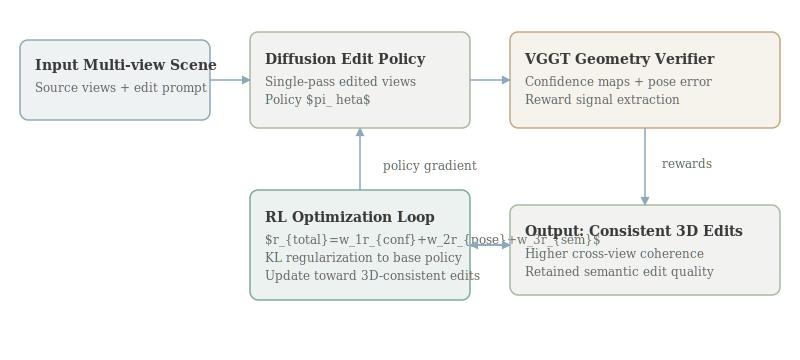

# Geometry-Guided Reinforcement Learning for Multi-view Consistent 3D Scene Editing

- **Authors:** Jiyuan Wang, Chunyu Lin, Lei Sun, Zhi Cao, Yuyang Yin, Lang Nie, Zhenlong Yuan, Xiangxiang Chu, Yunchao Wei, Kang Liao, Guosheng Lin
- **arXiv:** 2603.03143
- **Daily rank:** 1
- **Upvotes:** 122
- **Tags:** [daily papers]
- **Generated:** 2026-03-12 04:14:48.640 UTC

> [!note] Source Coverage
> Primary analysis source: AlphaXiv overview available. AlphaXiv full-text markdown available and used for method/equation detail.

> [!abstract] TL;DR
> RL3DEdit reframes multi-view consistent 3D scene editing as a reinforcement learning problem instead of a supervised finetuning problem. The key move is to keep a strong 2D diffusion prior intact, then optimize it with geometry-aware rewards so edited views remain coherent across camera poses. The paper matters because it identifies a realistic training bottleneck: paired, 3D-consistent editing supervision is scarce, but 3D-consistency verification is tractable. By using VGGT-derived confidence and pose signals as rewards, the system reports stronger consistency and better edit quality than prior baselines at practical runtime.
>
> **Who should read this:** This analysis is most useful for researchers working on 3D generation/editing, RL-based post-training, and teams building production pipelines where consistency across views is more important than single-image photorealism.

## 1. Header

Geometry-Guided RL for 3D Scene Editing is ranked #1 by upvotes in the HuggingFace daily list for 2026-03-11. This document follows the comprehensive-depth format and emphasizes technical mechanism, theoretical framing, and practical implications for post-training and multimodal system design.

## 2. TL;DR

RL3DEdit reframes multi-view consistent 3D scene editing as a reinforcement learning problem instead of a supervised finetuning problem. The key move is to keep a strong 2D diffusion prior intact, then optimize it with geometry-aware rewards so edited views remain coherent across camera poses.

The paper matters because it identifies a realistic training bottleneck: paired, 3D-consistent editing supervision is scarce, but 3D-consistency verification is tractable. By using VGGT-derived confidence and pose signals as rewards, the system reports stronger consistency and better edit quality than prior baselines at practical runtime.

This analysis is most useful for researchers working on 3D generation/editing, RL-based post-training, and teams building production pipelines where consistency across views is more important than single-image photorealism.

## 3. Background & Prerequisites

> [!info] Background & Prerequisites
> Recent 3D editing systems often inherit their semantic control from 2D diffusion models because text-guided 2D editing has matured quickly. However, those models are not inherently constrained by scene geometry. If each rendered view is edited independently, tiny local decisions in one view become global inconsistencies when the scene is observed from another angle. This mismatch appears as texture drift, shape wobble, and contradictory object boundaries across views. A core prerequisite is understanding why supervised finetuning is difficult in this setting. High-quality paired data would need original multi-view scene observations, desired edited targets, and consistent camera calibration for every sample. Collecting this at scale is expensive, and synthetic data is often too clean or too narrow. As a result, many methods rely on heuristic regularizers that enforce local smoothness but do not encode global 3D faithfulness. This paper builds on the idea that verification can be easier than generation. The model does not need ground-truth 3D edited labels if a separate 3D-aware model can score whether generated views are mutually consistent. That creates a useful split: the diffusion editor proposes candidate edits, and a geometry model evaluates whether those edits lie on a consistent manifold. RL can then optimize for the evaluator-defined objective even without explicit paired targets. Another prerequisite concept is reward shaping in high-dimensional generation tasks. Naive scalar rewards can be noisy and unstable, especially when each action corresponds to image-level denoising behavior. RL3DEdit addresses this by combining multiple reward sources from VGGT outputs rather than depending on a single metric. The approach resembles policy optimization in language models where diverse reward heads improve gradient signal quality. The broader trend is important for context. Several 2025-2026 papers in multimodal AI moved from pure pretraining to targeted post-training, including reasoning-focused methods and modality-specific alignment stages. RL3DEdit is the 3D editing analog of that shift: preserve a capable base model, then push it into a narrower capability frontier with reward-guided optimization. For readers from LLM backgrounds, a useful analogy is preference optimization for response coherence. In LLMs, trajectory-level rewards can improve faithfulness and style without rebuilding the base model. In RL3DEdit, trajectory-level geometric rewards improve cross-view coherence without retraining an entire 3D generative pipeline from scratch. This setup also connects to evaluation philosophy. Single-view image quality metrics can look strong while 3D consistency remains poor. The paper’s emphasis on geometry-aware reward and benchmarking argues that deployment metrics should reflect actual usage: users inspect 3D edits by moving around the scene, not by scoring one fixed camera view. Finally, the institutional context matters: a collaboration between academia and industry suggests the method targets practical workloads, not only controlled toy tasks. The reported efficiency and single-pass framing align with production constraints where iterative test-time optimization can be too slow.

Recent 3D editing systems often inherit their semantic control from 2D diffusion models because text-guided 2D editing has matured quickly. However, those models are not inherently constrained by scene geometry. If each rendered view is edited independently, tiny local decisions in one view become global inconsistencies when the scene is observed from another angle. This mismatch appears as texture drift, shape wobble, and contradictory object boundaries across views.

A core prerequisite is understanding why supervised finetuning is difficult in this setting. High-quality paired data would need original multi-view scene observations, desired edited targets, and consistent camera calibration for every sample. Collecting this at scale is expensive, and synthetic data is often too clean or too narrow. As a result, many methods rely on heuristic regularizers that enforce local smoothness but do not encode global 3D faithfulness.

This paper builds on the idea that verification can be easier than generation. The model does not need ground-truth 3D edited labels if a separate 3D-aware model can score whether generated views are mutually consistent. That creates a useful split: the diffusion editor proposes candidate edits, and a geometry model evaluates whether those edits lie on a consistent manifold. RL can then optimize for the evaluator-defined objective even without explicit paired targets.

Another prerequisite concept is reward shaping in high-dimensional generation tasks. Naive scalar rewards can be noisy and unstable, especially when each action corresponds to image-level denoising behavior. RL3DEdit addresses this by combining multiple reward sources from VGGT outputs rather than depending on a single metric. The approach resembles policy optimization in language models where diverse reward heads improve gradient signal quality.

The broader trend is important for context. Several 2025-2026 papers in multimodal AI moved from pure pretraining to targeted post-training, including reasoning-focused methods and modality-specific alignment stages. RL3DEdit is the 3D editing analog of that shift: preserve a capable base model, then push it into a narrower capability frontier with reward-guided optimization.

For readers from LLM backgrounds, a useful analogy is preference optimization for response coherence. In LLMs, trajectory-level rewards can improve faithfulness and style without rebuilding the base model. In RL3DEdit, trajectory-level geometric rewards improve cross-view coherence without retraining an entire 3D generative pipeline from scratch.

This setup also connects to evaluation philosophy. Single-view image quality metrics can look strong while 3D consistency remains poor. The paper’s emphasis on geometry-aware reward and benchmarking argues that deployment metrics should reflect actual usage: users inspect 3D edits by moving around the scene, not by scoring one fixed camera view.

Finally, the institutional context matters: a collaboration between academia and industry suggests the method targets practical workloads, not only controlled toy tasks. The reported efficiency and single-pass framing align with production constraints where iterative test-time optimization can be too slow.

## 4. Problem & Motivation

The paper targets a concrete failure mode in diffusion-based 3D editing: semantically plausible edits that collapse under viewpoint changes. Existing pipelines can create an attractive front view, but objects become inconsistent when the camera rotates because the model has no explicit pressure to maintain geometric agreement.

The authors argue that this is not only a quality issue; it is a usability blocker. In applications such as virtual production, digital twins, simulation assets, and AR content authoring, inconsistent edits force manual cleanup and destroy trust in automated tools. A method that improves consistency directly affects production cost and turnaround time.

Why now? The ecosystem already has stronger 3D foundation models and camera-aware perception tools than earlier waves of neural rendering. That means verification signals are finally strong enough to serve as RL rewards. Earlier attempts would have suffered from unreliable geometric evaluators, leading to unstable optimization.

A second motivation is data economics. If the field waits for large paired 3D edit datasets, progress will be slow and concentrated in few labs with proprietary assets. Reward-based optimization lowers that barrier by using unpaired or weakly paired data plus robust verification models.

The authors also identify a conceptual gap between objective and architecture. Many methods add cross-view attention or latent regularization but still train with losses that do not explicitly encode scene-level consistency. RL3DEdit aligns objective and desired behavior by making geometric consistency part of the optimization target.

From a research strategy perspective, the paper bets that mid/post-training is now the highest-leverage stage for this domain. Base diffusion priors are already strong on local semantics. The missing piece is global constraint satisfaction across views, and RL is used to close that gap.

The motivation extends to generalization. If the reward captures geometry rather than appearance templates, the policy may transfer better across scene categories than methods overfit to fixed datasets. That possibility, while requiring further validation, is one reason this work drew strong community interest.

In summary, the problem is not generating better pictures in isolation. It is ensuring that a sequence of edited images can be interpreted as one coherent 3D scene under camera motion, while avoiding dependence on scarce paired supervision.

## 5. Method / Approach

RL3DEdit starts from a pretrained single-pass diffusion editor that already performs strong semantic manipulation in 2D. Instead of replacing this backbone, the method adds an RL stage where policy updates are driven by geometry-derived rewards computed on generated multi-view outputs.

At each training step, the system samples source scene views and an edit instruction, produces edited views, then feeds those views into VGGT. The geometry model returns confidence maps and pose-related signals that are transformed into scalar rewards. These rewards measure whether edited views are mutually consistent in geometry and camera alignment.

The policy objective follows a constrained policy optimization style similar to modern RLHF variants. A simplified form is $$max_	heta;mathbb{E}_{	ausimpi_	heta}[r_{geo}(	au)+lambda r_{edit}(	au)]-eta,D_{KL}(pi_	heta|pi_{ref})$$ where $r_{geo}$ captures consistency and $r_{edit}$ preserves instruction-following quality. The KL term stabilizes updates against catastrophic drift from the reference diffusion policy.

Reward shaping is central. The paper discusses confidence and pose cues rather than a single binary consistency score. This matters because dense, graded signals produce lower-variance gradients and make policy updates less brittle. In practical terms, the model can improve from near-miss outputs instead of only receiving reward on rare perfect samples.

A second design choice is single-pass generation. Many consistency methods use iterative optimization at inference time or heavy multi-stage reconstruction loops. RL3DEdit places most cost in training, then keeps inference efficient by preserving a direct generation path. That tradeoff is often preferred in production systems with high query volume.

The training loop also implicitly performs manifold alignment. If 2D edits drift off the 3D-consistent manifold, reward drops; if edits preserve cross-view geometry, reward rises. Over time, policy gradients bias denoising dynamics toward edits that satisfy both semantics and geometry. This can be interpreted as learning a latent prior over geometrically valid edit trajectories.

The method can be viewed as three interacting modules: an edit policy, a geometry verifier, and a reward aggregator. The architecture figure in this report highlights this decomposition because it clarifies extensibility. Future work could swap VGGT with another 3D verifier or add task-specific reward terms without rewriting the core editor.

A practical equation for multi-term reward is $$r_{total}=w_1 r_{conf}+w_2 r_{pose}+w_3 r_{semantic}-w_4 r_{artifact}$$ where each term controls a known failure mode. Weight tuning determines how aggressively the model prioritizes strict consistency versus edit expressiveness.

Compared with supervised alternatives, this approach relaxes label requirements but introduces RL stability concerns. The paper reports stable optimization in experiments, suggesting the chosen reward design and policy regularization are sufficient in their setup.

From an engineering standpoint, the dependence on an external verifier introduces versioning considerations. If the verifier changes, reward distribution shifts. Teams adopting this approach should treat the reward model as part of the model specification and monitor drift across updates.

Overall, the method is a targeted post-training layer over an existing editor, not a full architecture replacement. That makes it attractive for teams that already have diffusion editing stacks and need stronger 3D consistency without rebuilding everything.

The design also offers a conceptual template for other modalities: define tractable verification signals for the hard property you want, then use RL to move a strong base model toward that property when direct supervision is sparse.

## 6. Results & Key Findings

> [!success] Key Results
> The headline claim is that RL3DEdit improves multi-view consistency while preserving or improving visual editing quality relative to prior methods. According to the paper’s summary and overview, the gains are consistent across multiple evaluation settings rather than isolated to one benchmark. Qualitatively, the reported outputs show fewer cross-view contradictions such as changing object shape, inconsistent edge placement, and texture discontinuity across camera poses. These are exactly the artifacts users notice first in interactive 3D workflows. Quantitatively, the method is presented as outperforming state-of-the-art baselines on consistency-related criteria while retaining efficiency. The key point is that improvements are not purchased by expensive iterative test-time optimization; they are obtained through training-time RL shaping. An important result dimension is stability. RL in image generation can be fragile, yet the authors emphasize stable convergence. If reproducible, this is significant because many practitioners avoid RL for vision generation due to instability concerns. The paper also reports that geometry reward does not collapse semantic editability. In other words, the model still follows text editing intent while becoming more 3D-consistent. This balance is crucial; pure consistency optimization could otherwise produce conservative edits that avoid visible changes. From a comparative perspective, RL3DEdit suggests objective mismatch is a bigger bottleneck than model capacity for this task. Many baselines likely had enough representational power but lacked training signals aligned with cross-view coherence. The broader implication is methodological: post-training can deliver meaningful gains in geometric fidelity without massive data collection campaigns. This could shorten iteration cycles for teams shipping 3D editing features. Another practical takeaway is that verifier quality determines ceiling performance. If VGGT-like models improve further, reward-guided editing systems may gain additional consistency without changing their base policy architecture. Finally, community reception reflected by upvotes indicates this problem framing resonates with current needs: not merely better single-image aesthetics, but reliable scene-level behavior for real downstream use.

- The headline claim is that RL3DEdit improves multi-view consistency while preserving or improving visual editing quality relative to prior methods. According to the paper’s summary and overview, the gains are consistent across multiple evaluation settings rather than isolated to one benchmark.
- Qualitatively, the reported outputs show fewer cross-view contradictions such as changing object shape, inconsistent edge placement, and texture discontinuity across camera poses. These are exactly the artifacts users notice first in interactive 3D workflows.
- Quantitatively, the method is presented as outperforming state-of-the-art baselines on consistency-related criteria while retaining efficiency. The key point is that improvements are not purchased by expensive iterative test-time optimization; they are obtained through training-time RL shaping.
- An important result dimension is stability. RL in image generation can be fragile, yet the authors emphasize stable convergence. If reproducible, this is significant because many practitioners avoid RL for vision generation due to instability concerns.
- The paper also reports that geometry reward does not collapse semantic editability. In other words, the model still follows text editing intent while becoming more 3D-consistent. This balance is crucial; pure consistency optimization could otherwise produce conservative edits that avoid visible changes.
- From a comparative perspective, RL3DEdit suggests objective mismatch is a bigger bottleneck than model capacity for this task. Many baselines likely had enough representational power but lacked training signals aligned with cross-view coherence.
- The broader implication is methodological: post-training can deliver meaningful gains in geometric fidelity without massive data collection campaigns. This could shorten iteration cycles for teams shipping 3D editing features.
- Another practical takeaway is that verifier quality determines ceiling performance. If VGGT-like models improve further, reward-guided editing systems may gain additional consistency without changing their base policy architecture.
- Finally, community reception reflected by upvotes indicates this problem framing resonates with current needs: not merely better single-image aesthetics, but reliable scene-level behavior for real downstream use.

## 7. Limitations & Open Questions

> [!warning] Limitations
> Dependence on verifier quality: if VGGT or similar geometry estimators are biased or noisy in certain scene types, policy updates may encode those biases. Reward misspecification risk: maximizing geometric proxies can still allow subtle semantic failures not captured by reward terms. Domain transfer uncertainty: performance on out-of-distribution scenes, unusual camera rigs, or heavy motion blur is not fully resolved. RL training cost: while inference is efficient, training requires reward model passes and careful hyperparameter tuning. Potential over-regularization: strong consistency pressure could suppress legitimate viewpoint-dependent effects when not carefully balanced. Evaluation scope: broader user studies and production metrics would strengthen claims about practical editing utility beyond benchmark settings. Toolchain complexity: adding RL + verifier infrastructure increases operational burden compared with pure supervised pipelines. Long-horizon edits: the paper focuses on single-pass edits; iterative multi-step edit sessions may surface additional failure modes.

- Dependence on verifier quality: if VGGT or similar geometry estimators are biased or noisy in certain scene types, policy updates may encode those biases.
- Reward misspecification risk: maximizing geometric proxies can still allow subtle semantic failures not captured by reward terms.
- Domain transfer uncertainty: performance on out-of-distribution scenes, unusual camera rigs, or heavy motion blur is not fully resolved.
- RL training cost: while inference is efficient, training requires reward model passes and careful hyperparameter tuning.
- Potential over-regularization: strong consistency pressure could suppress legitimate viewpoint-dependent effects when not carefully balanced.
- Evaluation scope: broader user studies and production metrics would strengthen claims about practical editing utility beyond benchmark settings.
- Toolchain complexity: adding RL + verifier infrastructure increases operational burden compared with pure supervised pipelines.
- Long-horizon edits: the paper focuses on single-pass edits; iterative multi-step edit sessions may surface additional failure modes.

## 8. Connections & Context

> [!example] Connections
> RL3DEdit aligns with [[02-thinking-to-recall|Thinking to Recall]] in a broad methodological sense: both use extra inference-time or training-time computation to unlock capabilities hidden in the base model. The paper complements [[03-omni-diffusion|Omni-Diffusion]] and [[05-internvl-u|InternVL-U]] by showing that architecture is only one lever; objective design and post-training can be equally decisive. Compared with [[04-mm-zero|MM-Zero]], which uses GRPO for zero-data multimodal evolution, RL3DEdit applies reward optimization to enforce geometric consistency under scarce paired supervision. Across this top-5 set, a shared trend appears: move from monolithic pretraining to targeted capability shaping (reasoning recall, multimodal unification, or 3D consistency) with domain-specific rewards and data programs. For practical teams, the cross-paper message is to treat post-training as a first-class stage with explicit capability goals rather than as an optional final polish.

- RL3DEdit aligns with [[02-thinking-to-recall|Thinking to Recall]] in a broad methodological sense: both use extra inference-time or training-time computation to unlock capabilities hidden in the base model.
- The paper complements [[03-omni-diffusion|Omni-Diffusion]] and [[05-internvl-u|InternVL-U]] by showing that architecture is only one lever; objective design and post-training can be equally decisive.
- Compared with [[04-mm-zero|MM-Zero]], which uses GRPO for zero-data multimodal evolution, RL3DEdit applies reward optimization to enforce geometric consistency under scarce paired supervision.
- Across this top-5 set, a shared trend appears: move from monolithic pretraining to targeted capability shaping (reasoning recall, multimodal unification, or 3D consistency) with domain-specific rewards and data programs.
- For practical teams, the cross-paper message is to treat post-training as a first-class stage with explicit capability goals rather than as an optional final polish.

A practical deployment playbook emerging from this paper is: start with a strong base editor, define failure-specific verifiers, run reward-guided post-training, and keep inference lightweight. This pattern can reduce latency regressions while still improving behavior on critical dimensions.

On the theory side, RL3DEdit can be interpreted as constrained manifold projection in function space. Policy updates penalize trajectories that violate geometric constraints, effectively reshaping the implicit prior over feasible edits.

For evaluation design, teams should report paired metrics: semantic edit success and geometric consistency under camera sweeps. Optimizing one without the other can produce misleading progress.

Future improvements may include uncertainty-aware rewards that down-weight ambiguous verifier outputs, reducing noisy gradient steps in hard scenes.

Another extension is hierarchical rewards that score local geometry, object identity persistence, and global scene structure separately, improving interpretability of failures.

The method also invites work on human-in-the-loop reward calibration where artists provide sparse preference labels for difficult cases, combining learned geometric scores with subjective quality judgments.

In terms of ecosystem impact, releasing code and models could make RL-based 3D editing a standard post-training step, similar to how instruction tuning became standard for LLMs.

Overall, RL3DEdit is best viewed as a template for solving “hard-to-label but easy-to-verify” problems in generative modeling.

## 9. Resources

- Links: [arXiv](https://arxiv.org/abs/2603.03143) · [PDF](https://arxiv.org/pdf/2603.03143) · [HuggingFace](https://huggingface.co/papers/2603.03143) · [GitHub](https://github.com/AMAP-ML/RL3DEdit) · [Project](https://amap-ml.github.io/RL3DEdit/)
- Related top-5 analyses: [[01-geometry-guided-rl-3d-editing|RL3DEdit]], [[02-thinking-to-recall|Thinking to Recall]], [[03-omni-diffusion|Omni-Diffusion]], [[04-mm-zero|MM-Zero]], [[05-internvl-u|InternVL-U]]
