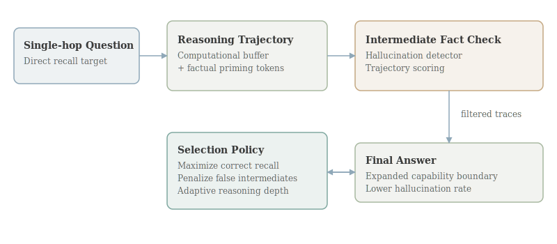

# Thinking to Recall: How Reasoning Unlocks Parametric Knowledge in LLMs

- **Authors:** Zorik Gekhman, Roee Aharoni, Eran Ofek, Mor Geva, Roi Reichart, Jonathan Herzig
- **arXiv:** 2603.09906
- **Daily rank:** 2
- **Upvotes:** 44
- **Tags:** [daily papers]
- **Generated:** 2026-03-12 04:14:48.640 UTC

> [!note] Source Coverage
> Primary analysis source: AlphaXiv overview available. AlphaXiv full-text markdown unavailable; analysis grounded in overview + arXiv abstract + HF metadata.

> [!abstract] TL;DR
> This paper shows that reasoning traces improve even single-hop factual QA, where explicit multi-step logic appears unnecessary. The key claim is that reasoning does not only re-rank known answers; it expands the effective capability boundary by surfacing answers the model otherwise rarely or never emits. Two mechanisms are proposed: a computational buffer effect (extra tokens enable latent computation) and factual priming (intermediate related facts bridge toward correct recall). The same mechanism creates a risk: hallucinated intermediate facts can propagate into final hallucinated answers.
>
> **Who should read this:** This is essential for teams designing post-training or decoding strategies for factual assistants, retrieval-free QA, and reasoning-augmented language systems where recall reliability matters more than stylistic fluency.

## 1. Header

Thinking to Recall is ranked #2 by upvotes in the HuggingFace daily list for 2026-03-11. This document follows the comprehensive-depth format and emphasizes technical mechanism, theoretical framing, and practical implications for post-training and multimodal system design.

## 2. TL;DR

This paper shows that reasoning traces improve even single-hop factual QA, where explicit multi-step logic appears unnecessary. The key claim is that reasoning does not only re-rank known answers; it expands the effective capability boundary by surfacing answers the model otherwise rarely or never emits.

Two mechanisms are proposed: a computational buffer effect (extra tokens enable latent computation) and factual priming (intermediate related facts bridge toward correct recall). The same mechanism creates a risk: hallucinated intermediate facts can propagate into final hallucinated answers.

This is essential for teams designing post-training or decoding strategies for factual assistants, retrieval-free QA, and reasoning-augmented language systems where recall reliability matters more than stylistic fluency.

## 3. Background & Prerequisites

> [!info] Background & Prerequisites
> The canonical motivation for chain-of-thought has been complex tasks like math and code. In those tasks, intermediate steps obviously decompose the problem. Single-hop factual questions challenge that intuition because the desired answer should already exist in model parameters and may require only direct retrieval from internal representations. Prior studies often measured pass@1 gains and concluded that reasoning mostly sharpens probability mass around already-accessible answers. This paper moves the discussion to capability boundary by analyzing pass@k at larger k and controlled interventions. That distinction is important: reweighting existing answers and unlocking new reachable answers imply different internal mechanisms. A prerequisite concept is parametric recall as a search process over distributed memory rather than direct table lookup. Even if an answer is encoded, decoding may fail to route to it under certain prompts. Extra reasoning tokens can alter activation trajectories and effectively provide additional search steps in latent space. The computational buffer hypothesis formalizes this idea: token generation provides workspace for intermediate computation independent of semantic quality. Earlier literature offered mixed evidence, partly because models and prompt protocols varied. This paper revisits the hypothesis in modern reasoning-capable LLMs with targeted controls. The factual priming mechanism is complementary. Generating related entities, events, or attributes can increase probability of the correct target through semantic neighborhood effects. In vector terms, intermediate facts may move hidden states closer to the manifold region where the correct answer is highly probable. This mechanism naturally introduces safety concerns. If the intermediate chain drifts into false but topically plausible statements, the final output can inherit those false anchors. That dynamic ties reasoning quality directly to hallucination risk rather than treating hallucination as only a final decoding issue. The paper sits within a broader post-training trend where reasoning is treated as an operational capability across tasks, not only benchmark math. It resonates with work in this daily batch emphasizing targeted capability shaping after base pretraining. For practitioners, the major conceptual shift is to treat reasoning as controllable compute budget for recall, with measurable tradeoffs between accuracy gain, latency, and hallucination exposure.

The canonical motivation for chain-of-thought has been complex tasks like math and code. In those tasks, intermediate steps obviously decompose the problem. Single-hop factual questions challenge that intuition because the desired answer should already exist in model parameters and may require only direct retrieval from internal representations.

Prior studies often measured pass@1 gains and concluded that reasoning mostly sharpens probability mass around already-accessible answers. This paper moves the discussion to capability boundary by analyzing pass@k at larger k and controlled interventions. That distinction is important: reweighting existing answers and unlocking new reachable answers imply different internal mechanisms.

A prerequisite concept is parametric recall as a search process over distributed memory rather than direct table lookup. Even if an answer is encoded, decoding may fail to route to it under certain prompts. Extra reasoning tokens can alter activation trajectories and effectively provide additional search steps in latent space.

The computational buffer hypothesis formalizes this idea: token generation provides workspace for intermediate computation independent of semantic quality. Earlier literature offered mixed evidence, partly because models and prompt protocols varied. This paper revisits the hypothesis in modern reasoning-capable LLMs with targeted controls.

The factual priming mechanism is complementary. Generating related entities, events, or attributes can increase probability of the correct target through semantic neighborhood effects. In vector terms, intermediate facts may move hidden states closer to the manifold region where the correct answer is highly probable.

This mechanism naturally introduces safety concerns. If the intermediate chain drifts into false but topically plausible statements, the final output can inherit those false anchors. That dynamic ties reasoning quality directly to hallucination risk rather than treating hallucination as only a final decoding issue.

The paper sits within a broader post-training trend where reasoning is treated as an operational capability across tasks, not only benchmark math. It resonates with work in this daily batch emphasizing targeted capability shaping after base pretraining.

For practitioners, the major conceptual shift is to treat reasoning as controllable compute budget for recall, with measurable tradeoffs between accuracy gain, latency, and hallucination exposure.

## 4. Problem & Motivation

The central problem is counterintuitive: why should reasoning help when no multi-step reasoning is required? If a question is single-hop factual, the model should answer directly. Yet empirical behavior suggests direct answers often miss reachable knowledge.

The authors frame this as a boundary problem rather than a confidence problem. Some correct answers remain effectively unreachable under short direct decoding, but become reachable when the model is allowed to think. This reframing has consequences for evaluation and system design.

A second problem is mechanistic ambiguity. Without controlled experiments, gains from reasoning could reflect prompt artifacts, longer outputs, or self-consistency sampling effects. The paper builds hypothesis-driven tests to isolate causal mechanisms.

The third problem is risk management. Reasoning traces can improve accuracy while increasing harmful confidence in false outputs if intermediate steps hallucinate. Systems that deploy reasoning by default need principled filtering or selection strategies.

Why now? Many production assistants increasingly rely on internal reasoning-style generation for reliability. Understanding when and why this helps factual recall is critical for deciding when to invoke reasoning and how to audit outputs.

The paper also addresses a practical optimization question: if reasoning length and content both matter, can systems allocate token budgets adaptively based on uncertainty instead of fixed long traces for every query?

At a research level, this work challenges a simplistic dichotomy between retrieval and reasoning. Even without external tools, internal reasoning may function as a retrieval facilitator within parametric memory.

Overall, the problem is to convert a useful but opaque empirical trick into a controlled, explainable, and safer mechanism for factual QA.

## 5. Method / Approach

The study uses controlled experiments on single-hop factual QA with and without reasoning prompts. Instead of only reporting pass@1, it evaluates pass@k behavior to inspect whether reasoning merely reorders answers or expands reachable answer sets.

To test computational buffer, the authors vary intermediate token generation in ways that decouple token count from semantic informativeness. If performance improves with additional tokens even under weakened semantic content, that supports the latent compute interpretation.

To test factual priming, the experiments examine trajectories where intermediate facts are topically related and analyze their correlation with final correctness. The key signal is whether semantically relevant intermediate content predicts successful recall beyond token length effects.

A simplified decomposition is $$P(y|x,	ext{reason}) approx P(y|x, c, s)$$ where $c$ denotes computational budget (tokenized latent steps) and $s$ denotes semantic trajectory quality. The paper’s hypothesis is that both $c$ and $s$ contribute, with $s$ introducing hallucination sensitivity.

The work also analyzes hallucination propagation by tracking correctness of intermediate statements and final outputs. This yields a practical criterion: prioritize reasoning trajectories that remain factually grounded during intermediate generation.

An applied selection objective can be written as $$argmax_{	au} ;mathbb{E}[mathbf{1}[y_{final}=y^*] - lambda,mathbf{1}[h(	au)=1]]$$ where $h(	au)$ flags hallucinated intermediate facts. This formalizes trajectory filtering as a safety-accuracy tradeoff.

Methodologically, the paper is strong in hypothesis-driven structure: each proposed mechanism has targeted interventions and diagnostics rather than relying on post-hoc narrative explanations.

The design still depends on model family and prompt templates, so generalization is an empirical question. But the framework itself is portable: evaluate boundary expansion, isolate compute vs semantics, then control hallucination pathways.

For engineering teams, the method suggests instrumentation requirements: store intermediate traces, annotate factuality heuristics, and benchmark pass@k under controlled reasoning budgets.

The paper does not claim full mechanistic interpretability in the strict neuron/circuit sense. Instead, it provides behavior-level evidence with enough granularity to inform practical policy changes in inference pipelines.

One practical policy derived from the method is selective reasoning: invoke longer traces for questions with high uncertainty or known recall brittleness, then filter traces using factuality checks before final answer selection.

Another implication is training-time alignment. If factual priming helps, post-training could explicitly reinforce truthful intermediate fact generation, not only final answer correctness.

## 6. Results & Key Findings

> [!success] Key Results
> The headline empirical result is that reasoning substantially increases factual QA performance even on simple single-hop questions, confirming that benefits extend beyond classic multi-step domains. Critically, gains appear at high-k settings, supporting the capability-boundary view rather than pure probability sharpening. This implies reasoning can unlock answers that are otherwise rarely sampled even with extensive decoding attempts. Evidence for computational buffer indicates that intermediate token generation contributes via latent computation, not only via explicit semantic decomposition. Evidence for factual priming shows that generating related facts can serve as a semantic bridge to the target answer, improving recall when those intermediate facts are correct. The paper also demonstrates a risk pathway: hallucinated intermediates increase final hallucination probability. This transforms intermediate trace quality into a first-order reliability metric. By prioritizing hallucination-free trajectories, the method reports direct accuracy improvements, showing that mechanism understanding can translate into immediate practical gains rather than only explanatory value. A broader result is methodological: pass@k and trajectory diagnostics reveal phenomena that pass@1 obscures. Evaluation choice determines what capability improvements are visible. These findings suggest reasoning is a controllable inference-time resource for factual recall, but one that requires guardrails to avoid trading one failure mode for another. In operational terms, the paper supports deploying reasoning with monitoring and filtering rather than unconditional long CoT for all queries.

- The headline empirical result is that reasoning substantially increases factual QA performance even on simple single-hop questions, confirming that benefits extend beyond classic multi-step domains.
- Critically, gains appear at high-k settings, supporting the capability-boundary view rather than pure probability sharpening. This implies reasoning can unlock answers that are otherwise rarely sampled even with extensive decoding attempts.
- Evidence for computational buffer indicates that intermediate token generation contributes via latent computation, not only via explicit semantic decomposition.
- Evidence for factual priming shows that generating related facts can serve as a semantic bridge to the target answer, improving recall when those intermediate facts are correct.
- The paper also demonstrates a risk pathway: hallucinated intermediates increase final hallucination probability. This transforms intermediate trace quality into a first-order reliability metric.
- By prioritizing hallucination-free trajectories, the method reports direct accuracy improvements, showing that mechanism understanding can translate into immediate practical gains rather than only explanatory value.
- A broader result is methodological: pass@k and trajectory diagnostics reveal phenomena that pass@1 obscures. Evaluation choice determines what capability improvements are visible.
- These findings suggest reasoning is a controllable inference-time resource for factual recall, but one that requires guardrails to avoid trading one failure mode for another.
- In operational terms, the paper supports deploying reasoning with monitoring and filtering rather than unconditional long CoT for all queries.

## 7. Limitations & Open Questions

> [!warning] Limitations
> Model-family dependence remains open; effects may vary across architectures and post-training recipes. Intermediate factuality detection is itself imperfect and may introduce filtering bias or false negatives. Reasoning length increases latency and cost, creating deployment tradeoffs not fully quantified in the paper. Some gains could be sensitive to prompt format and decoding hyperparameters; robust defaults need further study. The work focuses on factual QA; transfer to broader dialogue or tool-augmented settings is unresolved. Behavioral evidence does not fully reveal internal circuits, so causal mechanistic claims should remain modest. Trajectory selection may favor conservative responses if hallucination penalties are too strong. Benchmark contamination and memorization risks always remain when studying parametric recall at scale.

- Model-family dependence remains open; effects may vary across architectures and post-training recipes.
- Intermediate factuality detection is itself imperfect and may introduce filtering bias or false negatives.
- Reasoning length increases latency and cost, creating deployment tradeoffs not fully quantified in the paper.
- Some gains could be sensitive to prompt format and decoding hyperparameters; robust defaults need further study.
- The work focuses on factual QA; transfer to broader dialogue or tool-augmented settings is unresolved.
- Behavioral evidence does not fully reveal internal circuits, so causal mechanistic claims should remain modest.
- Trajectory selection may favor conservative responses if hallucination penalties are too strong.
- Benchmark contamination and memorization risks always remain when studying parametric recall at scale.

## 8. Connections & Context

> [!example] Connections
> The paper strongly connects to [[04-mm-zero|MM-Zero]] through RL-style trajectory optimization logic: both treat intermediate trajectories as optimization targets, not just final outputs. It relates to [[03-omni-diffusion|Omni-Diffusion]] and [[05-internvl-u|InternVL-U]] by emphasizing that architecture alone is insufficient; inference and post-training controls materially shift capability boundaries. With [[01-geometry-guided-rl-3d-editing|RL3DEdit]], there is a shared pattern of “hard-to-label, easy-to-evaluate” optimization using derived reward signals. Across the day’s top papers, a common theme emerges: unlock latent capability through structured intermediate computation, whether tokens, generated multimodal plans, or reward-scored trajectories. For product design, these connections suggest unified policy engines that allocate compute, apply safety filters, and adapt reasoning depth by task uncertainty.

- The paper strongly connects to [[04-mm-zero|MM-Zero]] through RL-style trajectory optimization logic: both treat intermediate trajectories as optimization targets, not just final outputs.
- It relates to [[03-omni-diffusion|Omni-Diffusion]] and [[05-internvl-u|InternVL-U]] by emphasizing that architecture alone is insufficient; inference and post-training controls materially shift capability boundaries.
- With [[01-geometry-guided-rl-3d-editing|RL3DEdit]], there is a shared pattern of “hard-to-label, easy-to-evaluate” optimization using derived reward signals.
- Across the day’s top papers, a common theme emerges: unlock latent capability through structured intermediate computation, whether tokens, generated multimodal plans, or reward-scored trajectories.
- For product design, these connections suggest unified policy engines that allocate compute, apply safety filters, and adapt reasoning depth by task uncertainty.

A practical deployment stack inspired by this work has three layers: uncertainty-triggered reasoning, intermediate factuality scoring, and final answer calibration. This can outperform static prompting while containing hallucination risk.

Teams should collect telemetry on trace properties such as length, entity density, and contradiction rates. These indicators can power adaptive controls and regression alerts after model updates.

From a training perspective, one extension is trajectory-level preference optimization where human or model-based judges score intermediate factual correctness, not only end answers.

Another extension is hybrid retrieval gating: if intermediate traces show low-confidence factual anchors, route to external retrieval before finalizing the response.

There is also a user-interface implication. Systems might expose condensed, verified intermediate facts to improve transparency while hiding noisy internal tokens.

For benchmarking, future suites should separate boundary expansion from calibration gains by combining pass@k, confidence metrics, and intervention studies.

Theoretical work could model reasoning as a bounded search process over latent memory graphs, clarifying when extra tokens improve access versus merely amplify noise.

In short, this paper turns reasoning from a vague prompting heuristic into a measurable control knob for factual reliability.

## 9. Resources

- Links: [arXiv](https://arxiv.org/abs/2603.09906) · [PDF](https://arxiv.org/pdf/2603.09906) · [HuggingFace](https://huggingface.co/papers/2603.09906)
- Related top-5 analyses: [[01-geometry-guided-rl-3d-editing|RL3DEdit]], [[02-thinking-to-recall|Thinking to Recall]], [[03-omni-diffusion|Omni-Diffusion]], [[04-mm-zero|MM-Zero]], [[05-internvl-u|InternVL-U]]
