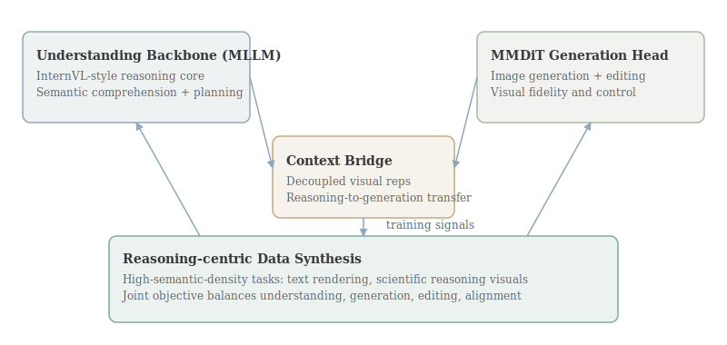

# InternVL-U: Democratizing Unified Multimodal Models for Understanding, Reasoning, Generation and Editing

- **Authors:** Changyao Tian, Danni Yang, Guanzhou Chen, Erfei Cui, Zhaokai Wang, Yuchen Duan, Penghao Yin, Sitao Chen, Ganlin Yang, Mingxin Liu, Zirun Zhu, Ziqian Fan, Leyao Gu, Haomin Wang, Qi Wei, Jinhui Yin, Xue Yang, Zhihang Zhong, Qi Qin, Yi Xin, Bin Fu, Yihao Liu, Jiaye Ge, Qipeng Guo, Gen Luo, Hongsheng Li, Yu Qiao, Kai Chen, Hongjie Zhang
- **arXiv:** 2603.09877
- **Daily rank:** 5
- **Upvotes:** 28
- **Tags:** [daily papers]
- **Generated:** 2026-03-12 04:14:48.640 UTC

> [!note] Source Coverage
> Primary analysis source: AlphaXiv overview available. AlphaXiv full-text markdown unavailable; analysis based on overview + abstract + HF metadata.

> [!abstract] TL;DR
> InternVL-U proposes a lightweight 4B unified multimodal model that combines a strong MLLM understanding core with a specialized MMDiT generation head under a modular, decoupled design. The model targets the hardest tradeoff in UMMs: preserving semantic intelligence while gaining high-quality generation and editing. Its distinctive contribution is a reasoning-centric data synthesis pipeline for high-semantic-density tasks (for example text rendering and scientific reasoning visuals). The reported outcome is a strong performance-efficiency balance, outperforming larger unified baselines on generation/editing while retaining reasoning strength.
>
> **Who should read this:** This paper is most relevant for teams building practical unified multimodal products where compute budget is constrained but users expect both reasoning-heavy understanding and high-fidelity visual generation/editing.

## 1. Header

InternVL-U is ranked #5 by upvotes in the HuggingFace daily list for 2026-03-11. This document follows the comprehensive-depth format and emphasizes technical mechanism, theoretical framing, and practical implications for post-training and multimodal system design.

## 2. TL;DR

InternVL-U proposes a lightweight 4B unified multimodal model that combines a strong MLLM understanding core with a specialized MMDiT generation head under a modular, decoupled design. The model targets the hardest tradeoff in UMMs: preserving semantic intelligence while gaining high-quality generation and editing.

Its distinctive contribution is a reasoning-centric data synthesis pipeline for high-semantic-density tasks (for example text rendering and scientific reasoning visuals). The reported outcome is a strong performance-efficiency balance, outperforming larger unified baselines on generation/editing while retaining reasoning strength.

This paper is most relevant for teams building practical unified multimodal products where compute budget is constrained but users expect both reasoning-heavy understanding and high-fidelity visual generation/editing.

## 3. Background & Prerequisites

> [!info] Background & Prerequisites
> Unified multimodal models promise one system for understanding, reasoning, generation, and editing, but current designs often sacrifice one capability to strengthen another. Generation-centric systems can produce attractive visuals yet underperform on dense semantic tasks; understanding-centric systems reason well but struggle with controllable synthesis. Two architecture families dominate. Fully-native UMMs train one model for everything, but engineering complexity is high and they may not inherit best-in-class understanding priors. Fully-ensemble systems attach separate generators to strong MLLMs, but this can create latent-space mismatch and heavy inference stacks. InternVL-U positions itself between these extremes by combining unified contextual modeling with modality-specific modularity. The approach tries to preserve semantic competence from the understanding backbone while adding a specialized visual generation pathway for quality-critical outputs. A prerequisite concept is decoupled visual representation. Instead of forcing one shared visual embedding to satisfy both OCR-like reasoning and image synthesis detail, the model uses tailored representations and interfaces between modules. Another prerequisite is data distribution mismatch. Understanding models are trained on text-rich, semantically dense data, whereas generation models often see aesthetically rich but semantically light images. InternVL-U addresses this via a reasoning-centric synthesis pipeline designed to inject dense semantics into generative training. Chain-of-thought-style alignment appears in the data program: abstract intent is expanded into fine-grained generation instructions, improving correspondence between user goals and visual outputs. The paper is timely because open-source communities need smaller, deployable UMMs. Large proprietary models can set quality bars, but many teams require 4B-scale efficiency for on-prem or cost-sensitive inference. Within this daily batch, InternVL-U is a key priority-topic paper because it directly addresses VLM architecture and training design under practical constraints, not only benchmark optimization.

Unified multimodal models promise one system for understanding, reasoning, generation, and editing, but current designs often sacrifice one capability to strengthen another. Generation-centric systems can produce attractive visuals yet underperform on dense semantic tasks; understanding-centric systems reason well but struggle with controllable synthesis.

Two architecture families dominate. Fully-native UMMs train one model for everything, but engineering complexity is high and they may not inherit best-in-class understanding priors. Fully-ensemble systems attach separate generators to strong MLLMs, but this can create latent-space mismatch and heavy inference stacks.

InternVL-U positions itself between these extremes by combining unified contextual modeling with modality-specific modularity. The approach tries to preserve semantic competence from the understanding backbone while adding a specialized visual generation pathway for quality-critical outputs.

A prerequisite concept is decoupled visual representation. Instead of forcing one shared visual embedding to satisfy both OCR-like reasoning and image synthesis detail, the model uses tailored representations and interfaces between modules.

Another prerequisite is data distribution mismatch. Understanding models are trained on text-rich, semantically dense data, whereas generation models often see aesthetically rich but semantically light images. InternVL-U addresses this via a reasoning-centric synthesis pipeline designed to inject dense semantics into generative training.

Chain-of-thought-style alignment appears in the data program: abstract intent is expanded into fine-grained generation instructions, improving correspondence between user goals and visual outputs.

The paper is timely because open-source communities need smaller, deployable UMMs. Large proprietary models can set quality bars, but many teams require 4B-scale efficiency for on-prem or cost-sensitive inference.

Within this daily batch, InternVL-U is a key priority-topic paper because it directly addresses VLM architecture and training design under practical constraints, not only benchmark optimization.

## 4. Problem & Motivation

The main problem is an objective mismatch between semantic intelligence and visual aesthetics. Optimizing for one can degrade the other when using a single undifferentiated training setup.

A second problem is cost-performance imbalance. Many unified baselines rely on large parameter counts or complicated ensembles, making deployment expensive and reducing accessibility.

Third, existing generation training data often lacks high semantic density, leading models to produce visually plausible but logically weak outputs in tasks such as text rendering, diagrams, or reasoning-dependent edits.

InternVL-U tackles these issues by pairing a strong MLLM with a specialized generation head and by redesigning the data pipeline around reasoning-rich synthesis.

Why now? User expectations for multimodal assistants are converging: they want one model to explain, reason, generate, and edit with consistency. Fragmented pipelines create product friction and brittle behavior across modes.

The paper also responds to democratization goals. A 4B model that competes with much larger baselines can broaden adoption in academic and startup settings where large-scale serving is infeasible.

At a research level, the work asks whether modular unification is a better path than fully monolithic training for near-term progress. The reported results suggest the answer may be yes for current compute regimes.

In summary, the problem is designing a unified multimodal system that remains semantically strong, visually capable, and operationally efficient at moderate model scale.

## 5. Method / Approach

InternVL-U integrates two primary components: a state-of-the-art multimodal understanding backbone (InternVL-family MLLM) and an MMDiT-based visual generation head. The interface is designed for shared context while preserving modality-specific specialization.

The architecture follows a modular principle: keep high-level reasoning in the backbone and delegate pixel-level synthesis/editing to the generation head. This avoids overloading one representation with conflicting objectives.

A central training innovation is reasoning-centric data synthesis for high-semantic-density tasks. The pipeline constructs examples where successful generation depends on understanding structured intent, not only producing aesthetically plausible images.

This can be viewed as minimizing a joint objective $$mathcal{L}=mathcal{L}_{understand}+alphamathcal{L}_{gen}+etamathcal{L}_{edit}+gammamathcal{L}_{reason-align}$$ where the alignment term encourages consistency between reasoning traces/intents and generated visual details.

The model also uses decoupled visual representations so understanding and generation pathways can maintain specialized features. Coupling occurs through contextual bridges rather than full parameter sharing.

For editing tasks, conditioning must preserve source content while applying precise semantic transformations. The modular head design is suited to this because it can focus on local visual fidelity while receiving high-level guidance from the reasoning backbone.

InternVL-U’s training pipeline emphasizes text rendering and scientific reasoning scenarios, domains where many generative models fail due to low semantic discipline. This targeted curriculum is likely a major contributor to reported gains.

A second useful equation for behavior interpretation is conditional generation: $$x_{img}^* = G_phi(z_{ctx}, z_{vis}, c_{reason})$$ where $z_{ctx}$ comes from backbone understanding and $c_{reason}$ encodes structured intent. Stronger $c_{reason}$ should reduce semantic drift in outputs.

Compared with fully-native UMMs, this approach reduces architecture risk by leveraging proven modules. Compared with fully-ensemble approaches, it aims for tighter integration via shared context and aligned data synthesis.

Implementation-wise, a 4B scale forces disciplined parameter budgeting. The paper’s modularity is as much a systems design decision as a modeling choice.

The method also introduces or uses targeted evaluation kits (as described in overview context) for generation/editing, helping ensure gains are measured on semantically meaningful tasks.

Overall, InternVL-U is a training-and-architecture co-design: modular components, reasoning-centric data, and explicit alignment objectives to balance capability dimensions.

## 6. Results & Key Findings

> [!success] Key Results
> The paper reports that InternVL-U, despite its 4B parameter size, outperforms larger unified baselines (including substantially larger models) on generation and editing benchmarks while preserving strong understanding/reasoning. This is a significant efficiency result: capability balance improves not through brute-force scaling but through architecture modularity and data-program alignment. Performance on high-semantic-density tasks suggests the reasoning-centric synthesis pipeline successfully narrows the gap between aesthetic generation and semantic correctness. The model’s unified behavior across understanding and generation indicates the modular bridge is effective enough to avoid severe capability fragmentation. From a product viewpoint, a small model with broad multimodal capability lowers deployment barriers and can enable edge or cost-constrained inference scenarios. The results also validate a broader strategy: targeted curriculum design can be as impactful as model size in multimodal systems. Comparative wins over larger baselines highlight that parameter count is not a sufficient proxy for unified multimodal quality. The work contributes practical evidence that democratized UMMs are viable today, not only a long-term aspiration tied to very large models. Community attention to this paper likely reflects high practical relevance: efficient unified models are immediately useful for real applications.

- The paper reports that InternVL-U, despite its 4B parameter size, outperforms larger unified baselines (including substantially larger models) on generation and editing benchmarks while preserving strong understanding/reasoning.
- This is a significant efficiency result: capability balance improves not through brute-force scaling but through architecture modularity and data-program alignment.
- Performance on high-semantic-density tasks suggests the reasoning-centric synthesis pipeline successfully narrows the gap between aesthetic generation and semantic correctness.
- The model’s unified behavior across understanding and generation indicates the modular bridge is effective enough to avoid severe capability fragmentation.
- From a product viewpoint, a small model with broad multimodal capability lowers deployment barriers and can enable edge or cost-constrained inference scenarios.
- The results also validate a broader strategy: targeted curriculum design can be as impactful as model size in multimodal systems.
- Comparative wins over larger baselines highlight that parameter count is not a sufficient proxy for unified multimodal quality.
- The work contributes practical evidence that democratized UMMs are viable today, not only a long-term aspiration tied to very large models.
- Community attention to this paper likely reflects high practical relevance: efficient unified models are immediately useful for real applications.

## 7. Limitations & Open Questions

> [!warning] Limitations
> AlphaXiv full text was unavailable in this run, limiting access to deeper ablation and training hyperparameter specifics. Modular systems can still suffer interface bottlenecks if context transfer between modules is suboptimal. Generation quality under extreme open-domain prompts may differ from benchmark-focused task distributions. Maintaining balanced performance over continual updates is challenging; one module can regress another if retrained independently. 4B scale is efficient but may still underperform larger systems on very long-context or highly compositional reasoning tasks. Evaluation claims should be validated with independent reproduction across diverse user workflows. Reasoning-centric data synthesis might introduce distribution biases if synthetic programs underrepresent real user intent. Safety and misuse controls for unified generation/editing are not the central focus and require separate governance layers.

- AlphaXiv full text was unavailable in this run, limiting access to deeper ablation and training hyperparameter specifics.
- Modular systems can still suffer interface bottlenecks if context transfer between modules is suboptimal.
- Generation quality under extreme open-domain prompts may differ from benchmark-focused task distributions.
- Maintaining balanced performance over continual updates is challenging; one module can regress another if retrained independently.
- 4B scale is efficient but may still underperform larger systems on very long-context or highly compositional reasoning tasks.
- Evaluation claims should be validated with independent reproduction across diverse user workflows.
- Reasoning-centric data synthesis might introduce distribution biases if synthetic programs underrepresent real user intent.
- Safety and misuse controls for unified generation/editing are not the central focus and require separate governance layers.

## 8. Connections & Context

> [!example] Connections
> InternVL-U and [[03-omni-diffusion|Omni-Diffusion]] represent two competing futures for unified multimodal design: modular autoregressive-plus-head integration versus diffusion-first unified backbones. With [[04-mm-zero|MM-Zero]], InternVL-U shares a focus on training pipeline innovation, though MM-Zero emphasizes autonomous synthetic curriculum while InternVL-U emphasizes reasoning-centric curated synthesis. Compared with [[02-thinking-to-recall|Thinking to Recall]], both highlight that intermediate reasoning structure can materially improve final task quality. Relative to [[01-geometry-guided-rl-3d-editing|RL3DEdit]], InternVL-U targets broader multimodal unification rather than domain-specific 3D editing consistency, but both show high leverage from post-training objective design. Across the top-5, this paper reinforces a central trend: practical progress is coming from deliberate capability balancing, not from one-dimensional scaling.

- InternVL-U and [[03-omni-diffusion|Omni-Diffusion]] represent two competing futures for unified multimodal design: modular autoregressive-plus-head integration versus diffusion-first unified backbones.
- With [[04-mm-zero|MM-Zero]], InternVL-U shares a focus on training pipeline innovation, though MM-Zero emphasizes autonomous synthetic curriculum while InternVL-U emphasizes reasoning-centric curated synthesis.
- Compared with [[02-thinking-to-recall|Thinking to Recall]], both highlight that intermediate reasoning structure can materially improve final task quality.
- Relative to [[01-geometry-guided-rl-3d-editing|RL3DEdit]], InternVL-U targets broader multimodal unification rather than domain-specific 3D editing consistency, but both show high leverage from post-training objective design.
- Across the top-5, this paper reinforces a central trend: practical progress is coming from deliberate capability balancing, not from one-dimensional scaling.

For practitioners, InternVL-U suggests a pragmatic architecture template: keep a strong understanding core, add specialized generation modules, and invest heavily in alignment data where semantics are dense.

A deployment recommendation is capability routing: use confidence estimators to decide when to invoke generation head refinement steps versus direct understanding-mode outputs.

Future work could integrate adaptive compute, allocating extra denoising or editing iterations only when semantic uncertainty is high.

Another extension is tighter feedback between generated outputs and reasoning traces, enabling self-critique loops that detect and fix semantic inconsistencies before final delivery.

Benchmark design should continue emphasizing text rendering and scientific diagrams, where unified models often fail despite strong natural image scores.

There is also a governance opportunity: modularity can support safer deployment if risky generation functions are isolated and policy-controlled.

For open-source ecosystems, a strong 4B unified model can become a common foundation for domain-specific adapters, lowering entry costs for applied multimodal research.

In summary, InternVL-U is a compelling case that efficient, practical UMMs can be built through architecture-data co-design focused on semantic fidelity.

## 9. Resources

- Links: [arXiv](https://arxiv.org/abs/2603.09877) · [PDF](https://arxiv.org/pdf/2603.09877) · [HuggingFace](https://huggingface.co/papers/2603.09877) · [GitHub](https://github.com/OpenGVLab/InternVL-U)
- Related top-5 analyses: [[01-geometry-guided-rl-3d-editing|RL3DEdit]], [[02-thinking-to-recall|Thinking to Recall]], [[03-omni-diffusion|Omni-Diffusion]], [[04-mm-zero|MM-Zero]], [[05-internvl-u|InternVL-U]]
