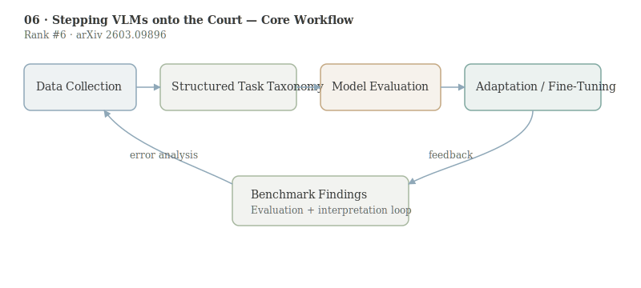

# Stepping VLMs onto the Court: Benchmarking Spatial Intelligence in Sports

- **Authors:** Yuchen Yang, Yuqing Shao, Duxiu Huang, Linfeng Dong, Yifei Liu, Suixin Tang, Xiang Zhou, Yuanyuan Gao, Wei Wang, Yue Zhou, Xue Yang, Yanfeng Wang, Xiao Sun, Zhihang Zhong
- **arXiv:** 2603.09896
- **Daily rank:** 6
- **Upvotes:** 21
- **Tags:** [daily papers]
- **Generated:** 2026-03-12 04:04:07.752 UTC

> [!note] Source Coverage
> Primary analysis source: AlphaXiv overview available. AlphaXiv full-text markdown unavailable; method details cross-checked against the arXiv abstract.

> [!abstract] TL;DR
> CourtSI reframes sports video as a metric spatial reasoning benchmark rather than only an action-recognition setting. By anchoring QA generation to real court geometry and evaluating 25 VLMs, the authors show a persistent human-AI gap and limited transfer from existing spatial datasets. The practical result is not just a benchmark: fine-tuning Qwen3-VL-8B on CourtSI yields a reported +23.5 point gain on CourtSI-Bench and improves transfer to an unseen related sport in CourtSI-Ext.
>
> **Who should read this:** This paper is most useful for teams building VLMs for robotics, analytics, or grounded video reasoning where precise location and relation judgments matter more than broad caption quality.

## 1. Header

> [!tip] Metadata
> Rank #6 in HuggingFace Daily Papers for 2026-03-11. Keywords: spatial intelligence, vision-language models, CourtSI, CourtSI-Bench, Qwen3-VL-8B.

## 2. TL;DR

CourtSI reframes sports video as a metric spatial reasoning benchmark rather than only an action-recognition setting. By anchoring QA generation to real court geometry and evaluating 25 VLMs, the authors show a persistent human-AI gap and limited transfer from existing spatial datasets.

The practical result is not just a benchmark: fine-tuning Qwen3-VL-8B on CourtSI yields a reported +23.5 point gain on CourtSI-Bench and improves transfer to an unseen related sport in CourtSI-Ext.

This paper is most useful for teams building VLMs for robotics, analytics, or grounded video reasoning where precise location and relation judgments matter more than broad caption quality.

## 3. Background & Prerequisites

> [!info] Background & Prerequisites
> Spatial intelligence in VLMs is often evaluated with static scenes, synthetic cubes, or single-frame object relations. Those settings are useful for controlled experiments, but they do not expose the failure modes that happen when human pose, motion blur, occlusion, and fine-grained geometry interact in real footage. CourtSI fills that realism gap by using net sports, where court lines create explicit metric references and decision boundaries. A second prerequisite concept is benchmark granularity. Many multimodal leaderboards blend semantic understanding and spatial reasoning into one score, making it hard to diagnose whether a model fails to read the scene, to reason over coordinates, or to compose temporal evidence. CourtSI separates tasks into counting, distance, localization, and relational reasoning so error patterns are interpretable. Third, this work sits in a broader movement from “can the model describe the image?” to “can the model reason physically from image evidence?” Similar pressure appears in papers like [[07-reading-not-thinking|Reading, Not Thinking]] and [[09-vlm-subtlebench|VLM-SubtleBench]], but CourtSI contributes a sports-specific data engine that scales to over one million QA pairs.

Spatial intelligence in VLMs is often evaluated with static scenes, synthetic cubes, or single-frame object relations. Those settings are useful for controlled experiments, but they do not expose the failure modes that happen when human pose, motion blur, occlusion, and fine-grained geometry interact in real footage. CourtSI fills that realism gap by using net sports, where court lines create explicit metric references and decision boundaries.

A second prerequisite concept is benchmark granularity. Many multimodal leaderboards blend semantic understanding and spatial reasoning into one score, making it hard to diagnose whether a model fails to read the scene, to reason over coordinates, or to compose temporal evidence. CourtSI separates tasks into counting, distance, localization, and relational reasoning so error patterns are interpretable.

Third, this work sits in a broader movement from “can the model describe the image?” to “can the model reason physically from image evidence?” Similar pressure appears in papers like [[07-reading-not-thinking|Reading, Not Thinking]] and [[09-vlm-subtlebench|VLM-SubtleBench]], but CourtSI contributes a sports-specific data engine that scales to over one million QA pairs.

## 4. Problem & Motivation

The core problem is that current VLM benchmarks overestimate spatial ability because they underrepresent dynamic human-object interactions. Sports provide a difficult but structured environment: body articulation is high, objects move quickly, and geometry constraints are strict. If a model can reason in this setting, it is more likely to transfer to high-stakes domains such as surveillance, officiating assistance, or embodied control.

The authors also argue timing matters now because VLMs are increasingly used as decision support systems. Weak spatial grounding can produce plausible but wrong answers that are hard for users to detect. A dedicated benchmark with human verification and task taxonomy gives researchers a concrete target for model improvement.

## 5. Method / Approach

CourtSI has two layers. The large training corpus (over one million QA pairs) is built through a semi-automatic scene reconstruction engine using court geometry as metric anchors. The evaluation layer, CourtSI-Bench, is a smaller human-verified set (3,686 QA pairs) designed for robust comparison across models.

The pipeline starts with sports footage ingestion, then extracts geometric primitives (court boundaries, net regions, player and object positions), and then instantiates QA templates across four major reasoning families. This structure enforces that answerability depends on grounded spatial evidence rather than generic priors.

Model evaluation covers 25 systems from open and proprietary families. The benchmark separates base capability from adaptation by reporting both zero-shot performance and post-fine-tuning performance for a representative model (Qwen3-VL-8B).

A useful way to formalize the setup is to treat each question as a function over reconstructed state: $$\hat{y}=f_\theta(\mathcal{V}, q),\quad y^*=g(\mathcal{S}_{court})$$ where $\mathcal{V}$ is video evidence and $\mathcal{S}_{court}$ is geometry-grounded scene state. Improvement comes from reducing alignment error between latent model state and metric scene state.

## 6. Results & Key Findings

> [!success] Key Results
> The headline findings are a measurable human-AI gap on CourtSI-Bench and weak out-of-domain transfer from existing spatial benchmarks, indicating that sports scenes expose failure modes hidden by easier datasets. Fine-tuning Qwen3-VL-8B on CourtSI improves accuracy on CourtSI-Bench by 23.5 percentage points, a large jump that suggests data design quality is at least as important as architecture changes for this capability. The adapted model reportedly generalizes to CourtSI-Ext (an unseen but related sport), which is important: the gain is not only memorization of one sport template. The authors also report improved spatial-aware commentary generation, implying that gains transfer from QA scoring to generative outputs where spatial coherence is visible to users.

- The headline findings are a measurable human-AI gap on CourtSI-Bench and weak out-of-domain transfer from existing spatial benchmarks, indicating that sports scenes expose failure modes hidden by easier datasets.
- Fine-tuning Qwen3-VL-8B on CourtSI improves accuracy on CourtSI-Bench by 23.5 percentage points, a large jump that suggests data design quality is at least as important as architecture changes for this capability.
- The adapted model reportedly generalizes to CourtSI-Ext (an unseen but related sport), which is important: the gain is not only memorization of one sport template.
- The authors also report improved spatial-aware commentary generation, implying that gains transfer from QA scoring to generative outputs where spatial coherence is visible to users.

## 7. Limitations & Open Questions

> [!warning] Limitations
> CourtSI centers on net sports and may not capture geometry types in contact sports, field sports, or first-person viewpoints. A broader benchmark suite is still needed for claims about universal spatial intelligence. Template-driven QA generation can leave lexical artifacts if not aggressively diversified. Even with human verification, models may exploit recurring phrasing or answer distributions. The reported adaptation result is strong for one model family. More evidence is needed on whether similar gains hold for architectures with different visual tokenizers and context-window behaviors. High scores on CourtSI do not guarantee causal understanding; a model can pass many items via robust perceptual heuristics without explicit world modeling.

- CourtSI centers on net sports and may not capture geometry types in contact sports, field sports, or first-person viewpoints. A broader benchmark suite is still needed for claims about universal spatial intelligence.
- Template-driven QA generation can leave lexical artifacts if not aggressively diversified. Even with human verification, models may exploit recurring phrasing or answer distributions.
- The reported adaptation result is strong for one model family. More evidence is needed on whether similar gains hold for architectures with different visual tokenizers and context-window behaviors.
- High scores on CourtSI do not guarantee causal understanding; a model can pass many items via robust perceptual heuristics without explicit world modeling.

## 8. Connections & Context

> [!example] Connections
> Compared with [[09-vlm-subtlebench|VLM-SubtleBench]], CourtSI emphasizes metric geometry in dynamic sports scenes, while SubtleBench emphasizes small visual deltas across domains. Together they define two complementary stress tests: precise geometry and subtle comparison. Compared with [[07-reading-not-thinking|Reading, Not Thinking]], CourtSI is less about OCR-style perception and more about scene-grounded relational reasoning. Both papers nonetheless highlight that benchmark construction choices can dominate measured capability. For practitioners, CourtSI suggests a concrete recipe: targeted, structured post-training data can close larger capability gaps than prompt engineering alone. That aligns with broader trends in mid/post-training from rank-1 to rank-5 papers in this daily batch.

- Compared with [[09-vlm-subtlebench|VLM-SubtleBench]], CourtSI emphasizes metric geometry in dynamic sports scenes, while SubtleBench emphasizes small visual deltas across domains. Together they define two complementary stress tests: precise geometry and subtle comparison.
- Compared with [[07-reading-not-thinking|Reading, Not Thinking]], CourtSI is less about OCR-style perception and more about scene-grounded relational reasoning. Both papers nonetheless highlight that benchmark construction choices can dominate measured capability.
- For practitioners, CourtSI suggests a concrete recipe: targeted, structured post-training data can close larger capability gaps than prompt engineering alone. That aligns with broader trends in mid/post-training from rank-1 to rank-5 papers in this daily batch.

A practical adoption note: sports analytics teams can use CourtSI-like task templates to evaluate private models before deployment. Even if the final application is commentary generation, including metric QA probes in evaluation helps catch spatial hallucinations early.

A research note: the benchmark could evolve into temporal chain tasks where answers require integrating evidence across multiple events, not just single snapshots. That extension would make it a stronger proxy for embodied planning and referee-style decision support.

## 9. Resources

- Links: [arXiv](https://arxiv.org/abs/2603.09896) · [PDF](https://arxiv.org/pdf/2603.09896) · [HuggingFace](https://huggingface.co/papers/2603.09896) · [GitHub](https://github.com/Visionary-Laboratory/CourtSI) · [Project](https://visionary-laboratory.github.io/CourtSI/)
- Related today: [[06-stepping-vlms-court|Stepping VLMs onto the Court]], [[07-reading-not-thinking|Reading, Not Thinking]], [[08-fish-audio-s2|Fish Audio S2]], [[09-vlm-subtlebench|VLM-SubtleBench]], [[10-audio-specialist-heads|Audio-Specialist Heads]]
