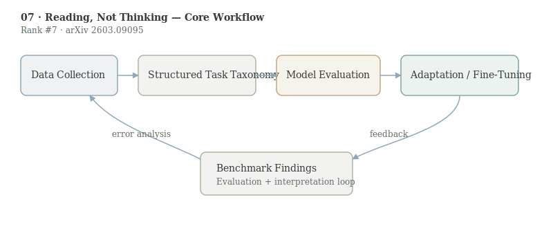

# Reading, Not Thinking: Understanding and Bridging the Modality Gap When Text Becomes Pixels in Multimodal LLMs

- **Authors:** Kaiser Sun, Xiaochuang Yuan, Hongjun Liu, Chen Zhao, Cheng Zhang, Mark Dredze, Fan Bai
- **arXiv:** 2603.09095
- **Daily rank:** 7
- **Upvotes:** 21
- **Tags:** [daily papers]
- **Generated:** 2026-03-12 04:04:07.752 UTC

> [!note] Source Coverage
> Primary analysis source: AlphaXiv overview available. AlphaXiv full-text markdown unavailable; quantitative values anchored to the arXiv abstract and HF metadata.

> [!abstract] TL;DR
> This paper shows that the “modality gap” in MLLMs is mostly a reading problem, not a reasoning problem: when the same content is rendered as pixels, models often fail on extraction, formatting, or arithmetic parsing before reasoning even begins. The proposed fix is lightweight self-distillation: pair image inputs with the model’s own text-mode reasoning traces. On GSM8K image mode, the reported jump from 30.71% to 92.72% suggests that targeted supervision can recover much of the lost capability without a full architecture redesign.
>
> **Who should read this:** This is essential reading for teams evaluating document AI, screenshot QA, chart reasoning, and production assistants where users often provide visual text rather than clean tokens.

## 1. Header

> [!tip] Metadata
> Rank #7 in HuggingFace Daily Papers for 2026-03-11. Keywords: multimodal large language models, modality gap, visual text understanding, self-distillation, GSM8K.

## 2. TL;DR

This paper shows that the “modality gap” in MLLMs is mostly a reading problem, not a reasoning problem: when the same content is rendered as pixels, models often fail on extraction, formatting, or arithmetic parsing before reasoning even begins.

The proposed fix is lightweight self-distillation: pair image inputs with the model’s own text-mode reasoning traces. On GSM8K image mode, the reported jump from 30.71% to 92.72% suggests that targeted supervision can recover much of the lost capability without a full architecture redesign.

This is essential reading for teams evaluating document AI, screenshot QA, chart reasoning, and production assistants where users often provide visual text rather than clean tokens.

## 3. Background & Prerequisites

> [!info] Background & Prerequisites
> Multimodal LLM pipelines usually fuse a vision encoder with a language decoder. In many products, the same user intent can be provided either as tokens (copy-paste text) or as pixels (screenshots, scans, rendered PDFs). If model behavior diverges strongly across those modes, reliability degrades and debugging becomes difficult. Prior work frequently reported modality gaps but often mixed synthetic renderings and real documents in ways that confound interpretation. A key prerequisite here is understanding evaluation controls: font, resolution, color scheme, and image pre-processing can each alter effective task difficulty. Another prerequisite concept is decomposition of failure type. The authors’ framing separates reading failures (character-level recognition, alignment, formatting, arithmetic transcription) from thinking failures (knowledge retrieval, chain-of-thought logic, strategy selection). This decomposition is what makes their intervention actionable. This paper directly complements [[09-vlm-subtlebench|VLM-SubtleBench]] and [[06-stepping-vlms-court|CourtSI]]: all three emphasize that benchmark format can hide or amplify specific bottlenecks.

Multimodal LLM pipelines usually fuse a vision encoder with a language decoder. In many products, the same user intent can be provided either as tokens (copy-paste text) or as pixels (screenshots, scans, rendered PDFs). If model behavior diverges strongly across those modes, reliability degrades and debugging becomes difficult.

Prior work frequently reported modality gaps but often mixed synthetic renderings and real documents in ways that confound interpretation. A key prerequisite here is understanding evaluation controls: font, resolution, color scheme, and image pre-processing can each alter effective task difficulty.

Another prerequisite concept is decomposition of failure type. The authors’ framing separates reading failures (character-level recognition, alignment, formatting, arithmetic transcription) from thinking failures (knowledge retrieval, chain-of-thought logic, strategy selection). This decomposition is what makes their intervention actionable.

This paper directly complements [[09-vlm-subtlebench|VLM-SubtleBench]] and [[06-stepping-vlms-court|CourtSI]]: all three emphasize that benchmark format can hide or amplify specific bottlenecks.

## 4. Problem & Motivation

The central question is why MLLMs underperform when textual content is converted into images. If the core failure is reasoning, solutions should focus on larger decoders or better CoT prompting. If the core failure is perception and modality alignment, then data and training strategy must change.

The paper argues urgency is high because real-world enterprise usage is image-heavy: invoices, forms, manuals, PDF pages, and UI screenshots. A model that is strong in text-only benchmark mode can still fail badly in deployed image mode.

## 5. Method / Approach

The study evaluates seven MLLMs on seven benchmarks under five input modes, covering both synthetic renderings and natural image documents (including arXiv PDFs and Wikipedia screenshots). This broad matrix is a design strength because it prevents overfitting conclusions to one benchmark family.

The authors report severe degradation in some synthetic settings (for example, math tasks dropping by more than 60 points), but much smaller gaps on some natural document images. They also show rendering choices can be dominant confounds, with font alone swinging performance by up to 47 points.

A grounded error analysis over 4,000+ examples attributes most of the delta to reading errors. Knowledge and reasoning error rates are comparatively stable, though some models exhibit chain-of-thought collapse under visual input.

The intervention is self-distillation: train with image inputs while supervising on the model’s own high-quality text-mode reasoning traces. Conceptually, the objective aligns latent states across modalities: $$\mathcal{L}=\lambda_1\mathcal{L}_{ans}+\lambda_2\mathcal{L}_{trace}(z_{img}, z_{txt})$$ where $\mathcal{L}_{trace}$ encourages reasoning consistency between image and text channels.

## 6. Results & Key Findings

> [!success] Key Results
> The strongest quantitative claim is image-mode GSM8K accuracy increasing from 30.71% to 92.72% after self-distillation, with transfer to unseen benchmarks and no catastrophic forgetting. The diagnostic takeaway is equally important: image mode selectively amplifies calculation and formatting errors. This gives teams concrete debugging targets rather than broad “model is weak” conclusions. By contrasting synthetic and natural documents, the paper also demonstrates that popular evaluation setups can overstate model weakness if rendering artifacts are not controlled. Collectively, the results suggest that modality adaptation can be achieved through targeted post-training, not only through larger multimodal pretraining runs.

- The strongest quantitative claim is image-mode GSM8K accuracy increasing from 30.71% to 92.72% after self-distillation, with transfer to unseen benchmarks and no catastrophic forgetting.
- The diagnostic takeaway is equally important: image mode selectively amplifies calculation and formatting errors. This gives teams concrete debugging targets rather than broad “model is weak” conclusions.
- By contrasting synthetic and natural documents, the paper also demonstrates that popular evaluation setups can overstate model weakness if rendering artifacts are not controlled.
- Collectively, the results suggest that modality adaptation can be achieved through targeted post-training, not only through larger multimodal pretraining runs.

## 7. Limitations & Open Questions

> [!warning] Limitations
> The large GSM8K gain may depend on benchmark style and prompt protocol; independent reproductions across additional math and code datasets would strengthen confidence. Self-distillation can inherit teacher mistakes. If text-mode traces contain systematic biases, the image-mode model may become better aligned but still wrong in the same direction. The approach reduces but does not eliminate dependence on rendering quality. Extreme OCR noise, handwriting, or low-resource scripts may still require explicit vision-front-end upgrades. The paper focuses on answer quality; latency and memory tradeoffs of trace-based training are less emphasized and matter for production deployment.

- The large GSM8K gain may depend on benchmark style and prompt protocol; independent reproductions across additional math and code datasets would strengthen confidence.
- Self-distillation can inherit teacher mistakes. If text-mode traces contain systematic biases, the image-mode model may become better aligned but still wrong in the same direction.
- The approach reduces but does not eliminate dependence on rendering quality. Extreme OCR noise, handwriting, or low-resource scripts may still require explicit vision-front-end upgrades.
- The paper focuses on answer quality; latency and memory tradeoffs of trace-based training are less emphasized and matter for production deployment.

## 8. Connections & Context

> [!example] Connections
> [[06-stepping-vlms-court|CourtSI]] shows dynamic spatial reasoning gaps; this work shows visual text reading gaps. Combined, they imply multimodal reliability requires specialized diagnostics per modality and per sub-skill. [[10-audio-specialist-heads|Audio-Specialist Heads]] tackles a parallel issue in audio: text dominance. Across modalities, the shared failure mode is over-reliance on language priors when non-text evidence should dominate. For model builders, the paper supports a practical roadmap: diagnosis first, then narrow interventions. Massive retraining is not always necessary if the bottleneck is localized and measurable.

- [[06-stepping-vlms-court|CourtSI]] shows dynamic spatial reasoning gaps; this work shows visual text reading gaps. Combined, they imply multimodal reliability requires specialized diagnostics per modality and per sub-skill.
- [[10-audio-specialist-heads|Audio-Specialist Heads]] tackles a parallel issue in audio: text dominance. Across modalities, the shared failure mode is over-reliance on language priors when non-text evidence should dominate.
- For model builders, the paper supports a practical roadmap: diagnosis first, then narrow interventions. Massive retraining is not always necessary if the bottleneck is localized and measurable.

A practical recommendation from this paper is to maintain paired evaluation suites: token mode and pixel mode for the same tasks. Regressions often appear in one mode first, and paired tracking makes this visible.

Another extension is confidence calibration by modality. If the model can estimate whether it is “reading” versus “guessing,” downstream systems can trigger OCR fallback, human review, or re-rendering automatically.

## 9. Resources

- Links: [arXiv](https://arxiv.org/abs/2603.09095) · [PDF](https://arxiv.org/pdf/2603.09095) · [HuggingFace](https://huggingface.co/papers/2603.09095)
- Related today: [[06-stepping-vlms-court|Stepping VLMs onto the Court]], [[07-reading-not-thinking|Reading, Not Thinking]], [[08-fish-audio-s2|Fish Audio S2]], [[09-vlm-subtlebench|VLM-SubtleBench]], [[10-audio-specialist-heads|Audio-Specialist Heads]]
