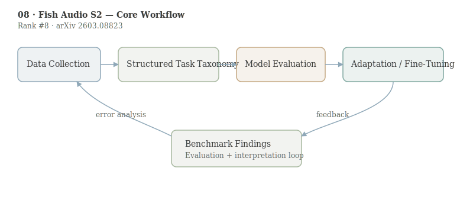

# Fish Audio S2 Technical Report

- **Authors:** Shijia Liao, Yuxuan Wang, Songting Liu, Yifan Cheng, Ruoyi Zhang, Tianyu Li, Shidong Li, Yisheng Zheng, Xingwei Liu, Qingzheng Wang, Zhizhuo Zhou, Jiahua Liu, Xin Chen, Dawei Han
- **arXiv:** 2603.08823
- **Daily rank:** 8
- **Upvotes:** 13
- **Tags:** [daily papers]
- **Generated:** 2026-03-12 04:04:07.752 UTC

> [!note] Source Coverage
> Primary analysis source: AlphaXiv overview available. AlphaXiv full-text markdown unavailable; result numbers anchored to the arXiv abstract and HF metadata.

> [!abstract] TL;DR
> Fish Audio S2 pushes open-source TTS toward instruction-following and dialogue-style generation by combining a staged data pipeline with multi-reward RL alignment. The system is designed for controllable speech, not only naturalness in single-speaker reading. Its production emphasis is notable: the authors report a streaming inference engine with RTF 0.195 and sub-100ms time-to-first-audio, indicating that controllability gains are paired with deployable latency.
>
> **Who should read this:** This paper is most relevant to speech teams building interactive agents, dubbing, audiobook generation, or multi-speaker dialogue systems where prompt-level control and low latency must coexist.

## 1. Header

> [!tip] Metadata
> Rank #8 in HuggingFace Daily Papers for 2026-03-11. Keywords: text-to-speech, instruction-following control, multi-speaker generation, reward modeling, streaming inference.

## 2. TL;DR

Fish Audio S2 pushes open-source TTS toward instruction-following and dialogue-style generation by combining a staged data pipeline with multi-reward RL alignment. The system is designed for controllable speech, not only naturalness in single-speaker reading.

Its production emphasis is notable: the authors report a streaming inference engine with RTF 0.195 and sub-100ms time-to-first-audio, indicating that controllability gains are paired with deployable latency.

This paper is most relevant to speech teams building interactive agents, dubbing, audiobook generation, or multi-speaker dialogue systems where prompt-level control and low latency must coexist.

## 3. Background & Prerequisites

> [!info] Background & Prerequisites
> Modern neural TTS has moved from pipeline-heavy systems to large sequence models that map text or semantic tokens to speech representations. Yet many open models still expose limited control over style, emotion, role, or conversation structure. Instruction-following TTS aims to close this gap by letting users specify vocal behavior in natural language. A second prerequisite is post-training in generative audio. Reinforcement-learning-style alignment is standard in LLMs, but less mature in TTS because reward design is harder: semantic correctness, audio quality, and speaker consistency can conflict. Fish Audio S2 addresses this by reusing data-pipeline tools both for curation and reward shaping, attempting to reduce train-test and pretrain-posttrain mismatch. This design choice is methodologically important even beyond this specific model. Within this daily batch, the paper connects to [[10-audio-specialist-heads|Audio-Specialist Heads]]: one focuses on better audio generation alignment, the other on better audio evidence use in multimodal reasoning.

Modern neural TTS has moved from pipeline-heavy systems to large sequence models that map text or semantic tokens to speech representations. Yet many open models still expose limited control over style, emotion, role, or conversation structure. Instruction-following TTS aims to close this gap by letting users specify vocal behavior in natural language.

A second prerequisite is post-training in generative audio. Reinforcement-learning-style alignment is standard in LLMs, but less mature in TTS because reward design is harder: semantic correctness, audio quality, and speaker consistency can conflict.

Fish Audio S2 addresses this by reusing data-pipeline tools both for curation and reward shaping, attempting to reduce train-test and pretrain-posttrain mismatch. This design choice is methodologically important even beyond this specific model.

Within this daily batch, the paper connects to [[10-audio-specialist-heads|Audio-Specialist Heads]]: one focuses on better audio generation alignment, the other on better audio evidence use in multimodal reasoning.

## 4. Problem & Motivation

The target problem is open-source TTS that can handle multi-speaker, multi-turn, instruction-conditioned generation without sacrificing real-time usability. Existing systems often trade off one axis: strong quality but weak control, or flexible control but unstable long-form speech.

The motivation is practical and commercial: voice interfaces increasingly require dynamic adaptation to role, tone, and context in the same session. Fixed-style synthesis no longer matches product demands for conversational AI.

## 5. Method / Approach

The report describes a multi-stage training recipe and a staged data pipeline that includes video captioning, speech captioning, voice-quality assessment, and reward modeling. The key idea is unification: use a shared infrastructure to generate supervision, score outputs, and support RL alignment.

At a high level, the training flow is: base TTS pretraining on broad speech-text data, instruction-aware supervised tuning for controllability, then multi-reward RL to optimize semantic fidelity, acoustic quality, and speaker similarity. This mirrors LLM post-training stacks but adapted for waveform-level outputs.

The implementation also includes an SGLang-based inference engine for streaming deployment. The report emphasizes time-to-first-audio and runtime factor, indicating systems engineering was considered alongside model quality.

A useful abstraction is multi-objective optimization over rewards: $$J(\theta)=\mathbb{E}[r_{sem}+\alpha r_{qual}+\beta r_{spk}]$$ where balancing coefficients control tradeoffs between instruction faithfulness, perceptual quality, and voice identity preservation.

## 6. Results & Key Findings

> [!success] Key Results
> From the abstract-level evidence, the system supports multi-speaker and multi-turn generation with natural-language instruction control, which is the main capability claim of the report. The inference stack is reported as production-ready with RTF 0.195 and time-to-first-audio below 100 ms, strong operational metrics for interactive settings. Open release of weights, fine-tuning code, and inference tooling is itself impactful, because it enables independent replication and downstream adaptation in the open-source ecosystem. The broader contribution is a recipe: data curation, reward modeling, and deployment design are co-developed rather than optimized in isolation.

- From the abstract-level evidence, the system supports multi-speaker and multi-turn generation with natural-language instruction control, which is the main capability claim of the report.
- The inference stack is reported as production-ready with RTF 0.195 and time-to-first-audio below 100 ms, strong operational metrics for interactive settings.
- Open release of weights, fine-tuning code, and inference tooling is itself impactful, because it enables independent replication and downstream adaptation in the open-source ecosystem.
- The broader contribution is a recipe: data curation, reward modeling, and deployment design are co-developed rather than optimized in isolation.

## 7. Limitations & Open Questions

> [!warning] Limitations
> The available public summary does not provide full benchmark tables in this context, so comparative claims against named baselines should be interpreted cautiously until reproduced. Instruction-following can increase variability; robustness under adversarial or ambiguous prompts remains an open question for safety and consistency. Multi-reward RL often requires careful coefficient tuning. Transfer to low-resource languages, singing, or highly expressive acting voices may require additional reward engineering. Latency claims depend on hardware and serving setup. Teams should validate end-to-end latency in their own deployment stack rather than relying on single-number reports.

- The available public summary does not provide full benchmark tables in this context, so comparative claims against named baselines should be interpreted cautiously until reproduced.
- Instruction-following can increase variability; robustness under adversarial or ambiguous prompts remains an open question for safety and consistency.
- Multi-reward RL often requires careful coefficient tuning. Transfer to low-resource languages, singing, or highly expressive acting voices may require additional reward engineering.
- Latency claims depend on hardware and serving setup. Teams should validate end-to-end latency in their own deployment stack rather than relying on single-number reports.

## 8. Connections & Context

> [!example] Connections
> Compared with [[10-audio-specialist-heads|Audio-Specialist Heads]], Fish Audio S2 focuses on generation control, while Audio-Specialist Heads focuses on interpretability and inference-time steering for understanding tasks. Compared with [[07-reading-not-thinking|Reading, Not Thinking]], both papers show that targeted post-training can close major modality-specific gaps without requiring full model redesign. For product teams, the combination of controllability plus low-latency inference is the key practical signal: model research and serving engineering are converging.

- Compared with [[10-audio-specialist-heads|Audio-Specialist Heads]], Fish Audio S2 focuses on generation control, while Audio-Specialist Heads focuses on interpretability and inference-time steering for understanding tasks.
- Compared with [[07-reading-not-thinking|Reading, Not Thinking]], both papers show that targeted post-training can close major modality-specific gaps without requiring full model redesign.
- For product teams, the combination of controllability plus low-latency inference is the key practical signal: model research and serving engineering are converging.

A practical extension would be explicit uncertainty outputs for instruction adherence, enabling automatic fallback when a requested speaking style cannot be reliably delivered.

Another near-term direction is preference-conditioned dialogue synthesis where user feedback updates reward weighting online. That could bring TTS post-training closer to RLHF-style personalization used in text assistants.

## 9. Resources

- Links: [arXiv](https://arxiv.org/abs/2603.08823) · [PDF](https://arxiv.org/pdf/2603.08823) · [HuggingFace](https://huggingface.co/papers/2603.08823) · [GitHub](https://github.com/fishaudio/fish-speech) · [Project](https://fish.audio/)
- Related today: [[06-stepping-vlms-court|Stepping VLMs onto the Court]], [[07-reading-not-thinking|Reading, Not Thinking]], [[08-fish-audio-s2|Fish Audio S2]], [[09-vlm-subtlebench|VLM-SubtleBench]], [[10-audio-specialist-heads|Audio-Specialist Heads]]
