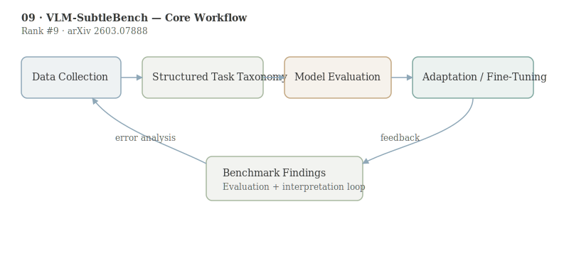

# VLM-SubtleBench: How Far Are VLMs from Human-Level Subtle Comparative Reasoning?

- **Authors:** Minkyu Kim, Sangheon Lee, Dongmin Park
- **arXiv:** 2603.07888
- **Daily rank:** 9
- **Upvotes:** 9
- **Tags:** [daily papers]
- **Generated:** 2026-03-12 04:04:07.752 UTC

> [!note] Source Coverage
> AlphaXiv overview unavailable; analysis based on arXiv abstract, HF metadata, and benchmark design context. AlphaXiv full-text markdown unavailable.

> [!abstract] TL;DR
> VLM-SubtleBench targets a blind spot in current multimodal evaluation: models may succeed when differences are large, yet fail when two images differ only in subtle, semantically important ways. By covering ten difference types across industrial, aerial, medical, and natural-image contexts, the benchmark exposes systematic model-human gaps and provides a cleaner target for advancing fine-grained comparative reasoning.
>
> **Who should read this:** This paper is particularly relevant for teams in quality inspection, medical support, remote sensing, and any workflow where “small visual change” implies major downstream decisions.

## 1. Header

> [!tip] Metadata
> Rank #9 in HuggingFace Daily Papers for 2026-03-11. Keywords: vision-language models, comparative reasoning, subtle differences, benchmarking.

## 2. TL;DR

VLM-SubtleBench targets a blind spot in current multimodal evaluation: models may succeed when differences are large, yet fail when two images differ only in subtle, semantically important ways.

By covering ten difference types across industrial, aerial, medical, and natural-image contexts, the benchmark exposes systematic model-human gaps and provides a cleaner target for advancing fine-grained comparative reasoning.

This paper is particularly relevant for teams in quality inspection, medical support, remote sensing, and any workflow where “small visual change” implies major downstream decisions.

## 3. Background & Prerequisites

> [!info] Background & Prerequisites
> Comparative reasoning is central to human perception: we do not only recognize objects, we detect differences that matter under task constraints. In AI evaluation, however, many VLM benchmarks are dominated by obvious changes and broad semantics, so they under-measure this capability. A key prerequisite concept is difference taxonomy. SubtleBench explicitly factors ten categories (Attribute, State, Emotion, Temporal, Spatial, Existence, Quantity, Quality, Viewpoint, Action), enabling per-type diagnosis rather than one aggregate score. Another prerequisite is domain transfer. A subtle difference in medical imaging is very different from a subtle difference in street photography, yet both require robust visual grounding. By spanning multiple domains, the benchmark tests whether models learn general comparison primitives or memorize dataset-specific cues. This perspective aligns with [[06-stepping-vlms-court|CourtSI]] and [[07-reading-not-thinking|Reading, Not Thinking]]: capability claims are only as strong as the stress tests used to measure them.

Comparative reasoning is central to human perception: we do not only recognize objects, we detect differences that matter under task constraints. In AI evaluation, however, many VLM benchmarks are dominated by obvious changes and broad semantics, so they under-measure this capability.

A key prerequisite concept is difference taxonomy. SubtleBench explicitly factors ten categories (Attribute, State, Emotion, Temporal, Spatial, Existence, Quantity, Quality, Viewpoint, Action), enabling per-type diagnosis rather than one aggregate score.

Another prerequisite is domain transfer. A subtle difference in medical imaging is very different from a subtle difference in street photography, yet both require robust visual grounding. By spanning multiple domains, the benchmark tests whether models learn general comparison primitives or memorize dataset-specific cues.

This perspective aligns with [[06-stepping-vlms-court|CourtSI]] and [[07-reading-not-thinking|Reading, Not Thinking]]: capability claims are only as strong as the stress tests used to measure them.

## 4. Problem & Motivation

The main problem is that current VLM progress can look stronger than it is when benchmarks emphasize salient differences. In real settings, the critical signal is often tiny: a slight defect, a faint lesion boundary, or a small spatial displacement.

This gap matters now because VLMs are being considered for decision-support roles where subtle misses can be costly. Without targeted evaluation, teams may deploy models that are impressive on demos but brittle on edge cases.

## 5. Method / Approach

The benchmark constructs paired image-question sets where answers hinge on nuanced visual distinctions. Unlike open-ended caption tasks, the setup forces grounded comparison between two similar alternatives.

The ten-category taxonomy encourages structured reporting. A model that performs well on quantity differences but poorly on temporal/state differences can be debugged with targeted training rather than generic scaling.

Evaluation includes both proprietary and open-source VLMs and compares them against human references, producing an explicit model-human gap estimate. This is critical because “best model among peers” is not the same as “good enough for deployment.”

A simple formal view is pairwise decision under small perturbations: $$\hat{y}=\arg\max_{y\in\mathcal{Y}}\;s_\theta(I_1,I_2,q,y)$$ where robust models require high score margins even when $I_1$ and $I_2$ differ minimally along task-relevant axes.

## 6. Results & Key Findings

> [!success] Key Results
> The principal finding is systematic underperformance versus humans across difference types and domains, confirming that subtle comparison remains an unsolved capability frontier for current VLMs. Controlled analyses identify specific deterioration points rather than uniform weakness, supporting the claim that “subtle reasoning” is a composite skill with uneven sub-capabilities. Because the benchmark spans industrial, aerial, and medical imagery, the results challenge assumptions that improvements on natural-image benchmarks alone will transfer to safety-critical domains. The paper’s contribution is therefore less about a single SOTA number and more about measurement quality: it creates the evaluation lens needed to drive the next iteration of model development.

- The principal finding is systematic underperformance versus humans across difference types and domains, confirming that subtle comparison remains an unsolved capability frontier for current VLMs.
- Controlled analyses identify specific deterioration points rather than uniform weakness, supporting the claim that “subtle reasoning” is a composite skill with uneven sub-capabilities.
- Because the benchmark spans industrial, aerial, and medical imagery, the results challenge assumptions that improvements on natural-image benchmarks alone will transfer to safety-critical domains.
- The paper’s contribution is therefore less about a single SOTA number and more about measurement quality: it creates the evaluation lens needed to drive the next iteration of model development.

## 7. Limitations & Open Questions

> [!warning] Limitations
> Without AlphaXiv intermediate report data in this run, fine-grained implementation details (annotation workflow, inter-rater stats, prompt protocol) should be verified from the full paper before reproduction. Benchmark curation can inadvertently introduce shortcut signals, especially in paired tasks. Continued adversarial auditing is required to ensure models cannot exploit trivial artifacts. Human-level comparison depends on evaluator expertise; domain-specific subsets (for example medical) may require expert annotators for truly meaningful upper bounds. SubtleBench diagnoses the problem but does not itself provide a training recipe, so downstream teams still need targeted data and objective design to improve model behavior.

- Without AlphaXiv intermediate report data in this run, fine-grained implementation details (annotation workflow, inter-rater stats, prompt protocol) should be verified from the full paper before reproduction.
- Benchmark curation can inadvertently introduce shortcut signals, especially in paired tasks. Continued adversarial auditing is required to ensure models cannot exploit trivial artifacts.
- Human-level comparison depends on evaluator expertise; domain-specific subsets (for example medical) may require expert annotators for truly meaningful upper bounds.
- SubtleBench diagnoses the problem but does not itself provide a training recipe, so downstream teams still need targeted data and objective design to improve model behavior.

## 8. Connections & Context

> [!example] Connections
> [[06-stepping-vlms-court|CourtSI]] and SubtleBench together map two complementary failure regimes: dynamic metric reasoning and static subtle discrimination. [[07-reading-not-thinking|Reading, Not Thinking]] suggests one route for improvement: identify the specific bottleneck and perform targeted modality-aware distillation. A similar strategy may work for subtle visual comparison. For this day’s collection, SubtleBench reinforces a broad trend: benchmark sophistication is becoming a first-class contribution, not only model size or architecture changes.

- [[06-stepping-vlms-court|CourtSI]] and SubtleBench together map two complementary failure regimes: dynamic metric reasoning and static subtle discrimination.
- [[07-reading-not-thinking|Reading, Not Thinking]] suggests one route for improvement: identify the specific bottleneck and perform targeted modality-aware distillation. A similar strategy may work for subtle visual comparison.
- For this day’s collection, SubtleBench reinforces a broad trend: benchmark sophistication is becoming a first-class contribution, not only model size or architecture changes.

A useful next step is curriculum-based training from salient to subtle differences, with category-balanced sampling to prevent overfitting to easy difference types.

Another high-value extension is uncertainty-aware scoring. For subtle tasks, calibrated abstention may be preferable to forced guesses in safety-critical pipelines.

## 9. Resources

- Links: [arXiv](https://arxiv.org/abs/2603.07888) · [PDF](https://arxiv.org/pdf/2603.07888) · [HuggingFace](https://huggingface.co/papers/2603.07888) · [GitHub](https://github.com/krafton-ai/VLM-SubtleBench)
- Related today: [[06-stepping-vlms-court|Stepping VLMs onto the Court]], [[07-reading-not-thinking|Reading, Not Thinking]], [[08-fish-audio-s2|Fish Audio S2]], [[09-vlm-subtlebench|VLM-SubtleBench]], [[10-audio-specialist-heads|Audio-Specialist Heads]]
