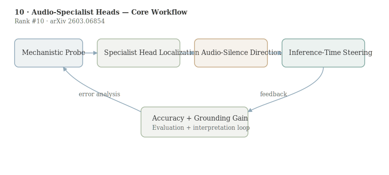

# Are Audio-Language Models Listening? Audio-Specialist Heads for Adaptive Audio Steering

- **Authors:** Neta Glazer, Lenny Aharon, Ethan Fetaya
- **arXiv:** 2603.06854
- **Daily rank:** 10
- **Upvotes:** 9
- **Tags:** [daily papers]
- **Generated:** 2026-03-12 04:04:07.752 UTC

> [!note] Source Coverage
> AlphaXiv overview unavailable; analysis based on arXiv abstract, HF metadata, and mechanistic-interpretability methodology patterns. AlphaXiv full-text markdown unavailable.

> [!abstract] TL;DR
> The paper identifies a small set of audio-specialist attention heads in large audio-language models and uses them to build an interpretable “listening signal” that tracks when audio evidence actually influences predictions. Using this localization, the authors construct an audio-vs-silence steering direction and apply inference-time activation intervention, reporting up to +8.0 points on MMAU for two Qwen-based models without parameter updates. This is a strong mechanistic-interpretability result with immediate practical implications.
>
> **Who should read this:** Researchers in mechanistic interpretability, multimodal reliability, and model steering should read this paper; it gives a concrete, auditable intervention path for reducing text-dominance failures in audio-language models.

## 1. Header

> [!tip] Metadata
> Rank #10 in HuggingFace Daily Papers for 2026-03-11. Keywords: audio-language models, mechanistic interpretability, attention heads, activation steering, MMAU.

## 2. TL;DR

The paper identifies a small set of audio-specialist attention heads in large audio-language models and uses them to build an interpretable “listening signal” that tracks when audio evidence actually influences predictions.

Using this localization, the authors construct an audio-vs-silence steering direction and apply inference-time activation intervention, reporting up to +8.0 points on MMAU for two Qwen-based models without parameter updates. This is a strong mechanistic-interpretability result with immediate practical implications.

Researchers in mechanistic interpretability, multimodal reliability, and model steering should read this paper; it gives a concrete, auditable intervention path for reducing text-dominance failures in audio-language models.

## 3. Background & Prerequisites

> [!info] Background & Prerequisites
> Large multimodal models often exhibit modality imbalance: one channel dominates because it is easier to exploit statistically. In audio-language systems, text priors can overpower weak or noisy acoustic evidence, leading to fluent but poorly grounded outputs. Detecting and correcting this failure mode is difficult when interventions happen only at prompt level. Mechanistic interpretability offers a different strategy: localize circuits that mediate a specific behavior and intervene directly in internal activations. In transformer models, attention heads are natural units for this analysis because they can specialize in token routing patterns tied to specific modalities or tasks. A prerequisite concept is activation steering. Instead of retraining, one can add a direction vector to hidden states at inference time to push the model toward or away from behaviors. If that direction is derived from interpretable differences (for example, audio-present minus audio-absent), steering can be both effective and auditable. This work is one of the clearest mechanistic contributions in this daily batch, and it pairs naturally with [[08-fish-audio-s2|Fish Audio S2]]: one optimizes generation behavior through training, the other improves evidence utilization through targeted internal control.

Large multimodal models often exhibit modality imbalance: one channel dominates because it is easier to exploit statistically. In audio-language systems, text priors can overpower weak or noisy acoustic evidence, leading to fluent but poorly grounded outputs. Detecting and correcting this failure mode is difficult when interventions happen only at prompt level.

Mechanistic interpretability offers a different strategy: localize circuits that mediate a specific behavior and intervene directly in internal activations. In transformer models, attention heads are natural units for this analysis because they can specialize in token routing patterns tied to specific modalities or tasks.

A prerequisite concept is activation steering. Instead of retraining, one can add a direction vector to hidden states at inference time to push the model toward or away from behaviors. If that direction is derived from interpretable differences (for example, audio-present minus audio-absent), steering can be both effective and auditable.

This work is one of the clearest mechanistic contributions in this daily batch, and it pairs naturally with [[08-fish-audio-s2|Fish Audio S2]]: one optimizes generation behavior through training, the other improves evidence utilization through targeted internal control.

## 4. Problem & Motivation

The paper tackles text dominance in LALMs: models can answer based on linguistic priors even when decisive information exists in audio. This failure is dangerous because outputs remain coherent, so users may not notice that the model ignored the evidence channel.

The core challenge is to build interventions that are both useful and interpretable. End-to-end fine-tuning can improve metrics but rarely explains where grounding happens inside the network. The authors aim for a method that diagnoses internal engagement and improves it without weight updates.

## 5. Method / Approach

Step 1 is head-level localization. The authors identify attention heads whose audio attention pattern correlates with audio-dependent behavior, defining them as audio-specialist heads. Rather than treating the full model as a black box, they isolate a sparse mechanism set.

Step 2 is signal construction. They derive a listening signal from these heads and verify that it rises when audio evidence affects the final answer under normal prompting. This transforms a qualitative concern (“is it listening?”) into a measurable quantity.

Step 3 is steering direction estimation. By contrasting activation states under audio-present and audio-silence conditions, they construct an audio-silence direction in representation space. The intervention adds this direction at inference time to the final representation, amplifying audio influence.

Step 4 is evaluation on MMAU with Qwen-based LALMs. The abstract reports up to +8.0 percentage point improvement without parameter updates, indicating the intervention shifts behavior materially while preserving deployment simplicity.

A compact formalization is: $$h^{\prime}=h+\gamma\,d_{audio-silence}$$ where $h$ is the base hidden state, $d_{audio-silence}$ is the steering vector derived from specialist-head analysis, and $\gamma$ controls intervention strength. The interpretability value comes from grounding $d$ in a localized mechanism rather than arbitrary latent directions.

Methodologically, this sits between probing and full editing. Probing alone is diagnostic but not corrective; full finetuning is corrective but opaque. Head-localized steering gives both diagnosis and intervention in a single loop, which is why this paper stands out for practical mech-interp.

## 6. Results & Key Findings

> [!success] Key Results
> The key quantitative claim is up to +8.0 points on MMAU across two Qwen-based audio-language models, achieved with inference-time intervention only. The key qualitative claim is even more important for interpretability: the listening signal increases when audio evidence is causally relevant to outputs. This suggests the identified heads are not merely correlated markers but useful handles on model behavior. Because no parameter updates are required, the approach can be tested rapidly in production-like environments. Teams can evaluate gains, regressions, and sensitivity by tuning one steering coefficient rather than launching expensive retraining. The paper also advances a broader thesis: modality grounding can be improved through sparse, mechanistically informed controls. That opens a practical path for reliability interventions in other modalities (vision, sensor fusion) where dominance imbalance appears.

- The key quantitative claim is up to +8.0 points on MMAU across two Qwen-based audio-language models, achieved with inference-time intervention only.
- The key qualitative claim is even more important for interpretability: the listening signal increases when audio evidence is causally relevant to outputs. This suggests the identified heads are not merely correlated markers but useful handles on model behavior.
- Because no parameter updates are required, the approach can be tested rapidly in production-like environments. Teams can evaluate gains, regressions, and sensitivity by tuning one steering coefficient rather than launching expensive retraining.
- The paper also advances a broader thesis: modality grounding can be improved through sparse, mechanistically informed controls. That opens a practical path for reliability interventions in other modalities (vision, sensor fusion) where dominance imbalance appears.

## 7. Limitations & Open Questions

> [!warning] Limitations
> AlphaXiv detailed report was unavailable in this run, so architecture-layer specifics and ablations should be verified from the full manuscript before precise replication. Steering gains may vary with prompt distribution and task mix. A direction that helps evidence-heavy QA might hurt free-form generation or conversational style if over-applied. Head specialization can shift across model versions. The identified specialist set may not transfer directly to different checkpoints or architectures. Interpretability does not automatically imply safety; stronger audio influence could amplify spurious audio artifacts if the input channel is noisy or adversarial. Intervention strength calibration remains nontrivial. Too low yields no effect, too high may distort unrelated capabilities. Operational deployment needs guardrails and per-task tuning.

- AlphaXiv detailed report was unavailable in this run, so architecture-layer specifics and ablations should be verified from the full manuscript before precise replication.
- Steering gains may vary with prompt distribution and task mix. A direction that helps evidence-heavy QA might hurt free-form generation or conversational style if over-applied.
- Head specialization can shift across model versions. The identified specialist set may not transfer directly to different checkpoints or architectures.
- Interpretability does not automatically imply safety; stronger audio influence could amplify spurious audio artifacts if the input channel is noisy or adversarial.
- Intervention strength calibration remains nontrivial. Too low yields no effect, too high may distort unrelated capabilities. Operational deployment needs guardrails and per-task tuning.

## 8. Connections & Context

> [!example] Connections
> [[07-reading-not-thinking|Reading, Not Thinking]] reports text dominance-like failures in visual text mode. This paper shows an analogous issue in audio and provides a mechanistic correction path. [[08-fish-audio-s2|Fish Audio S2]] addresses controllable audio generation via training-time alignment, while this paper addresses understanding-time grounding via inference-time steering. Together they represent complementary levers for robust audio AI. Across the daily top-10, this work is the clearest example of actionable mechanistic interpretability: localized circuit discovery tied directly to measurable behavioral improvement.

- [[07-reading-not-thinking|Reading, Not Thinking]] reports text dominance-like failures in visual text mode. This paper shows an analogous issue in audio and provides a mechanistic correction path.
- [[08-fish-audio-s2|Fish Audio S2]] addresses controllable audio generation via training-time alignment, while this paper addresses understanding-time grounding via inference-time steering. Together they represent complementary levers for robust audio AI.
- Across the daily top-10, this work is the clearest example of actionable mechanistic interpretability: localized circuit discovery tied directly to measurable behavioral improvement.

For practitioners, a strong next experiment is closed-loop adaptive steering where $gamma$ is set from a confidence estimate of audio relevance per query. That could improve robustness versus fixed-strength intervention.

For research, the natural extension is causal mediation analysis across layers to quantify how much each specialist head contributes to final logits. That would turn the current intervention into a more complete causal map of audio grounding.

## 9. Resources

- Links: [arXiv](https://arxiv.org/abs/2603.06854) · [PDF](https://arxiv.org/pdf/2603.06854) · [HuggingFace](https://huggingface.co/papers/2603.06854)
- Related today: [[06-stepping-vlms-court|Stepping VLMs onto the Court]], [[07-reading-not-thinking|Reading, Not Thinking]], [[08-fish-audio-s2|Fish Audio S2]], [[09-vlm-subtlebench|VLM-SubtleBench]], [[10-audio-specialist-heads|Audio-Specialist Heads]]
