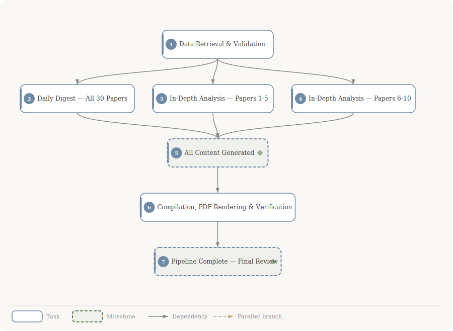

<div align="center">

# HF Daily Papers Analysis 2026-03-11

**7 tasks** &bull; **8 dependencies** &bull; Exported March 11, 2026

</div>

## DAG Overview



### At a Glance

| Metric | Value |
|---|---|
| Tasks | 5 |
| Milestones | 2 |
| Dependencies | 8 |
| Parallel branches | 0 |

### Execution Flow

```
● #1 Data Retrieval & Validation
  ┬─ ● #2 Daily Digest — All 30 Papers
  ├─ ● #3 In-Depth Analysis — Papers 1-5
  └─ ● #4 In-Depth Analysis — Papers 6-10
        ◆ #5 All Content Generated
          ● #6 Compilation, PDF Rendering & Verification
            ◆ #7 Pipeline Complete — Final Review
```

---

## Task Details

### ● Task #1: Data Retrieval & Validation

`Planned` &nbsp; `urgent`

| | |
|---|---|
| **Unlocks** | → #2 *Daily Digest — All 30 Papers*<br>→ #3 *In-Depth Analysis — Papers 1-5*<br>→ #4 *In-Depth Analysis — Papers 6-10* |
| **Schedule** | 2026-03-12 → 2026-03-12 |

<details>
<summary><strong>Task Description</strong> <em>(click to expand)</em></summary>

Fetch and validate HuggingFace Daily Papers for 2026-03-11.

**Steps:**
1. Run: `curl -sL "https://huggingface.co/api/daily_papers?date=2026-03-11" -o /home/zhuoran-nebius/repos/HF-papers/data/daily-papers.json`
2. **Date validation**: Parse the JSON. If empty array `[]`, report 'No HuggingFace Daily Papers found for 2026-03-11' and STOP. If invalid JSON or request failure, report error and STOP.
3. Parse all papers, extract metadata: id, title, authors, summary, upvotes, ai_summary, ai_keywords, publishedAt.
4. Rank by `paper.upvotes` descending. Select top-10 for in-depth analysis.
5. No additional papers to resolve ({{additionalPapers}} is empty). No keyword filter to apply ({{filterKeywords}} is empty).
6. Apply custom priority: flag papers matching these topics for emphasis in analysis: (i) new LLM/VLM architectures or training/optimization algorithms, (ii) mechanistic interpretability or theoretical foundations, (iii) mid-training or post-training for reasoning, (iv) agents and agentic systems.
7. Write output files:
   - `/home/zhuoran-nebius/repos/HF-papers/data/daily-papers.json` — raw API response
   - `/home/zhuoran-nebius/repos/HF-papers/data/paper-metadata.md` — parsed metadata in markdown table with rank, arxiv ID, title, upvotes, keywords, and priority-topic flags
   - `/home/zhuoran-nebius/repos/HF-papers/data/top10-papers.json` — JSON array of the top-10 papers with all metadata needed for in-depth analysis

**Directory setup**: Create `/home/zhuoran-nebius/repos/HF-papers/data/`, `/home/zhuoran-nebius/repos/HF-papers/papers/`, `/home/zhuoran-nebius/repos/HF-papers/figures/` directories.

**Done when**: `data/daily-papers.json` has 30 papers, `data/top10-papers.json` has exactly 10 papers ranked by upvotes, `data/paper-metadata.md` is a readable summary.

</details>

---

### ● Task #2: Daily Digest — All 30 Papers

`Planned` &nbsp; `high`

| | |
|---|---|
| **Depends on** | ← #1 *Data Retrieval & Validation* |
| **Unlocks** | → #5 *All Content Generated* |
| **Schedule** | 2026-03-12 → 2026-03-12 |

<details>
<summary><strong>Task Description</strong> <em>(click to expand)</em></summary>

Generate the daily digest summarizing ALL 30 papers from 2026-03-11 as both HTML and Markdown.

**Inputs**: Read `/home/zhuoran-nebius/repos/HF-papers/data/daily-papers.json` for all paper data.

**Digest structure** (per SKILL.md Section 2):
- Group papers by research area inferred from `ai_keywords`:
  - Language Models & NLP
  - Computer Vision & Multimodal
  - Reinforcement Learning & Agents
  - Audio, Speech & Music
  - Science & Mathematics
  - Systems & Infrastructure
  - Other
- Within each group, sort by upvotes descending. Show group count in section header.
- For each paper include:
  1. Title (linked to arXiv: `https://arxiv.org/abs/{id}`)
  2. Authors (first 3, then 'et al.')
  3. Upvotes badge
  4. Keywords (from ai_keywords)
  5. One-paragraph summary (3-5 sentences synthesizing abstract + ai_summary as TL;DR seed)
  6. Key contribution (single bold sentence)
  7. Links: arXiv, PDF (`https://arxiv.org/pdf/{id}`), HuggingFace (`https://huggingface.co/papers/{id}`)

**HTML output** (`/home/zhuoran-nebius/repos/HF-papers/daily-digest-2026-03-11.html`):
- Self-contained with embedded CSS using the color palette from SKILL.md Section 4
- Palatino typography, 900px max-width, warm off-white background (#FAF8F5)
- Use box styles: box-gold for metadata badges, box-green for key contributions
- Badge styles for upvotes (.badge-upvotes) and daily paper tag (.badge-daily)
- Header: 'HuggingFace Daily Papers Digest — March 11, 2026' with paper count and generation timestamp

**Markdown output** (`/home/zhuoran-nebius/repos/HF-papers/daily-digest-2026-03-11.md`):
- YAML frontmatter: title, date: 2026-03-11, type: digest, tags: [daily-papers, 2026-03-11], papers: 30
- Use Obsidian callout syntax: `> [!success]` for key contributions, `> [!info]` for summaries
- Standard markdown tables, headers, and links

**Done when**: Both files exist, contain all 30 papers grouped correctly, HTML renders in a browser with correct styling, Markdown has valid frontmatter and Obsidian callouts.

</details>

---

### ● Task #3: In-Depth Analysis — Papers 1-5

`Planned` &nbsp; `high`

| | |
|---|---|
| **Depends on** | ← #1 *Data Retrieval & Validation* |
| **Unlocks** | → #5 *All Content Generated* |
| **Schedule** | 2026-03-12 → 2026-03-12 |

<details>
<summary><strong>Task Description</strong> <em>(click to expand)</em></summary>

Generate comprehensive in-depth analyses for the top-5 papers by upvotes. These get the fullest treatment (2000-4000 words each).

**Papers in this batch** (from `/home/zhuoran-nebius/repos/HF-papers/data/top10-papers.json`):
1. [122↑] 2603.03143 — Geometry-Guided RL for 3D Scene Editing
2. [44↑] 2603.09906 — Thinking to Recall: Reasoning Unlocks Parametric Knowledge ⭐ Priority: post-training for reasoning
3. [37↑] 2603.06577 — Omni-Diffusion: Unified Multimodal with Masked Discrete Diffusion ⭐ Priority: new architecture
4. [36↑] 2603.09206 — MM-Zero: Self-Evolving VLMs From Zero Data ⭐ Priority: VLM training algorithm
5. [28↑] 2603.09877 — InternVL-U: Unified Multimodal Models ⭐ Priority: new VLM architecture

**For EACH paper, do the following:**
1. Fetch AlphaXiv overview: `curl -sL "https://alphaxiv.org/overview/{ARXIV_ID}.md"` — this is the PRIMARY source (~16K chars). If 404 or empty, fall back to paper abstract (`paper.summary`, ~1300 chars), then `ai_summary` (~200 chars). Note fallback in analysis.
2. Fetch AlphaXiv full text: `curl -sL "https://alphaxiv.org/abs/{ARXIV_ID}.md"` — for equations and details.
3. Generate the 9-section analysis document per SKILL.md Section 3.2:
   - Header (title, authors, arXiv ID, upvotes badge, rank badge, daily paper tag)
   - TL;DR (box-pink, 2-3 sentences, seed from ai_summary then expand)
   - Background & Prerequisites (box-blue, prior work, 2-3 prerequisite concepts)
   - Problem & Motivation
   - Method/Approach (with SVG figure + step-by-step + KaTeX equations)
   - Results & Key Findings (box-green)
   - Limitations & Open Questions (box-pink)
   - Connections & Context (box-lavender, links to other daily papers)
   - Resources (links)
4. Create SVG architecture/workflow figure(s) per SKILL.md Section 5:
   - Save to `/home/zhuoran-nebius/repos/HF-papers/figures/{NN}-{slug}.svg`
   - Use Palatino font, low-saturation palette, rounded rect nodes, clean arrows
   - Embed inline in HTML, reference via relative path in Markdown
5. **Comprehensive depth** for top-5: 2000-4000 words, full background, multiple figures if warranted, equation walkthrough.

**HTML output**: `/home/zhuoran-nebius/repos/HF-papers/papers/{NN}-{title-slug}.html` — self-contained CSS, KaTeX CDN included, color palette per SKILL.md Section 4.
**Markdown output**: `/home/zhuoran-nebius/repos/HF-papers/papers/{NN}-{title-slug}.md` — YAML frontmatter (title, date, type: analysis, tags, rank, arxiv), Obsidian callouts, wikilinks to other papers.

Files to create (5 papers × 2 formats = 10 files + ~5 SVGs):
- `papers/01-geometry-guided-rl-3d-editing.{html,md}`
- `papers/02-thinking-to-recall.{html,md}`
- `papers/03-omni-diffusion.{html,md}`
- `papers/04-mm-zero.{html,md}`
- `papers/05-internvl-u.{html,md}`
- `figures/01-geometry-guided-rl-3d-editing.svg` (and more as needed)

**⭐ Priority topics emphasis**: Papers #2, #3, #4, #5 match the user's priority topics. Give extra attention to: how the architecture/training differs from prior work, theoretical grounding, and practical implications for reasoning or multimodal AI.

**Done when**: All 10 files + SVGs exist, HTML renders correctly with styling and KaTeX, Markdown has valid frontmatter and callouts, each analysis is 2000-4000 words.

</details>

---

### ● Task #4: In-Depth Analysis — Papers 6-10

`Planned` &nbsp; `high`

| | |
|---|---|
| **Depends on** | ← #1 *Data Retrieval & Validation* |
| **Unlocks** | → #5 *All Content Generated* |
| **Schedule** | 2026-03-12 → 2026-03-12 |

<details>
<summary><strong>Task Description</strong> <em>(click to expand)</em></summary>

Generate in-depth analyses for papers ranked 6-10 by upvotes. Standard depth (1000-2000 words each).

**Papers in this batch** (from `/home/zhuoran-nebius/repos/HF-papers/data/top10-papers.json`):
6. [21↑] 2603.09896 — Stepping VLMs onto the Court: Benchmarking Spatial Intelligence
7. [21↑] 2603.09095 — Reading, Not Thinking: Modality Gap in Multimodal LLMs
8. [13↑] 2603.08823 — Fish Audio S2 Technical Report
9. [9↑] 2603.07888 — VLM-SubtleBench: Subtle Comparative Reasoning
10. [9↑] 2603.06854 — Are Audio-Language Models Listening? Audio-Specialist Heads ⭐ Priority: mechanistic interpretability

**For EACH paper, do the following:**
1. Fetch AlphaXiv overview: `curl -sL "https://alphaxiv.org/overview/{ARXIV_ID}.md"` — primary source. If 404/empty, use paper abstract then ai_summary as fallback. Note in analysis.
2. Fetch AlphaXiv full text: `curl -sL "https://alphaxiv.org/abs/{ARXIV_ID}.md"`
3. Generate the 9-section analysis per SKILL.md Section 3.2 (same structure as batch 1):
   - Header, TL;DR (box-pink), Background (box-blue), Problem, Method (with SVG), Results (box-green), Limitations (box-pink), Connections (box-lavender), Resources
4. Create SVG figure(s) per SKILL.md Section 5, saved to `/home/zhuoran-nebius/repos/HF-papers/figures/{NN}-{slug}.svg`
5. **Standard depth** for papers 6-10: 1000-2000 words, abbreviated background, one main figure, key results.

**HTML output**: `/home/zhuoran-nebius/repos/HF-papers/papers/{NN}-{title-slug}.html` — self-contained CSS, KaTeX, color palette.
**Markdown output**: `/home/zhuoran-nebius/repos/HF-papers/papers/{NN}-{title-slug}.md` — YAML frontmatter, Obsidian callouts, wikilinks.

Files to create:
- `papers/06-stepping-vlms-court.{html,md}`
- `papers/07-reading-not-thinking.{html,md}`
- `papers/08-fish-audio-s2.{html,md}`
- `papers/09-vlm-subtlebench.{html,md}`
- `papers/10-audio-specialist-heads.{html,md}`
- `figures/06-stepping-vlms-court.svg` (and more as needed)

**⭐ Priority topic**: Paper #10 (Audio-Specialist Heads) directly addresses mechanistic interpretability — give it extra depth and emphasis on the interpretability methodology.

**Done when**: All 10 files + SVGs exist, HTML renders correctly, Markdown has valid frontmatter, each analysis is 1000-2000 words.

</details>

---

### ◆ Task #5: All Content Generated

`Planned` &nbsp; `Milestone`

| | |
|---|---|
| **Depends on** | ← #2 *Daily Digest — All 30 Papers*<br>← #3 *In-Depth Analysis — Papers 1-5*<br>← #4 *In-Depth Analysis — Papers 6-10* |
| **Unlocks** | → #6 *Compilation, PDF Rendering & Verification* |
| **Schedule** | 2026-03-12 → 2026-03-12 |

<details>
<summary><strong>Task Description</strong> <em>(click to expand)</em></summary>

All individual deliverables are complete: daily digest (HTML + MD) and all 10 in-depth paper analyses (HTML + MD + SVG figures). Ready for compilation.

</details>

---

### ● Task #6: Compilation, PDF Rendering & Verification

`Planned` &nbsp; `high`

| | |
|---|---|
| **Depends on** | ← #5 *All Content Generated* |
| **Unlocks** | → #7 *Pipeline Complete — Final Review* |
| **Schedule** | 2026-03-12 → 2026-03-12 |

<details>
<summary><strong>Task Description</strong> <em>(click to expand)</em></summary>

Assemble the compiled document and render all PDFs.

**Step 1 — Install PDF tooling**:
- Run `cd /home/zhuoran-nebius/repos/HF-papers && npm init -y && npm install puppeteer` to get puppeteer with bundled Chromium (no system Chrome available).
- Verify: `node -e "const p = require('puppeteer'); console.log('puppeteer OK');"`

**Step 2 — Compiled HTML** (`/home/zhuoran-nebius/repos/HF-papers/daily-papers-2026-03-11.html`):
Assemble a single self-contained HTML document with:
1. Cover page: 'HuggingFace Daily Papers — March 11, 2026', paper count (30 total, 10 analyzed), generation timestamp
2. Table of Contents: links to digest section and each in-depth analysis, showing paper titles with rank and upvote count
3. Daily Digest: embed full content from `daily-digest-2026-03-11.html` (inline, not iframe)
4. In-Depth Analyses: embed each paper analysis in rank order (papers 01-10), with `page-break-before: always` between each
5. Appendix: Data Sources — API endpoints used, AlphaXiv coverage notes, any papers where overview was unavailable
- Self-contained CSS (same palette), KaTeX CDN, all SVGs inlined
- Ensure internal TOC links work (use `id` anchors)

**Step 3 — Compiled Markdown** (`/home/zhuoran-nebius/repos/HF-papers/daily-papers-2026-03-11.md`):
- YAML frontmatter: title, date: 2026-03-11, type: compiled, tags: [daily-papers, 2026-03-11], papers: 30
- Combine all content: TOC with wikilinks, digest, all 10 analyses
- Use `---` horizontal rules as section separators
- SVG figures referenced via relative paths: ``

**Step 4 — Render PDFs using puppeteer**:
```javascript
const puppeteer = require('puppeteer');
const path = require('path');
(async () => {
  const browser = await puppeteer.launch({ headless: 'new', args: ['--no-sandbox'] });
  const page = await browser.newPage();
  // Digest PDF
  await page.goto('file://' + path.resolve('./daily-digest-2026-03-11.html'), { waitUntil: 'networkidle0', timeout: 60000 });
  await page.pdf({ path: './daily-digest-2026-03-11.pdf', format: 'A4', printBackground: true, margin: { top: '0.75in', right: '0.75in', bottom: '0.75in', left: '0.75in' } });
  // Compiled PDF
  await page.goto('file://' + path.resolve('./daily-papers-2026-03-11.html'), { waitUntil: 'networkidle0', timeout: 120000 });
  await page.pdf({ path: './daily-papers-2026-03-11.pdf', format: 'A4', printBackground: true, margin: { top: '0.75in', right: '0.75in', bottom: '0.75in', left: '0.75in' } });
  await browser.close();
})();
```

**Step 5 — Verification**:
- Verify all output files exist:
  - `daily-digest-2026-03-11.{html,md,pdf}`
  - `daily-papers-2026-03-11.{html,md,pdf}`
  - `papers/01-*.{html,md}` through `papers/10-*.{html,md}` (20 files)
  - `figures/*.svg` (at least 10 SVGs)
  - `data/daily-papers.json`, `data/top10-papers.json`, `data/paper-metadata.md`
- Verify PDF file sizes are non-zero (at least 50KB each)
- Check compiled HTML has working TOC anchors
- Verify all arXiv links use correct paper IDs
- List final file tree for user review

**Done when**: All files exist with correct content, PDFs render successfully (non-zero size), compiled document has working TOC, file tree printed.

</details>

---

### ◆ Task #7: Pipeline Complete — Final Review

`Planned` &nbsp; `Milestone`

| | |
|---|---|
| **Depends on** | ← #6 *Compilation, PDF Rendering & Verification* |
| **Schedule** | 2026-03-12 → 2026-03-12 |

<details>
<summary><strong>Task Description</strong> <em>(click to expand)</em></summary>

All deliverables generated and verified. Full output tree under /home/zhuoran-nebius/repos/HF-papers/:
- data/ (raw JSON, metadata)
- papers/ (10 × HTML + MD)
- figures/ (SVG diagrams)
- daily-digest-2026-03-11.{html,md,pdf}
- daily-papers-2026-03-11.{html,md,pdf}

Human review: check quality of analyses, figure accuracy, and overall formatting.

</details>

---

