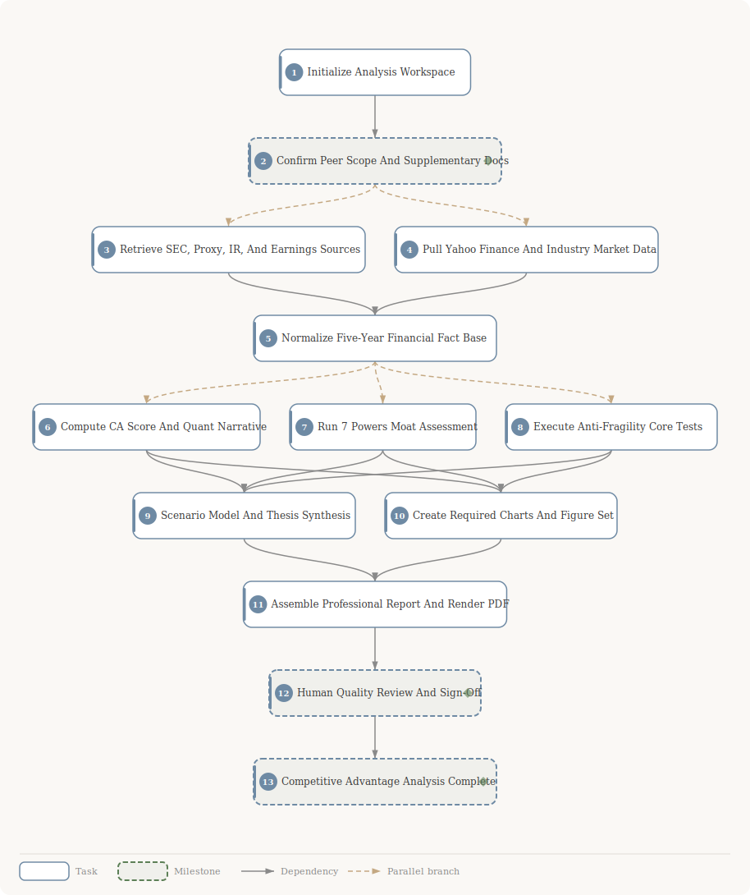

# Moat & Fragility Analysis: CRWV

**Company**: CuriosityStream (CRWV)
**Task**: Comprehensive competitive advantage analysis -- quantitative CA scoring, qualitative 7 Powers moat assessment, and Taleb-inspired anti-fragility resilience testing

## Planning DAG

**13 tasks** &bull; **18 dependencies**

| # | Task | Depends on |
|:---:|------|------------|
| 1 | Initialize Analysis Workspace | -- |
| 2 | Confirm Peer Scope And Supplementary Docs | #1 |
| 3 | Retrieve SEC, Proxy, IR, And Earnings Sources | #2 |
| 4 | Pull Yahoo Finance And Industry Market Data | #2 |
| 5 | Normalize Five-Year Financial Fact Base | #3, #4 |
| 6 | Compute CA Score And Quant Narrative | #5 |
| 7 | Run 7 Powers Moat Assessment | #5 |
| 8 | Execute Anti-Fragility Core Tests | #5 |
| 9 | Scenario Model And Thesis Synthesis | #6, #7, #8 |
| 10 | Create Required Charts And Figure Set | #6, #7, #8 |
| 11 | Assemble Professional Report And Render PDF | #9, #10 |
| 12 | Human Quality Review And Sign-Off | #11 |
| 13 | Competitive Advantage Analysis Complete | #12 |

> Milestones: #2, #12, #13
>
> **[View full task descriptions and prompts →](plan/plan-detail.md)**

## Deliverables

| Format | Location | Description |
|--------|----------|-------------|
| Report (PDF) | `deliverables/moat-analysis.pdf` | Full moat & fragility report with executive summary, CA scoring, 7 Powers assessment, anti-fragility tests, and scenario analysis |
| Report (HTML) | `deliverables/moat-analysis.html` | Self-contained styled HTML report |
| CA Radar Chart | `deliverables/assets/ca-radar.svg` | 4-pillar competitive advantage radar |
| Moat Heatmap | `deliverables/assets/moat-heatmap.svg` | 7 Powers strength heatmap |
| Revenue & Market Share | `deliverables/assets/revenue-market-share-trend.svg` | Historical revenue and market share trend |
| ROIC vs WACC | `deliverables/assets/roic-vs-wacc.svg` | Return on invested capital vs cost of capital |
| Scenario Outcomes | `deliverables/assets/scenario-outcomes.svg` | Bull/base/bear scenario analysis chart |
