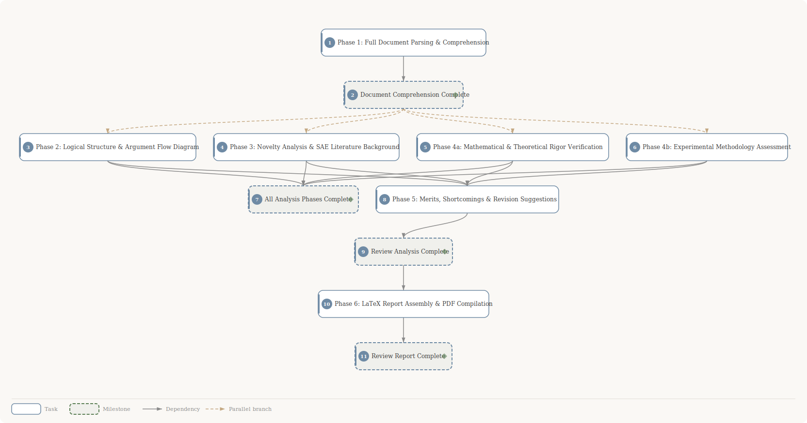

# Paper Review: Geometry-Based Activation (GBA) Sparse Autoencoders

**Paper**: Geometry-Based Activation for Sparse Autoencoders
**Task**: Comprehensive academic review with 8-dimension scoring, argument flow analysis, and concrete revision suggestions

## Planning DAG

**11 tasks** &bull; **16 dependencies**

| # | Task | Depends on |
|:---:|------|------------|
| 1 | Phase 1: Full Document Parsing & Comprehension | -- |
| 2 | ◆ **Document Comprehension Complete** | #1 |
| 3 | Phase 2: Logical Structure & Argument Flow Diagram | #2 |
| 4 | Phase 3: Novelty Analysis & SAE Literature Background | #2 |
| 5 | Phase 4a: Mathematical & Theoretical Rigor Verification | #2 |
| 6 | Phase 4b: Experimental Methodology Assessment | #2 |
| 7 | ◆ **All Analysis Phases Complete** | #3, #4, #5, #6 |
| 8 | Phase 5: Merits, Shortcomings & Revision Suggestions | #3, #4, #5, #6 |
| 9 | ◆ **Review Analysis Complete** | #8 |
| 10 | Phase 6: LaTeX Report Assembly & PDF Compilation | #9 |
| 11 | ◆ **Review Report Complete** | #10 |

> ◆ = milestone
>
> **[View full task descriptions and prompts →](plan/plan-detail.md)**

## Deliverables

| Format | Location | Description |
|--------|----------|-------------|
| Review Report (PDF) | `deliverables/review-report.pdf` | Full review with scoring dashboard, argument flow, revision suggestions |
| Review Report (LaTeX) | `deliverables/review-report.tex` | Source LaTeX for the review report |
